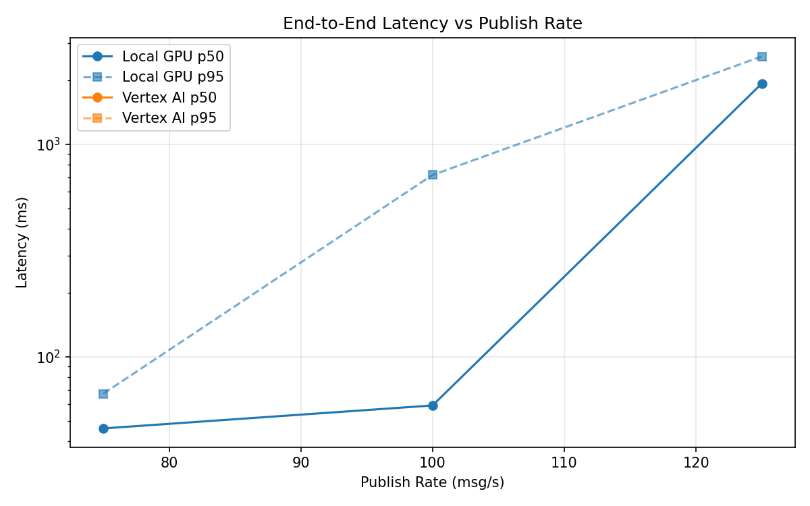
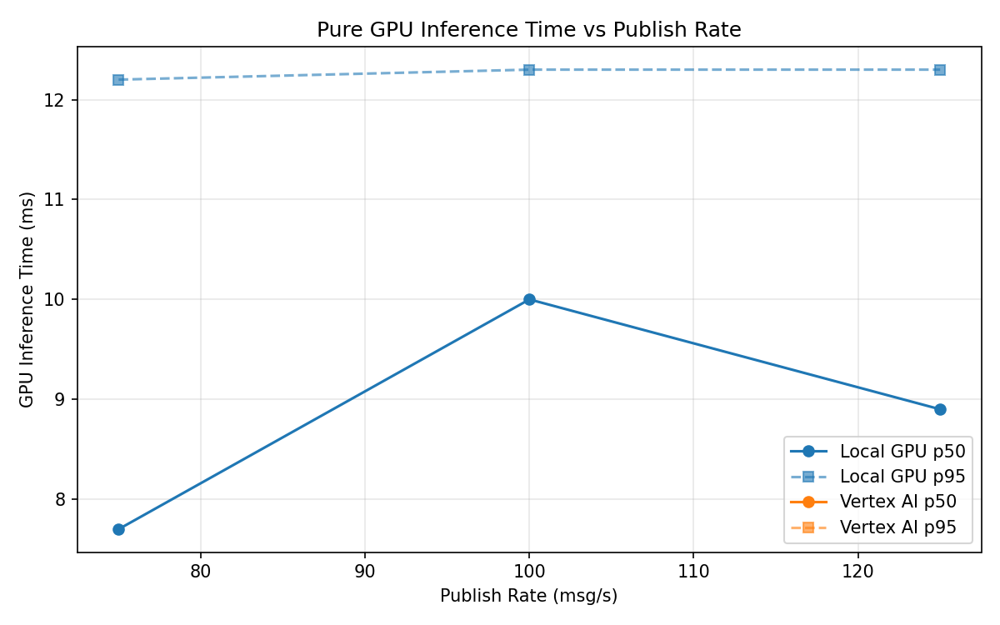
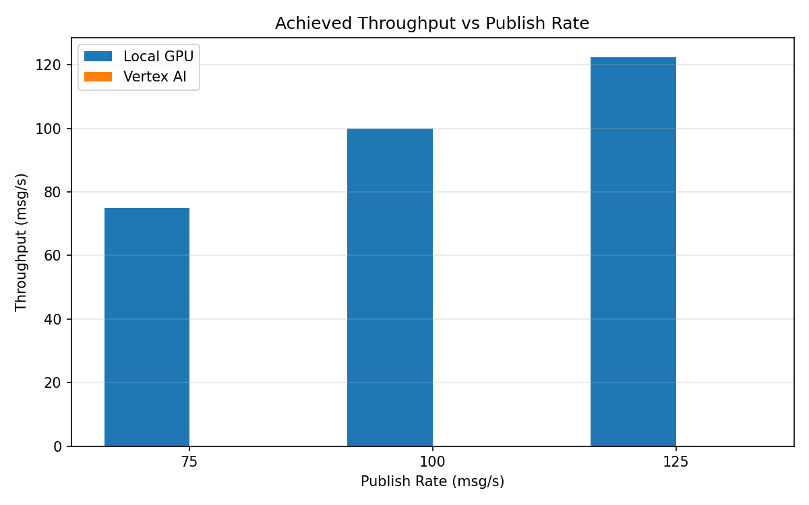

# Benchmark Report

Generated: 2026-03-08 09:56:42

## Configuration

| Parameter | Value |
|---|---|
| Messages per phase | 100s per phase |
| Rates (msg/s) | 75, 100, 125 |
| Experiments | Local GPU, Vertex AI |

## Throughput

| Rate (msg/s) | Local GPU | Vertex AI |
|---|---|---|
| 75 | 75.0 | — |
| 100 | 99.9 | — |
| 125 | 122.4 | — |

## End-to-End Latency (ms)

| Rate | Percentile | Local GPU | Vertex AI |
|---|---|---|---|
| 75 | p50 | 46.0 | — |
| 75 | p95 | 67.0 | — |
| 75 | p99 | 552.1 | — |
| 100 | p50 | 59.0 | — |
| 100 | p95 | 717.0 | — |
| 100 | p99 | 867.0 | — |
| 125 | p50 | 1934.0 | — |
| 125 | p95 | 2592.0 | — |
| 125 | p99 | 2665.0 | — |

## GPU Inference Time (ms)

| Rate | Percentile | Local GPU | Vertex AI |
|---|---|---|---|
| 75 | p50 | 7.7 | — |
| 75 | p95 | 12.2 | — |
| 75 | p99 | 13.8 | — |
| 100 | p50 | 10.0 | — |
| 100 | p95 | 12.3 | — |
| 100 | p99 | 13.7 | — |
| 125 | p50 | 8.9 | — |
| 125 | p95 | 12.3 | — |
| 125 | p99 | 13.9 | — |

## Charts

### Latency vs Publish Rate

### GPU Inference Time vs Publish Rate

### Throughput vs Publish Rate

