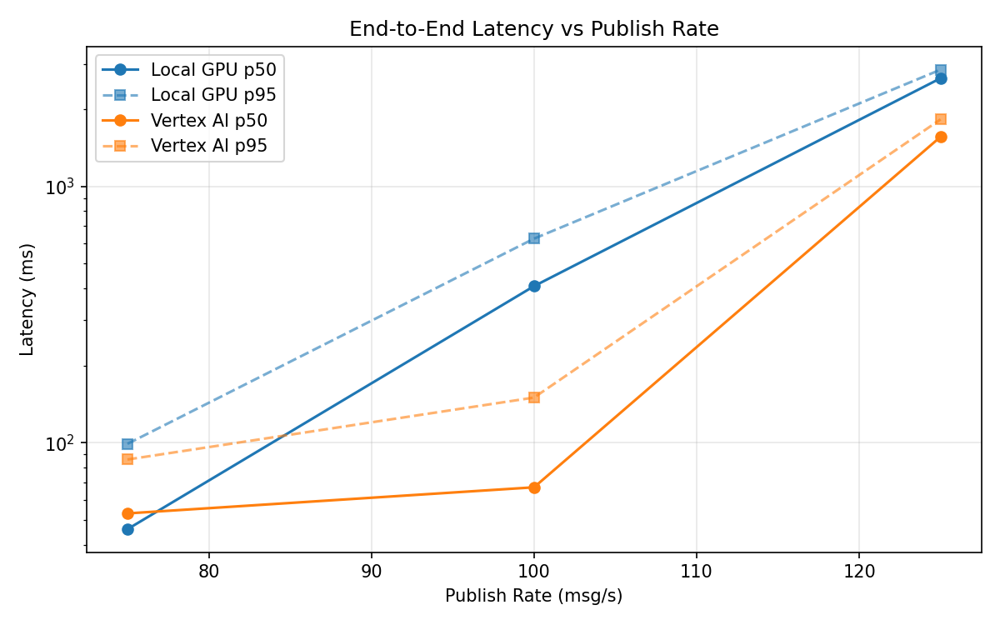
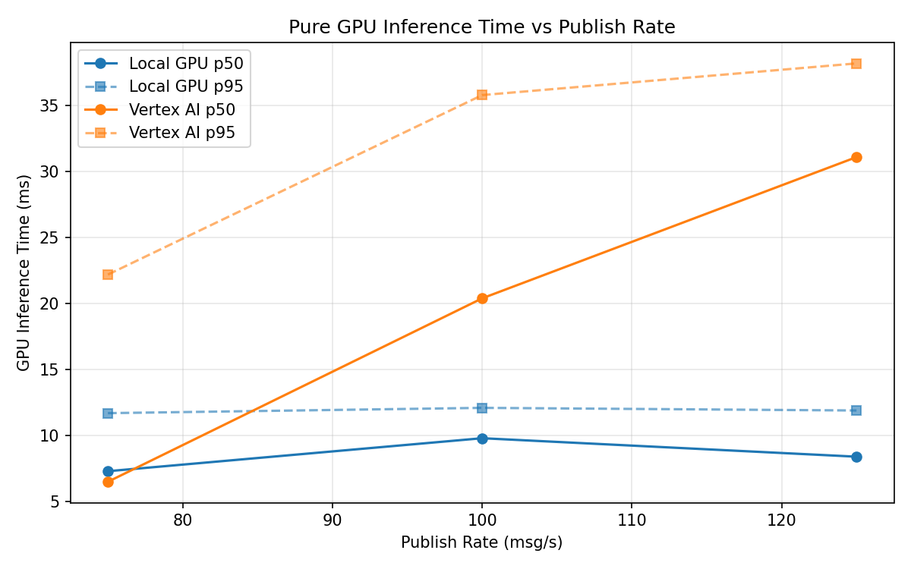
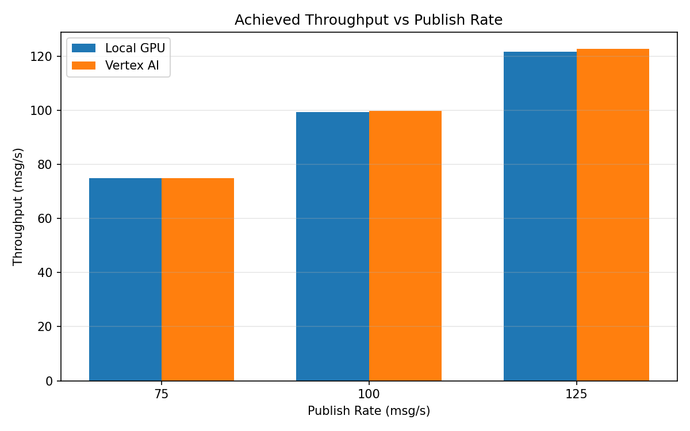

# Benchmark Report

Generated: 2026-03-08 08:28:20

## Configuration

| Parameter | Value |
|---|---|
| Messages per phase | 100s per phase |
| Rates (msg/s) | 75, 100, 125 |
| Experiments | Local GPU, Vertex AI |

## Throughput

| Rate (msg/s) | Local GPU | Vertex AI |
|---|---|---|
| 75 | 75.0 | 75.0 |
| 100 | 99.4 | 99.9 |
| 125 | 121.7 | 122.8 |

## End-to-End Latency (ms)

| Rate | Percentile | Local GPU | Vertex AI |
|---|---|---|---|
| 75 | p50 | 46.0 | 53.0 |
| 75 | p95 | 99.0 | 86.0 |
| 75 | p99 | 727.0 | 445.0 |
| 100 | p50 | 408.0 | 67.0 |
| 100 | p95 | 625.0 | 150.0 |
| 100 | p99 | 687.0 | 223.0 |
| 125 | p50 | 2639.0 | 1560.0 |
| 125 | p95 | 2851.0 | 1824.0 |
| 125 | p99 | 2893.0 | 1872.0 |

## GPU Inference Time (ms)

| Rate | Percentile | Local GPU | Vertex AI |
|---|---|---|---|
| 75 | p50 | 7.3 | 6.5 |
| 75 | p95 | 11.7 | 22.2 |
| 75 | p99 | 12.9 | 34.0 |
| 100 | p50 | 9.8 | 20.4 |
| 100 | p95 | 12.1 | 35.8 |
| 100 | p99 | 13.3 | 45.5 |
| 125 | p50 | 8.4 | 31.1 |
| 125 | p95 | 11.9 | 38.2 |
| 125 | p99 | 12.9 | 48.3 |

## Charts

### Latency vs Publish Rate

### GPU Inference Time vs Publish Rate

### Throughput vs Publish Rate

