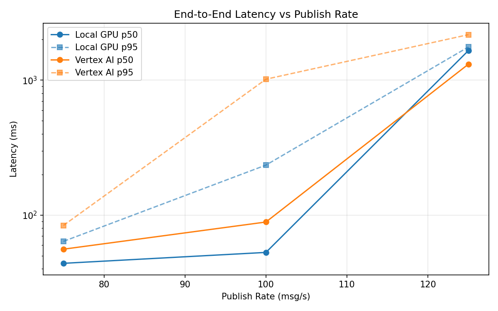
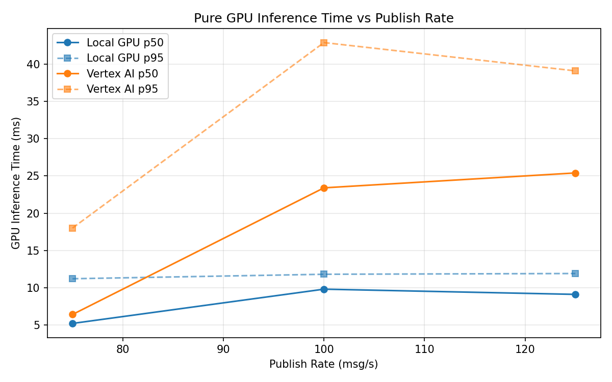
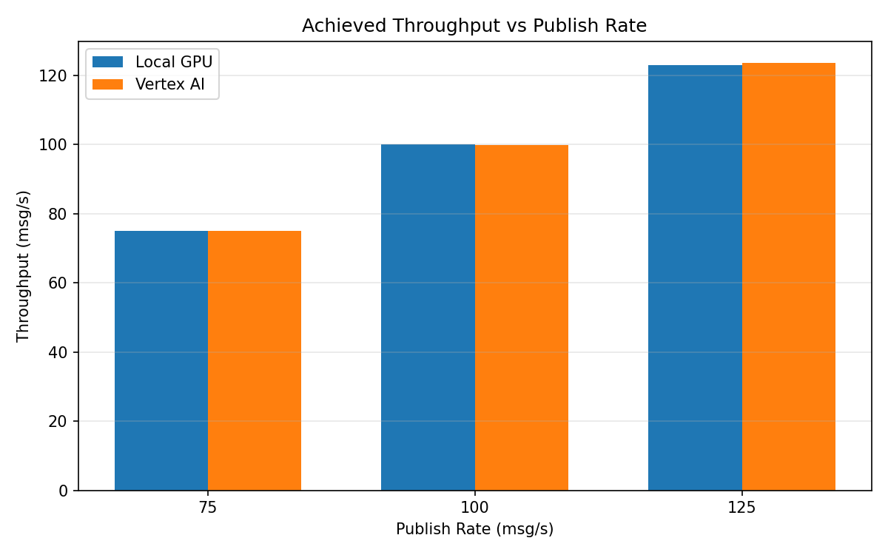

# Benchmark Report

Generated: 2026-03-08 07:50:32

## Configuration

| Parameter | Value |
|---|---|
| Messages per phase | 100s per phase |
| Rates (msg/s) | 75, 100, 125 |
| Experiments | Local GPU, Vertex AI |

## Throughput

| Rate (msg/s) | Local GPU | Vertex AI |
|---|---|---|
| 75 | 75.0 | 75.0 |
| 100 | 100.0 | 99.9 |
| 125 | 122.9 | 123.6 |

## End-to-End Latency (ms)

| Rate | Percentile | Local GPU | Vertex AI |
|---|---|---|---|
| 75 | p50 | 44.0 | 56.0 |
| 75 | p95 | 64.0 | 84.0 |
| 75 | p99 | 391.0 | 197.0 |
| 100 | p50 | 53.0 | 89.0 |
| 100 | p95 | 235.0 | 1017.0 |
| 100 | p99 | 481.0 | 1133.0 |
| 125 | p50 | 1657.5 | 1314.0 |
| 125 | p95 | 1762.0 | 2174.0 |
| 125 | p99 | 1796.0 | 2598.0 |

## GPU Inference Time (ms)

| Rate | Percentile | Local GPU | Vertex AI |
|---|---|---|---|
| 75 | p50 | 5.2 | 6.4 |
| 75 | p95 | 11.2 | 18.0 |
| 75 | p99 | 11.8 | 29.7 |
| 100 | p50 | 9.8 | 23.4 |
| 100 | p95 | 11.8 | 42.9 |
| 100 | p99 | 12.7 | 53.8 |
| 125 | p50 | 9.1 | 25.4 |
| 125 | p95 | 11.9 | 39.1 |
| 125 | p99 | 12.8 | 49.9 |

## Charts

### Latency vs Publish Rate

### GPU Inference Time vs Publish Rate

### Throughput vs Publish Rate

