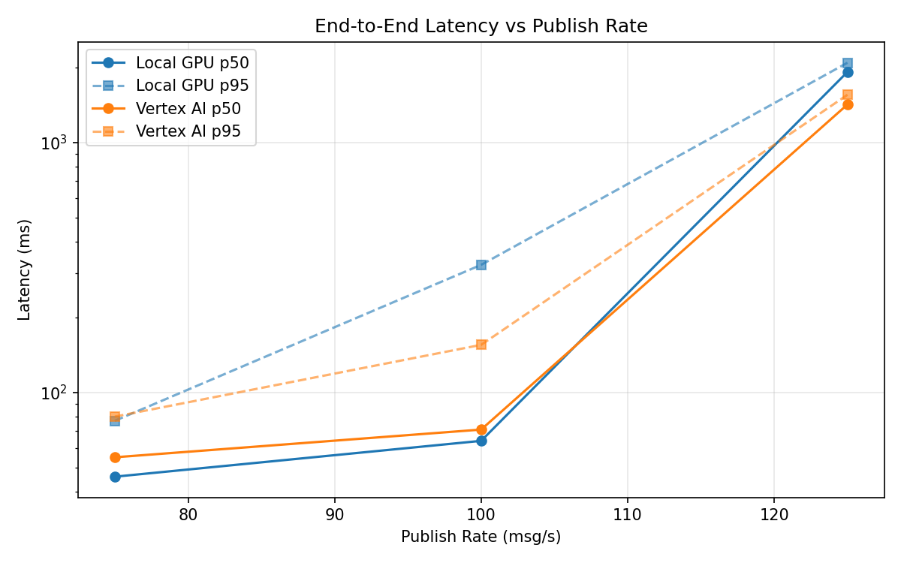
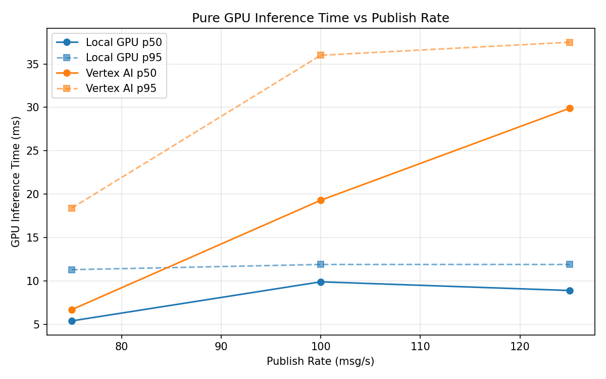
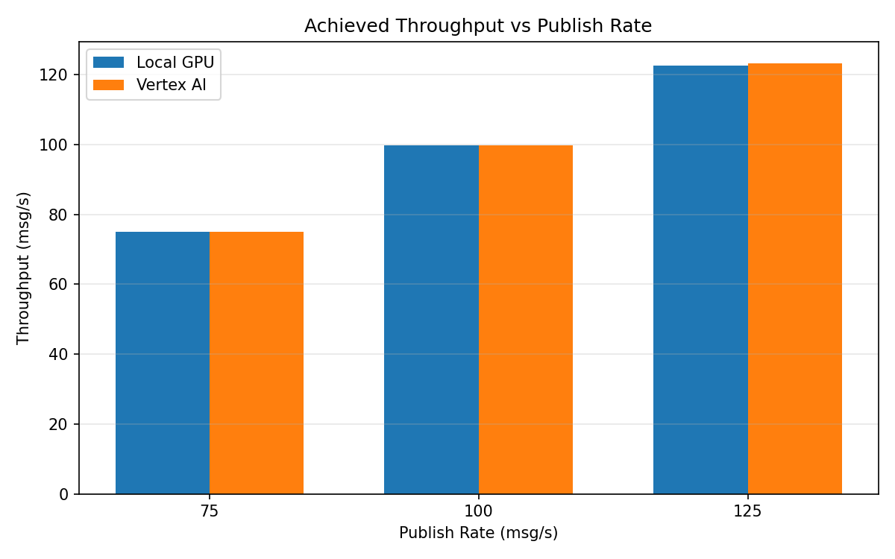

# Benchmark Report

Generated: 2026-03-08 08:41:08

## Configuration

| Parameter | Value |
|---|---|
| Messages per phase | 100s per phase |
| Rates (msg/s) | 75, 100, 125 |
| Experiments | Local GPU, Vertex AI |

## Throughput

| Rate (msg/s) | Local GPU | Vertex AI |
|---|---|---|
| 75 | 75.0 | 75.0 |
| 100 | 99.9 | 99.9 |
| 125 | 122.6 | 123.3 |

## End-to-End Latency (ms)

| Rate | Percentile | Local GPU | Vertex AI |
|---|---|---|---|
| 75 | p50 | 46.0 | 55.0 |
| 75 | p95 | 77.0 | 80.0 |
| 75 | p99 | 351.0 | 271.0 |
| 100 | p50 | 64.0 | 71.0 |
| 100 | p95 | 324.0 | 155.0 |
| 100 | p99 | 512.0 | 263.0 |
| 125 | p50 | 1917.0 | 1420.0 |
| 125 | p95 | 2086.0 | 1553.0 |
| 125 | p99 | 2135.0 | 1609.0 |

## GPU Inference Time (ms)

| Rate | Percentile | Local GPU | Vertex AI |
|---|---|---|---|
| 75 | p50 | 5.4 | 6.7 |
| 75 | p95 | 11.3 | 18.4 |
| 75 | p99 | 12.2 | 31.6 |
| 100 | p50 | 9.9 | 19.3 |
| 100 | p95 | 11.9 | 36.0 |
| 100 | p99 | 12.7 | 46.2 |
| 125 | p50 | 8.9 | 29.9 |
| 125 | p95 | 11.9 | 37.5 |
| 125 | p99 | 12.8 | 47.0 |

## Charts

### Latency vs Publish Rate

### GPU Inference Time vs Publish Rate

### Throughput vs Publish Rate

