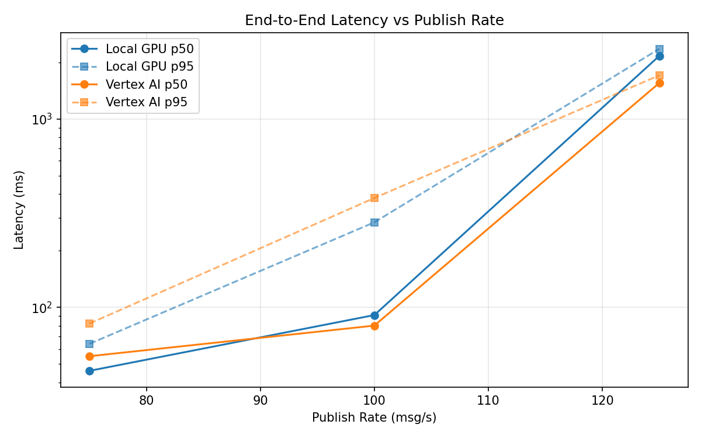
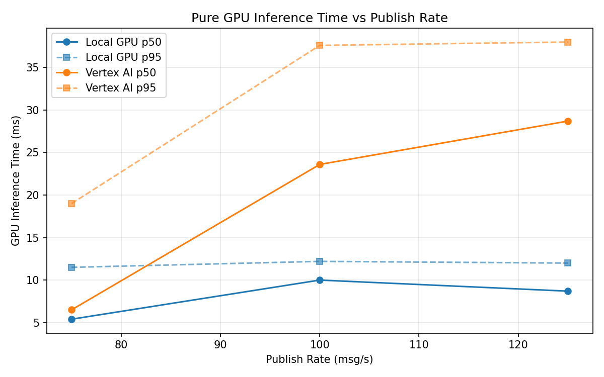
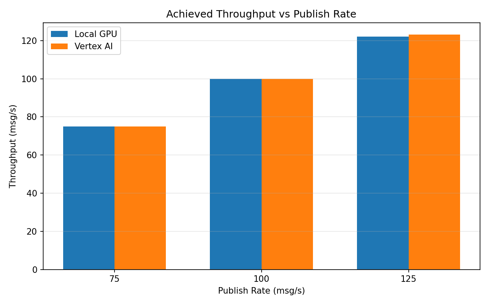

# Benchmark Report

Generated: 2026-03-08 08:03:04

## Configuration

| Parameter | Value |
|---|---|
| Messages per phase | 100s per phase |
| Rates (msg/s) | 75, 100, 125 |
| Experiments | Local GPU, Vertex AI |

## Throughput

| Rate (msg/s) | Local GPU | Vertex AI |
|---|---|---|
| 75 | 75.0 | 75.0 |
| 100 | 99.9 | 100.0 |
| 125 | 122.2 | 123.2 |

## End-to-End Latency (ms)

| Rate | Percentile | Local GPU | Vertex AI |
|---|---|---|---|
| 75 | p50 | 46.0 | 55.0 |
| 75 | p95 | 64.0 | 82.0 |
| 75 | p99 | 115.0 | 157.0 |
| 100 | p50 | 91.0 | 80.0 |
| 100 | p95 | 283.0 | 381.0 |
| 100 | p99 | 326.0 | 688.0 |
| 125 | p50 | 2168.0 | 1557.0 |
| 125 | p95 | 2363.0 | 1709.0 |
| 125 | p99 | 2443.0 | 1761.0 |

## GPU Inference Time (ms)

| Rate | Percentile | Local GPU | Vertex AI |
|---|---|---|---|
| 75 | p50 | 5.4 | 6.5 |
| 75 | p95 | 11.5 | 19.0 |
| 75 | p99 | 12.7 | 31.5 |
| 100 | p50 | 10.0 | 23.6 |
| 100 | p95 | 12.2 | 37.6 |
| 100 | p99 | 13.2 | 48.5 |
| 125 | p50 | 8.7 | 28.7 |
| 125 | p95 | 12.0 | 38.0 |
| 125 | p99 | 13.1 | 49.0 |

## Charts

### Latency vs Publish Rate

### GPU Inference Time vs Publish Rate

### Throughput vs Publish Rate

