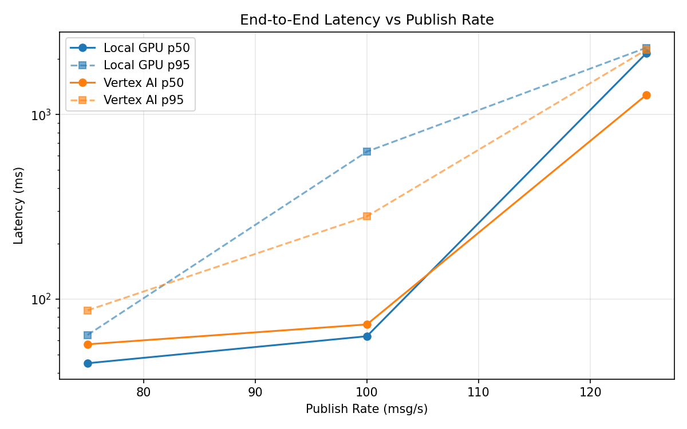
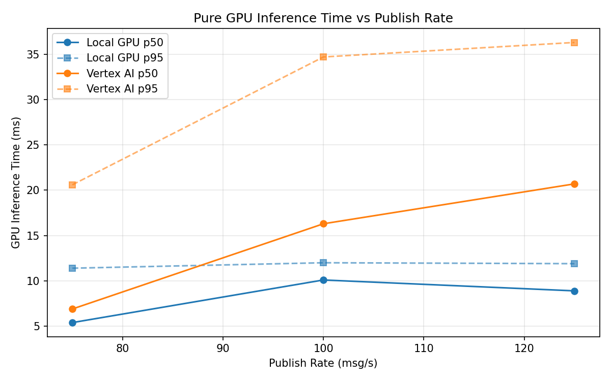
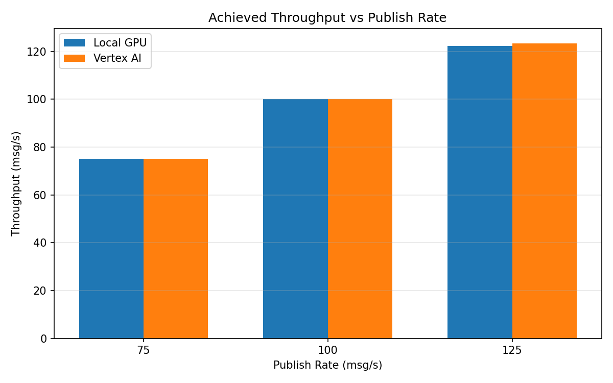

# Benchmark Report

Generated: 2026-03-08 08:53:26

## Configuration

| Parameter | Value |
|---|---|
| Messages per phase | 100s per phase |
| Rates (msg/s) | 75, 100, 125 |
| Experiments | Local GPU, Vertex AI |

## Throughput

| Rate (msg/s) | Local GPU | Vertex AI |
|---|---|---|
| 75 | 75.0 | 75.0 |
| 100 | 100.0 | 100.0 |
| 125 | 122.4 | 123.4 |

## End-to-End Latency (ms)

| Rate | Percentile | Local GPU | Vertex AI |
|---|---|---|---|
| 75 | p50 | 45.0 | 57.0 |
| 75 | p95 | 64.0 | 87.0 |
| 75 | p99 | 471.0 | 306.0 |
| 100 | p50 | 63.0 | 73.0 |
| 100 | p95 | 630.0 | 281.0 |
| 100 | p99 | 1069.0 | 727.0 |
| 125 | p50 | 2146.5 | 1277.0 |
| 125 | p95 | 2300.0 | 2244.0 |
| 125 | p99 | 2338.0 | 2563.0 |

## GPU Inference Time (ms)

| Rate | Percentile | Local GPU | Vertex AI |
|---|---|---|---|
| 75 | p50 | 5.4 | 6.9 |
| 75 | p95 | 11.4 | 20.6 |
| 75 | p99 | 12.4 | 30.8 |
| 100 | p50 | 10.1 | 16.3 |
| 100 | p95 | 12.0 | 34.7 |
| 100 | p99 | 12.9 | 45.8 |
| 125 | p50 | 8.9 | 20.7 |
| 125 | p95 | 11.9 | 36.3 |
| 125 | p99 | 12.7 | 46.0 |

## Charts

### Latency vs Publish Rate

### GPU Inference Time vs Publish Rate

### Throughput vs Publish Rate

