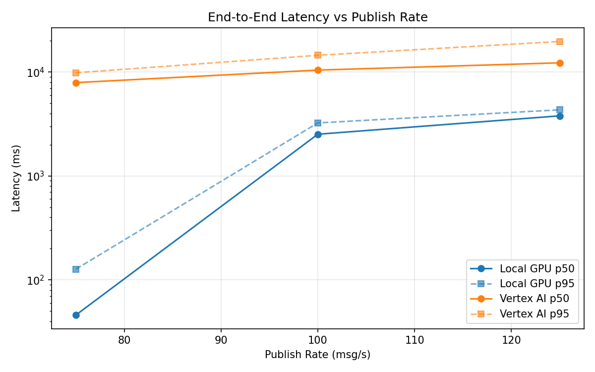
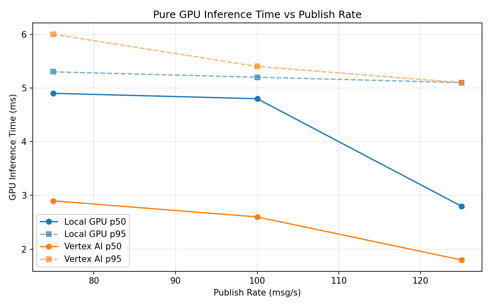
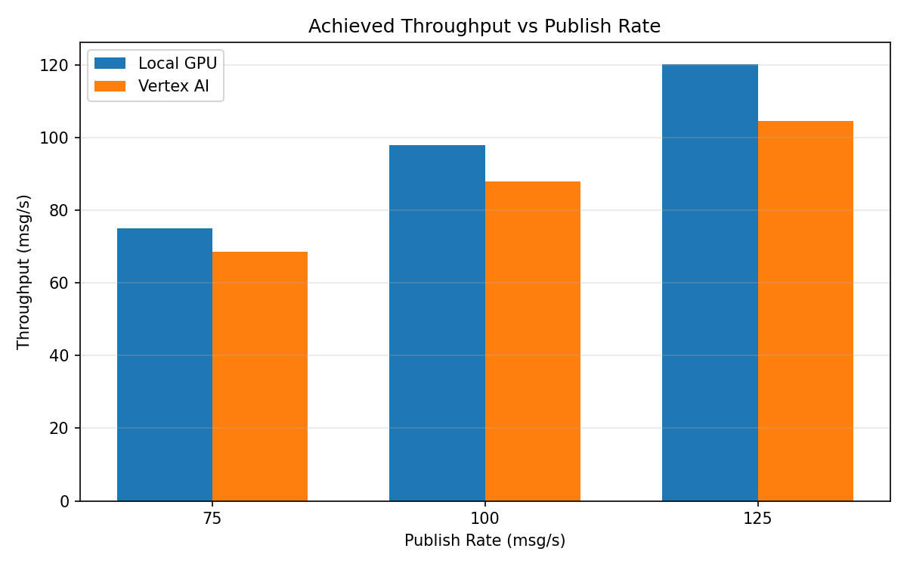

# Benchmark Report

Generated: 2026-03-08 03:26:10

## Configuration

| Parameter | Value |
|---|---|
| Messages per phase | 100s per phase |
| Rates (msg/s) | 75, 100, 125 |
| Experiments | Local GPU, Vertex AI |

## Throughput

| Rate (msg/s) | Local GPU | Vertex AI |
|---|---|---|
| 75 | 75.0 | 68.6 |
| 100 | 97.9 | 88.0 |
| 125 | 120.2 | 104.6 |

## End-to-End Latency (ms)

| Rate | Percentile | Local GPU | Vertex AI |
|---|---|---|---|
| 75 | p50 | 46.0 | 7918.5 |
| 75 | p95 | 127.0 | 9849.0 |
| 75 | p99 | 380.0 | 9975.0 |
| 100 | p50 | 2523.0 | 10450.0 |
| 100 | p95 | 3243.0 | 14503.1 |
| 100 | p99 | 3393.0 | 14755.0 |
| 125 | p50 | 3792.0 | 12276.5 |
| 125 | p95 | 4333.0 | 19709.0 |
| 125 | p99 | 4374.0 | 20209.0 |

## GPU Inference Time (ms)

| Rate | Percentile | Local GPU | Vertex AI |
|---|---|---|---|
| 75 | p50 | 4.9 | 2.9 |
| 75 | p95 | 5.3 | 6.0 |
| 75 | p99 | 6.3 | 8.1 |
| 100 | p50 | 4.8 | 2.6 |
| 100 | p95 | 5.2 | 5.4 |
| 100 | p99 | 6.1 | 7.1 |
| 125 | p50 | 2.8 | 1.8 |
| 125 | p95 | 5.1 | 5.1 |
| 125 | p99 | 6.0 | 6.5 |

## Charts

### Latency vs Publish Rate

### GPU Inference Time vs Publish Rate

### Throughput vs Publish Rate

