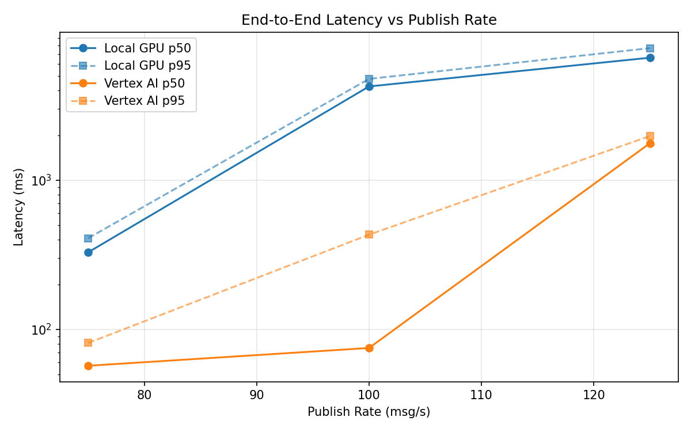
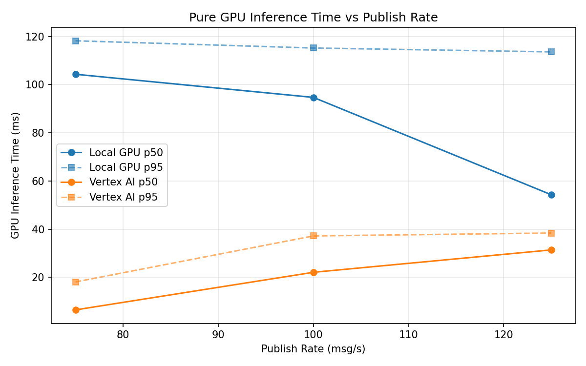
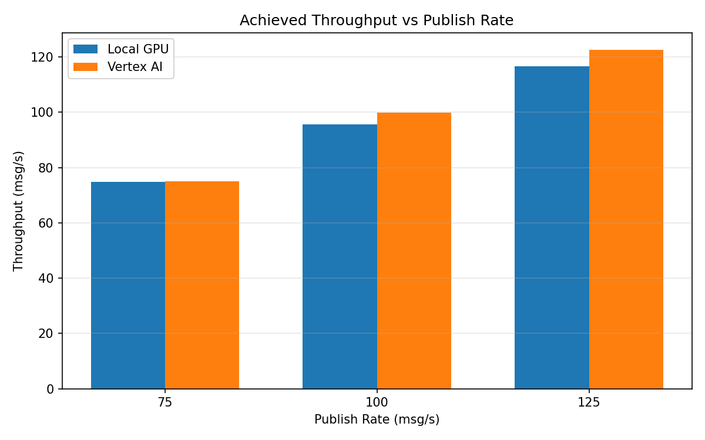

# Benchmark Report

Generated: 2026-03-08 05:21:08

## Configuration

| Parameter | Value |
|---|---|
| Messages per phase | 100s per phase |
| Rates (msg/s) | 75, 100, 125 |
| Experiments | Local GPU, Vertex AI |

## Throughput

| Rate (msg/s) | Local GPU | Vertex AI |
|---|---|---|
| 75 | 74.8 | 75.0 |
| 100 | 95.7 | 99.9 |
| 125 | 116.7 | 122.6 |

## End-to-End Latency (ms)

| Rate | Percentile | Local GPU | Vertex AI |
|---|---|---|---|
| 75 | p50 | 328.0 | 57.0 |
| 75 | p95 | 408.0 | 81.0 |
| 75 | p99 | 503.0 | 131.0 |
| 100 | p50 | 4246.0 | 75.0 |
| 100 | p95 | 4771.0 | 431.0 |
| 100 | p99 | 4870.0 | 846.0 |
| 125 | p50 | 6617.0 | 1768.0 |
| 125 | p95 | 7669.0 | 1976.0 |
| 125 | p99 | 7813.0 | 2054.0 |

## GPU Inference Time (ms)

| Rate | Percentile | Local GPU | Vertex AI |
|---|---|---|---|
| 75 | p50 | 104.3 | 6.5 |
| 75 | p95 | 118.2 | 18.1 |
| 75 | p99 | 124.2 | 31.8 |
| 100 | p50 | 94.7 | 22.1 |
| 100 | p95 | 115.2 | 37.2 |
| 100 | p99 | 121.7 | 47.3 |
| 125 | p50 | 54.3 | 31.4 |
| 125 | p95 | 113.6 | 38.4 |
| 125 | p99 | 120.4 | 48.1 |

## Charts

### Latency vs Publish Rate

### GPU Inference Time vs Publish Rate

### Throughput vs Publish Rate

