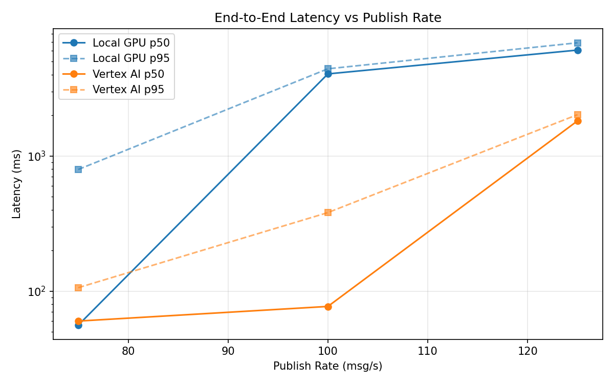
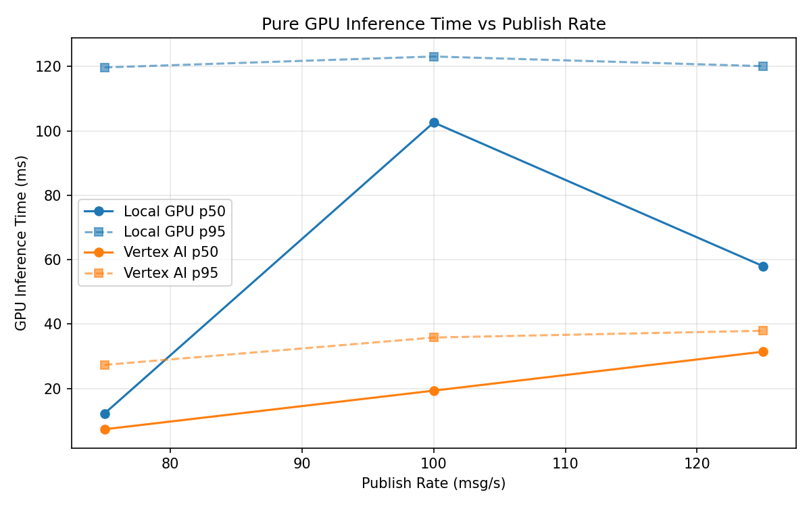
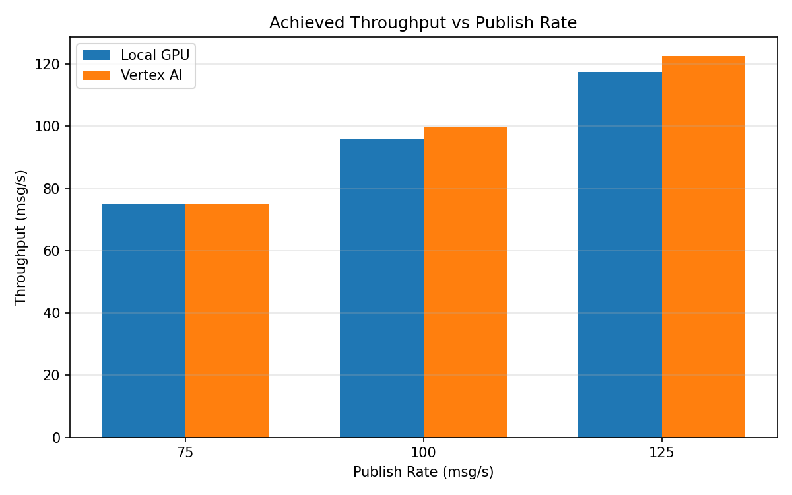

# Benchmark Report

Generated: 2026-03-08 05:33:32

## Configuration

| Parameter | Value |
|---|---|
| Messages per phase | 100s per phase |
| Rates (msg/s) | 75, 100, 125 |
| Experiments | Local GPU, Vertex AI |

## Throughput

| Rate (msg/s) | Local GPU | Vertex AI |
|---|---|---|
| 75 | 75.0 | 75.0 |
| 100 | 96.1 | 99.9 |
| 125 | 117.4 | 122.6 |

## End-to-End Latency (ms)

| Rate | Percentile | Local GPU | Vertex AI |
|---|---|---|---|
| 75 | p50 | 56.0 | 60.0 |
| 75 | p95 | 794.0 | 106.0 |
| 75 | p99 | 1146.0 | 830.0 |
| 100 | p50 | 4047.0 | 77.0 |
| 100 | p95 | 4414.0 | 381.0 |
| 100 | p99 | 4504.0 | 662.0 |
| 125 | p50 | 6071.0 | 1818.0 |
| 125 | p95 | 6875.0 | 2021.0 |
| 125 | p99 | 7016.0 | 2097.0 |

## GPU Inference Time (ms)

| Rate | Percentile | Local GPU | Vertex AI |
|---|---|---|---|
| 75 | p50 | 12.2 | 7.3 |
| 75 | p95 | 119.7 | 27.3 |
| 75 | p99 | 127.8 | 34.3 |
| 100 | p50 | 102.6 | 19.3 |
| 100 | p95 | 123.1 | 35.8 |
| 100 | p99 | 131.0 | 44.2 |
| 125 | p50 | 58.0 | 31.4 |
| 125 | p95 | 120.1 | 37.9 |
| 125 | p99 | 127.3 | 46.4 |

## Charts

### Latency vs Publish Rate

### GPU Inference Time vs Publish Rate

### Throughput vs Publish Rate

