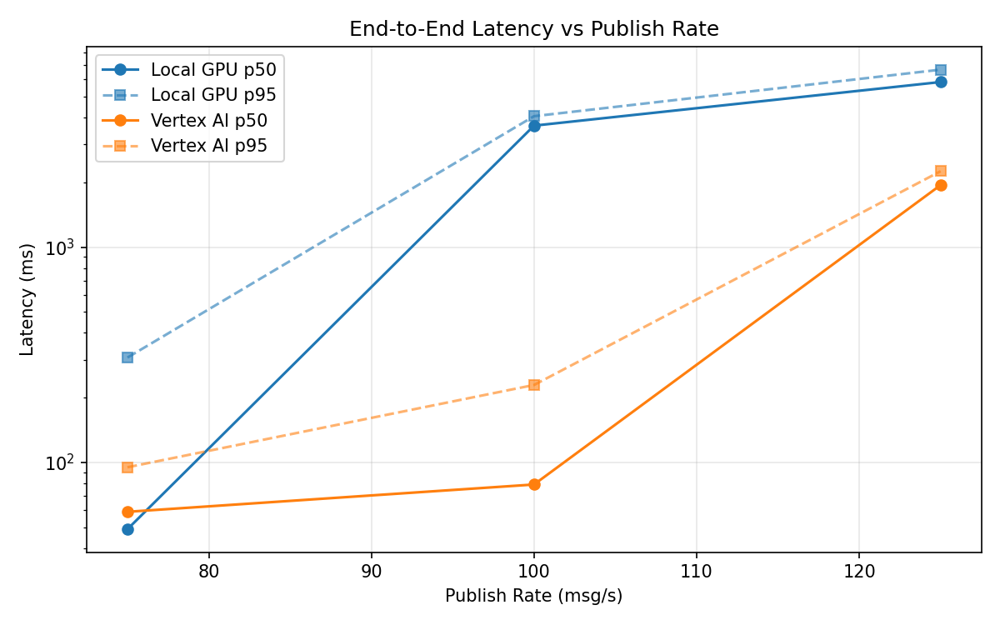
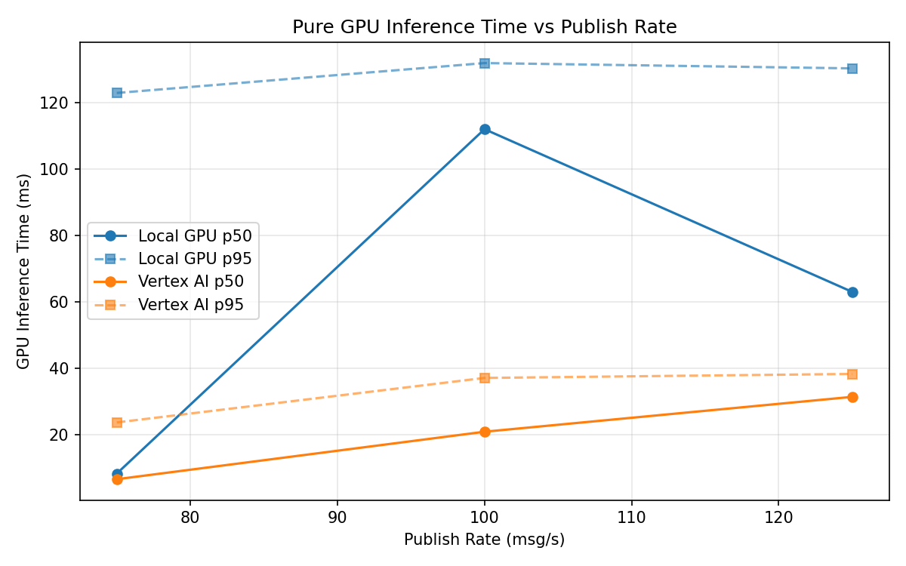
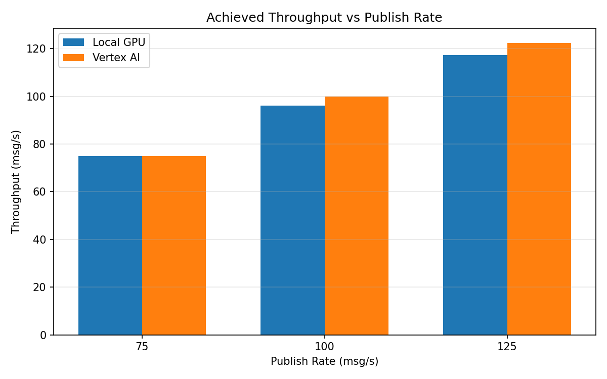

# Benchmark Report

Generated: 2026-03-08 05:46:25

## Configuration

| Parameter | Value |
|---|---|
| Messages per phase | 100s per phase |
| Rates (msg/s) | 75, 100, 125 |
| Experiments | Local GPU, Vertex AI |

## Throughput

| Rate (msg/s) | Local GPU | Vertex AI |
|---|---|---|
| 75 | 74.9 | 75.0 |
| 100 | 96.2 | 99.9 |
| 125 | 117.2 | 122.4 |

## End-to-End Latency (ms)

| Rate | Percentile | Local GPU | Vertex AI |
|---|---|---|---|
| 75 | p50 | 49.0 | 59.0 |
| 75 | p95 | 307.0 | 95.0 |
| 75 | p99 | 519.0 | 575.0 |
| 100 | p50 | 3665.0 | 79.0 |
| 100 | p95 | 4055.0 | 229.0 |
| 100 | p99 | 4155.0 | 354.0 |
| 125 | p50 | 5843.0 | 1941.0 |
| 125 | p95 | 6670.0 | 2251.0 |
| 125 | p99 | 6817.0 | 2362.0 |

## GPU Inference Time (ms)

| Rate | Percentile | Local GPU | Vertex AI |
|---|---|---|---|
| 75 | p50 | 8.4 | 6.7 |
| 75 | p95 | 123.0 | 23.8 |
| 75 | p99 | 132.9 | 34.0 |
| 100 | p50 | 112.1 | 21.0 |
| 100 | p95 | 132.0 | 37.2 |
| 100 | p99 | 139.7 | 46.6 |
| 125 | p50 | 63.1 | 31.5 |
| 125 | p95 | 130.4 | 38.4 |
| 125 | p99 | 138.8 | 47.7 |

## Charts

### Latency vs Publish Rate

### GPU Inference Time vs Publish Rate

### Throughput vs Publish Rate

