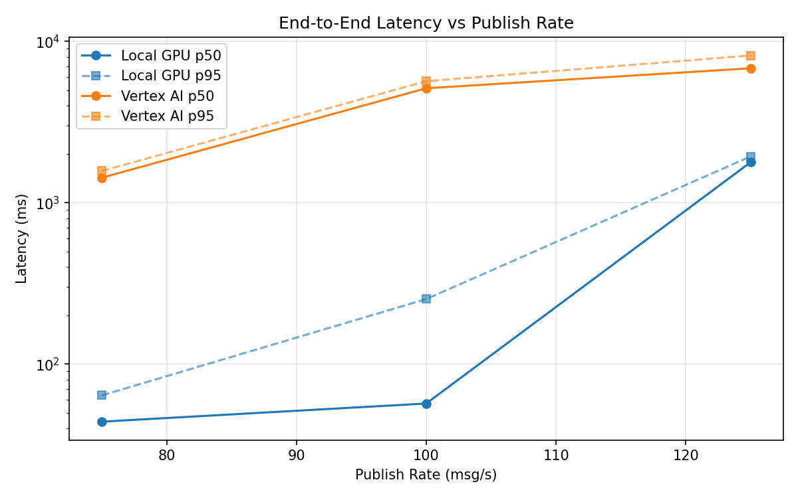
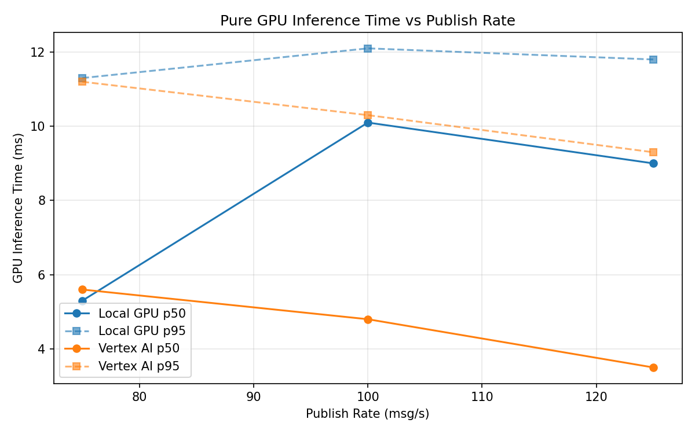
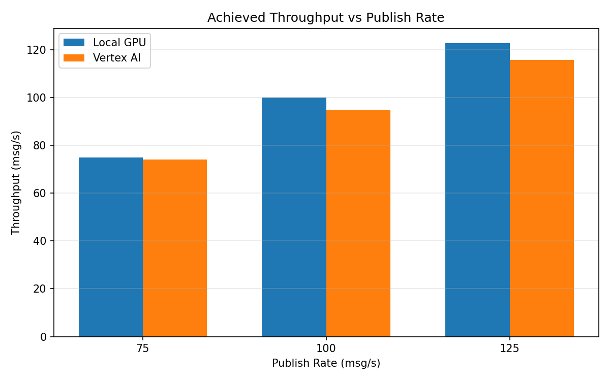

# Benchmark Report

Generated: 2026-03-08 03:38:33

## Configuration

| Parameter | Value |
|---|---|
| Messages per phase | 100s per phase |
| Rates (msg/s) | 75, 100, 125 |
| Experiments | Local GPU, Vertex AI |

## Throughput

| Rate (msg/s) | Local GPU | Vertex AI |
|---|---|---|
| 75 | 75.0 | 74.0 |
| 100 | 100.0 | 94.8 |
| 125 | 122.8 | 115.8 |

## End-to-End Latency (ms)

| Rate | Percentile | Local GPU | Vertex AI |
|---|---|---|---|
| 75 | p50 | 44.0 | 1430.0 |
| 75 | p95 | 64.0 | 1575.0 |
| 75 | p99 | 313.0 | 1613.0 |
| 100 | p50 | 57.0 | 5125.0 |
| 100 | p95 | 253.0 | 5669.0 |
| 100 | p99 | 422.0 | 5743.0 |
| 125 | p50 | 1783.0 | 6812.5 |
| 125 | p95 | 1937.0 | 8179.0 |
| 125 | p99 | 1973.0 | 8283.0 |

## GPU Inference Time (ms)

| Rate | Percentile | Local GPU | Vertex AI |
|---|---|---|---|
| 75 | p50 | 5.3 | 5.6 |
| 75 | p95 | 11.3 | 11.2 |
| 75 | p99 | 12.4 | 13.6 |
| 100 | p50 | 10.1 | 4.8 |
| 100 | p95 | 12.1 | 10.3 |
| 100 | p99 | 13.1 | 12.5 |
| 125 | p50 | 9.0 | 3.5 |
| 125 | p95 | 11.8 | 9.3 |
| 125 | p99 | 12.9 | 11.8 |

## Charts

### Latency vs Publish Rate

### GPU Inference Time vs Publish Rate

### Throughput vs Publish Rate

