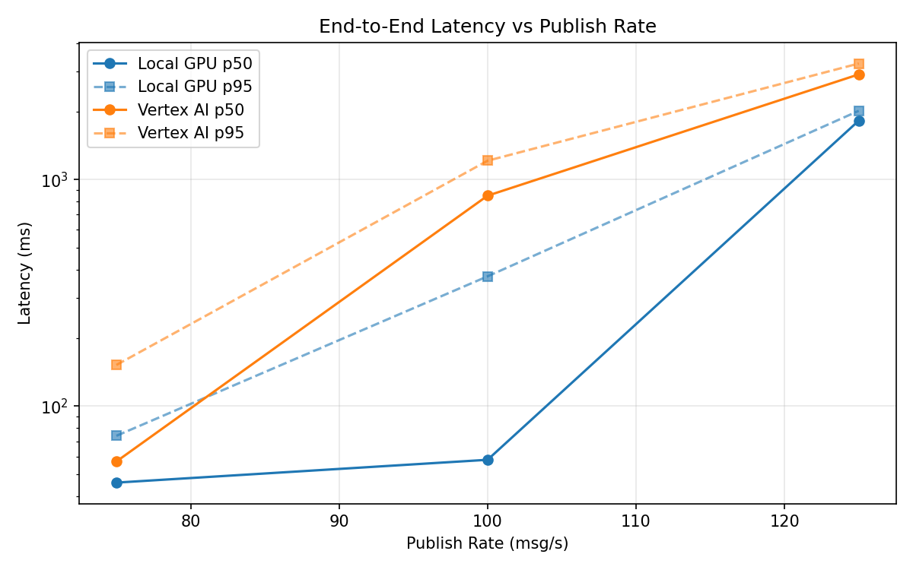
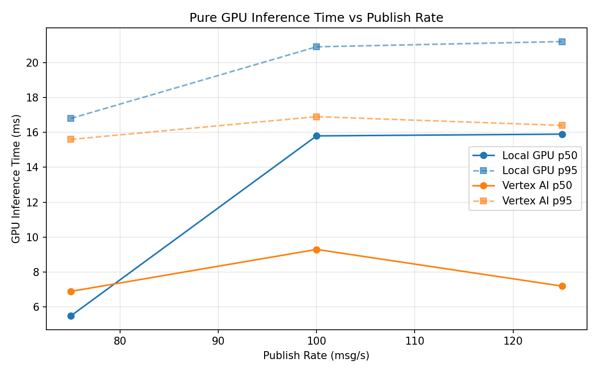
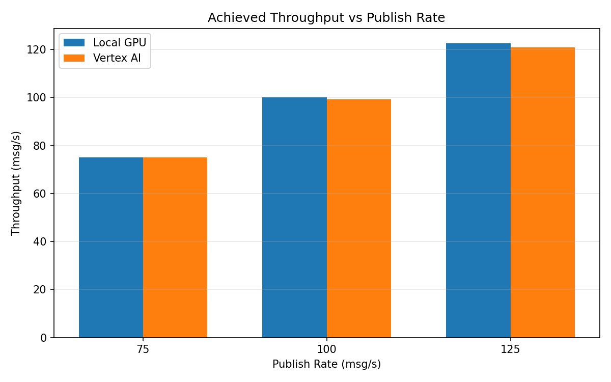

# Benchmark Report

Generated: 2026-03-08 03:50:36

## Configuration

| Parameter | Value |
|---|---|
| Messages per phase | 100s per phase |
| Rates (msg/s) | 75, 100, 125 |
| Experiments | Local GPU, Vertex AI |

## Throughput

| Rate (msg/s) | Local GPU | Vertex AI |
|---|---|---|
| 75 | 75.0 | 75.0 |
| 100 | 100.0 | 99.2 |
| 125 | 122.6 | 120.9 |

## End-to-End Latency (ms)

| Rate | Percentile | Local GPU | Vertex AI |
|---|---|---|---|
| 75 | p50 | 46.0 | 57.0 |
| 75 | p95 | 74.0 | 152.0 |
| 75 | p99 | 459.0 | 456.0 |
| 100 | p50 | 58.0 | 849.0 |
| 100 | p95 | 374.1 | 1211.0 |
| 100 | p99 | 815.0 | 1258.0 |
| 125 | p50 | 1820.0 | 2912.0 |
| 125 | p95 | 2011.0 | 3252.0 |
| 125 | p99 | 2050.0 | 3401.0 |

## GPU Inference Time (ms)

| Rate | Percentile | Local GPU | Vertex AI |
|---|---|---|---|
| 75 | p50 | 5.5 | 6.9 |
| 75 | p95 | 16.8 | 15.6 |
| 75 | p99 | 20.2 | 19.5 |
| 100 | p50 | 15.8 | 9.3 |
| 100 | p95 | 20.9 | 16.9 |
| 100 | p99 | 22.8 | 22.3 |
| 125 | p50 | 15.9 | 7.2 |
| 125 | p95 | 21.2 | 16.4 |
| 125 | p99 | 23.3 | 20.8 |

## Charts

### Latency vs Publish Rate

### GPU Inference Time vs Publish Rate

### Throughput vs Publish Rate

