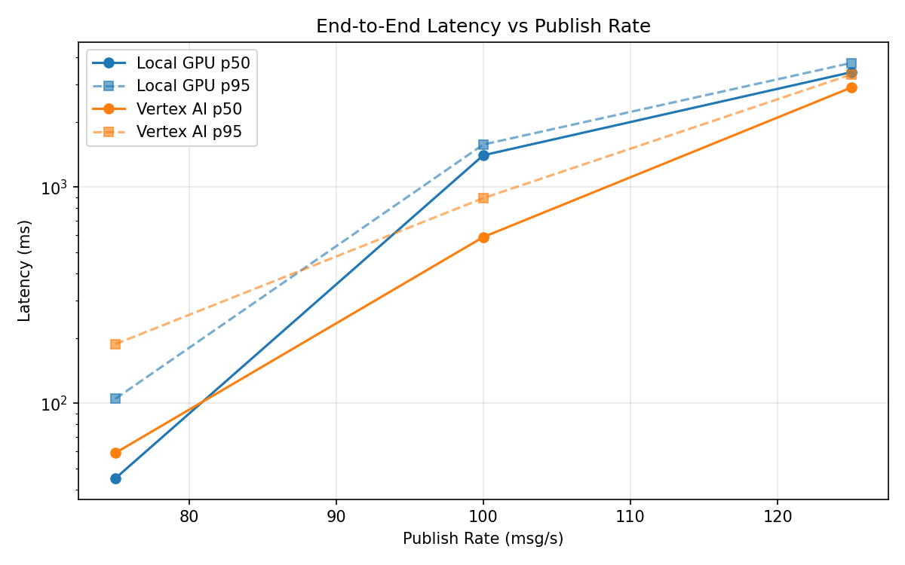
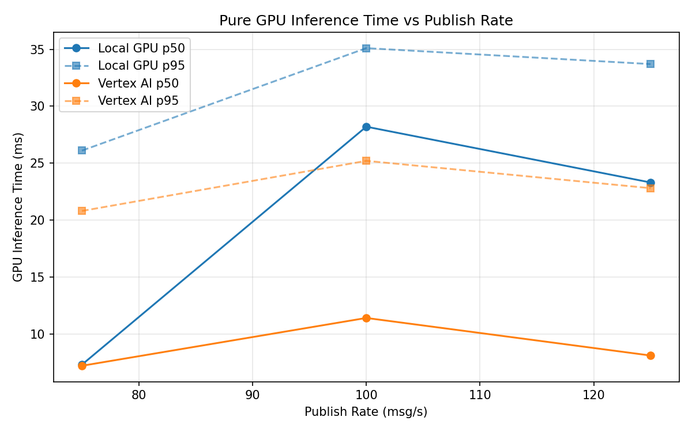
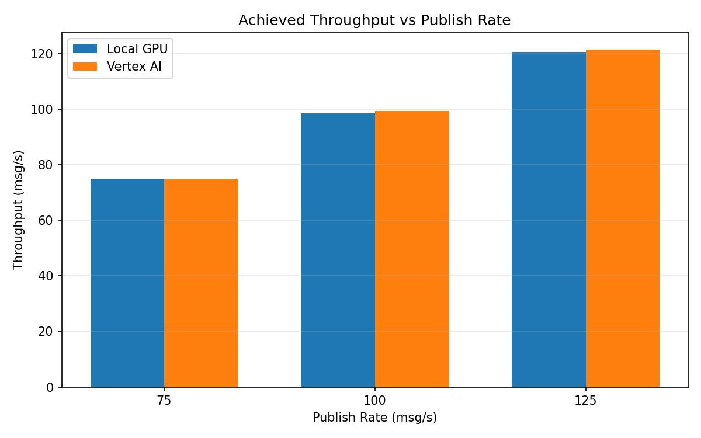

# Benchmark Report

Generated: 2026-03-08 04:03:29

## Configuration

| Parameter | Value |
|---|---|
| Messages per phase | 100s per phase |
| Rates (msg/s) | 75, 100, 125 |
| Experiments | Local GPU, Vertex AI |

## Throughput

| Rate (msg/s) | Local GPU | Vertex AI |
|---|---|---|
| 75 | 75.0 | 75.0 |
| 100 | 98.6 | 99.4 |
| 125 | 120.6 | 121.5 |

## End-to-End Latency (ms)

| Rate | Percentile | Local GPU | Vertex AI |
|---|---|---|---|
| 75 | p50 | 45.0 | 59.0 |
| 75 | p95 | 105.0 | 188.0 |
| 75 | p99 | 548.0 | 342.0 |
| 100 | p50 | 1405.0 | 588.0 |
| 100 | p95 | 1575.0 | 890.0 |
| 100 | p99 | 1623.0 | 959.0 |
| 125 | p50 | 3401.0 | 2888.5 |
| 125 | p95 | 3754.0 | 3319.0 |
| 125 | p99 | 3819.0 | 3402.0 |

## GPU Inference Time (ms)

| Rate | Percentile | Local GPU | Vertex AI |
|---|---|---|---|
| 75 | p50 | 7.3 | 7.2 |
| 75 | p95 | 26.1 | 20.8 |
| 75 | p99 | 32.7 | 27.6 |
| 100 | p50 | 28.2 | 11.4 |
| 100 | p95 | 35.1 | 25.2 |
| 100 | p99 | 37.7 | 31.0 |
| 125 | p50 | 23.3 | 8.1 |
| 125 | p95 | 33.7 | 22.8 |
| 125 | p99 | 36.9 | 28.6 |

## Charts

### Latency vs Publish Rate

### GPU Inference Time vs Publish Rate

### Throughput vs Publish Rate

