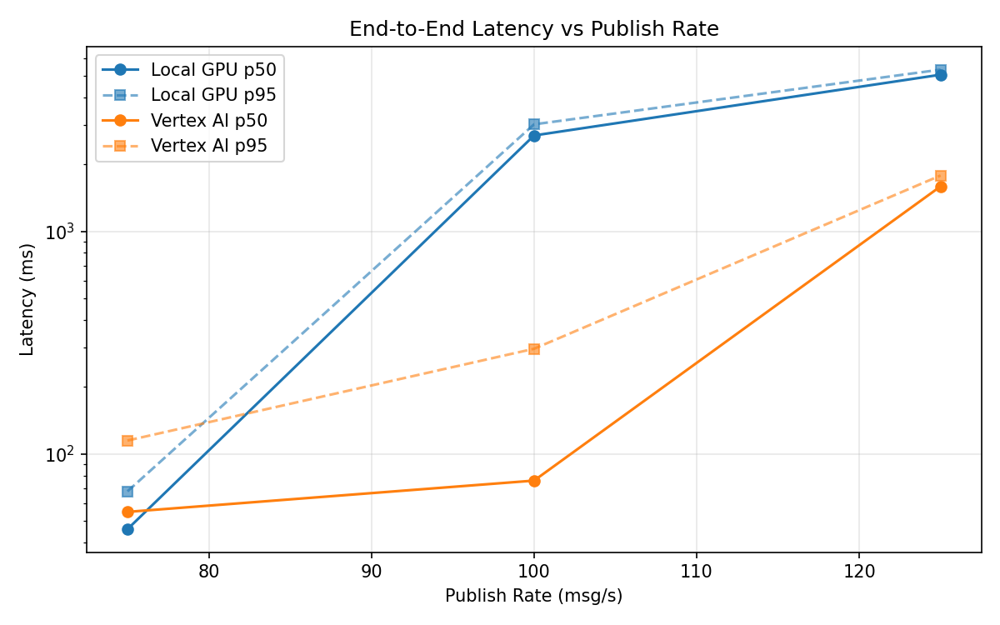
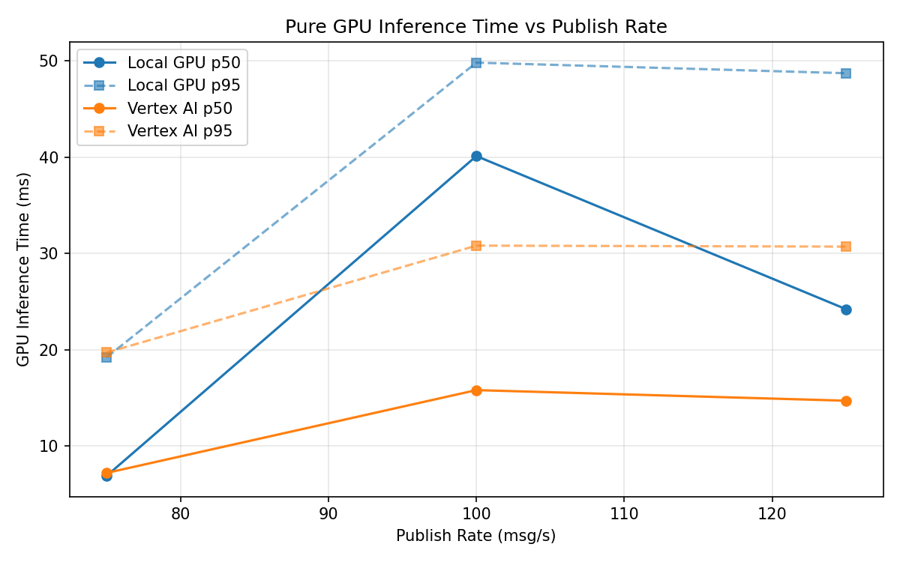
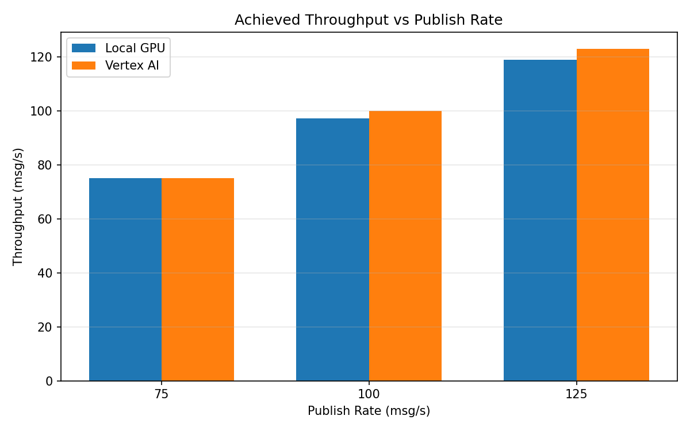

# Benchmark Report

Generated: 2026-03-08 04:17:47

## Configuration

| Parameter | Value |
|---|---|
| Messages per phase | 100s per phase |
| Rates (msg/s) | 75, 100, 125 |
| Experiments | Local GPU, Vertex AI |

## Throughput

| Rate (msg/s) | Local GPU | Vertex AI |
|---|---|---|
| 75 | 75.0 | 75.0 |
| 100 | 97.2 | 99.9 |
| 125 | 118.8 | 122.9 |

## End-to-End Latency (ms)

| Rate | Percentile | Local GPU | Vertex AI |
|---|---|---|---|
| 75 | p50 | 46.0 | 55.0 |
| 75 | p95 | 68.0 | 115.0 |
| 75 | p99 | 134.0 | 510.1 |
| 100 | p50 | 2693.5 | 76.0 |
| 100 | p95 | 3022.0 | 297.0 |
| 100 | p99 | 3095.0 | 758.0 |
| 125 | p50 | 5049.0 | 1592.0 |
| 125 | p95 | 5320.0 | 1781.0 |
| 125 | p99 | 5371.0 | 1824.0 |

## GPU Inference Time (ms)

| Rate | Percentile | Local GPU | Vertex AI |
|---|---|---|---|
| 75 | p50 | 6.9 | 7.2 |
| 75 | p95 | 19.2 | 19.7 |
| 75 | p99 | 42.4 | 29.5 |
| 100 | p50 | 40.1 | 15.8 |
| 100 | p95 | 49.8 | 30.8 |
| 100 | p99 | 53.0 | 38.3 |
| 125 | p50 | 24.2 | 14.7 |
| 125 | p95 | 48.7 | 30.7 |
| 125 | p99 | 52.5 | 37.5 |

## Charts

### Latency vs Publish Rate

### GPU Inference Time vs Publish Rate

### Throughput vs Publish Rate

