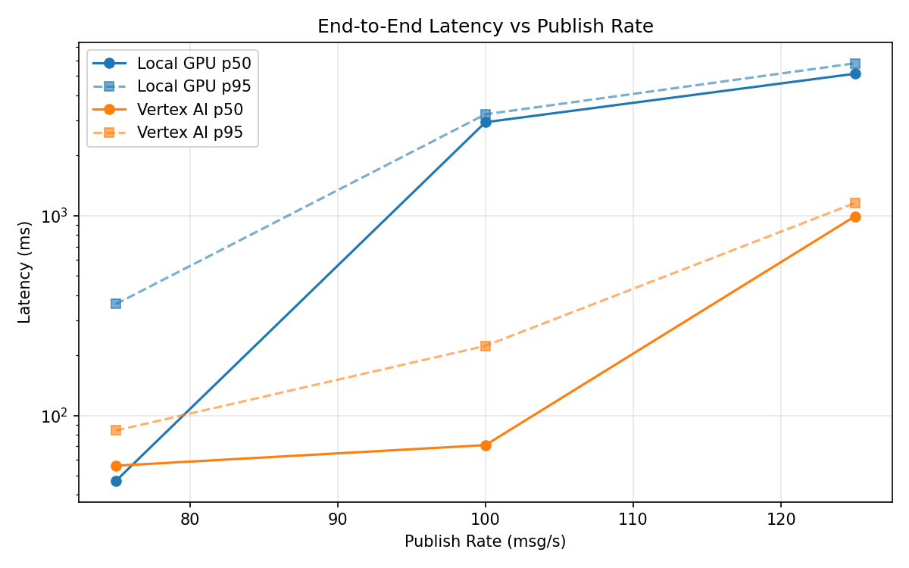
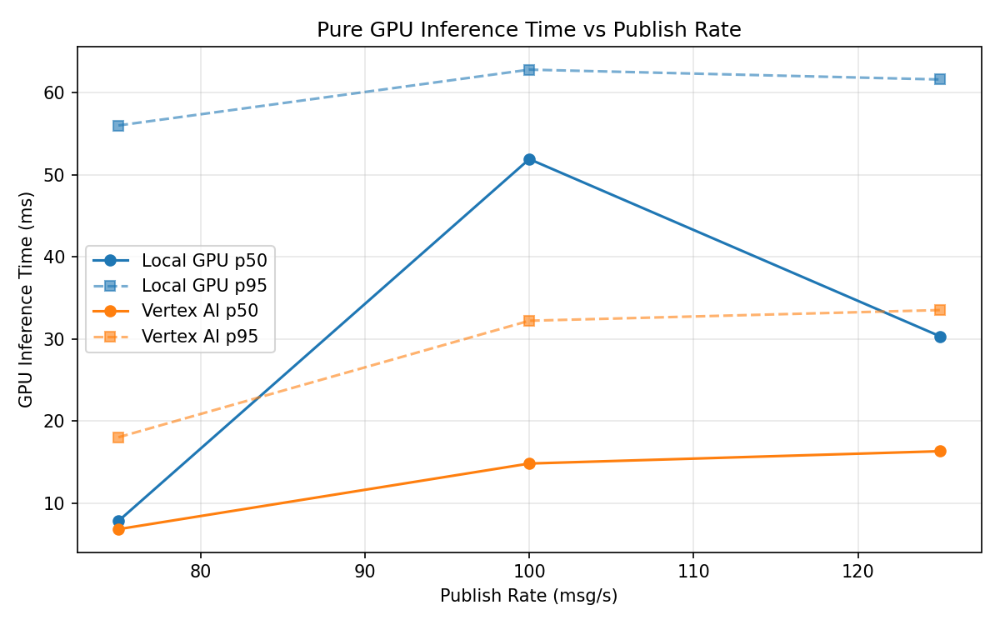
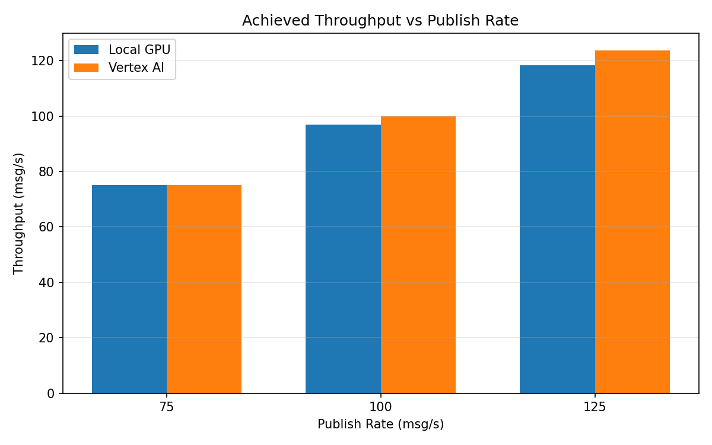

# Benchmark Report

Generated: 2026-03-08 04:29:55

## Configuration

| Parameter | Value |
|---|---|
| Messages per phase | 100s per phase |
| Rates (msg/s) | 75, 100, 125 |
| Experiments | Local GPU, Vertex AI |

## Throughput

| Rate (msg/s) | Local GPU | Vertex AI |
|---|---|---|
| 75 | 75.0 | 75.0 |
| 100 | 97.0 | 100.0 |
| 125 | 118.4 | 123.7 |

## End-to-End Latency (ms)

| Rate | Percentile | Local GPU | Vertex AI |
|---|---|---|---|
| 75 | p50 | 47.0 | 56.0 |
| 75 | p95 | 361.0 | 84.0 |
| 75 | p99 | 703.0 | 207.0 |
| 100 | p50 | 2937.0 | 71.0 |
| 100 | p95 | 3218.0 | 223.0 |
| 100 | p99 | 3306.0 | 487.0 |
| 125 | p50 | 5135.0 | 993.0 |
| 125 | p95 | 5792.0 | 1157.0 |
| 125 | p99 | 5857.0 | 1218.0 |

## GPU Inference Time (ms)

| Rate | Percentile | Local GPU | Vertex AI |
|---|---|---|---|
| 75 | p50 | 7.8 | 6.8 |
| 75 | p95 | 56.0 | 18.0 |
| 75 | p99 | 62.5 | 30.2 |
| 100 | p50 | 51.9 | 14.8 |
| 100 | p95 | 62.8 | 32.2 |
| 100 | p99 | 66.5 | 41.0 |
| 125 | p50 | 30.3 | 16.3 |
| 125 | p95 | 61.6 | 33.5 |
| 125 | p99 | 65.9 | 42.1 |

## Charts

### Latency vs Publish Rate

### GPU Inference Time vs Publish Rate

### Throughput vs Publish Rate

