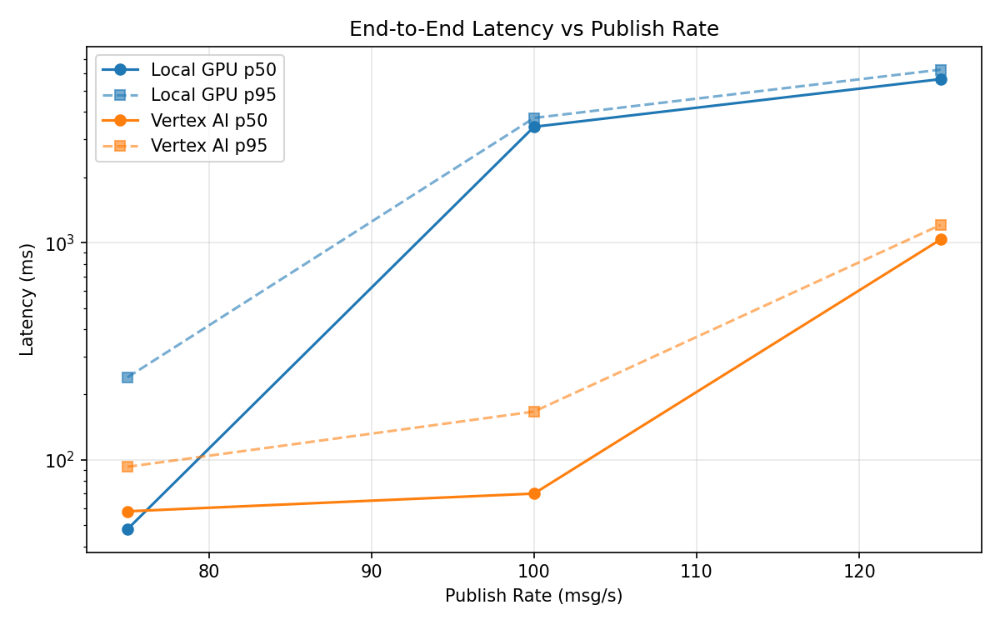
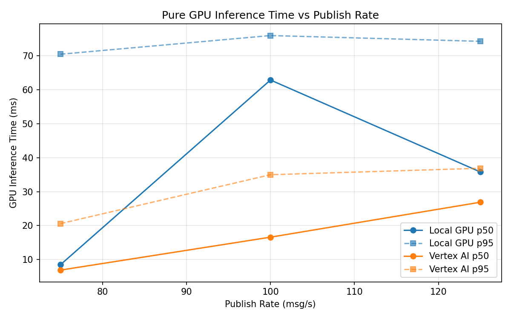
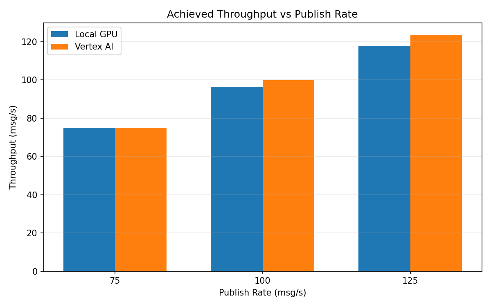

# Benchmark Report

Generated: 2026-03-08 04:42:29

## Configuration

| Parameter | Value |
|---|---|
| Messages per phase | 100s per phase |
| Rates (msg/s) | 75, 100, 125 |
| Experiments | Local GPU, Vertex AI |

## Throughput

| Rate (msg/s) | Local GPU | Vertex AI |
|---|---|---|
| 75 | 75.0 | 75.0 |
| 100 | 96.5 | 99.9 |
| 125 | 117.7 | 123.6 |

## End-to-End Latency (ms)

| Rate | Percentile | Local GPU | Vertex AI |
|---|---|---|---|
| 75 | p50 | 48.0 | 58.0 |
| 75 | p95 | 240.0 | 93.0 |
| 75 | p99 | 411.0 | 428.0 |
| 100 | p50 | 3419.0 | 70.0 |
| 100 | p95 | 3755.0 | 167.0 |
| 100 | p99 | 3802.0 | 287.0 |
| 125 | p50 | 5666.5 | 1035.0 |
| 125 | p95 | 6266.0 | 1208.0 |
| 125 | p99 | 6328.0 | 1259.0 |

## GPU Inference Time (ms)

| Rate | Percentile | Local GPU | Vertex AI |
|---|---|---|---|
| 75 | p50 | 8.5 | 6.9 |
| 75 | p95 | 70.5 | 20.6 |
| 75 | p99 | 76.0 | 32.2 |
| 100 | p50 | 62.9 | 16.6 |
| 100 | p95 | 76.0 | 35.0 |
| 100 | p99 | 80.7 | 44.8 |
| 125 | p50 | 35.8 | 26.9 |
| 125 | p95 | 74.3 | 36.9 |
| 125 | p99 | 78.9 | 46.3 |

## Charts

### Latency vs Publish Rate

### GPU Inference Time vs Publish Rate

### Throughput vs Publish Rate

