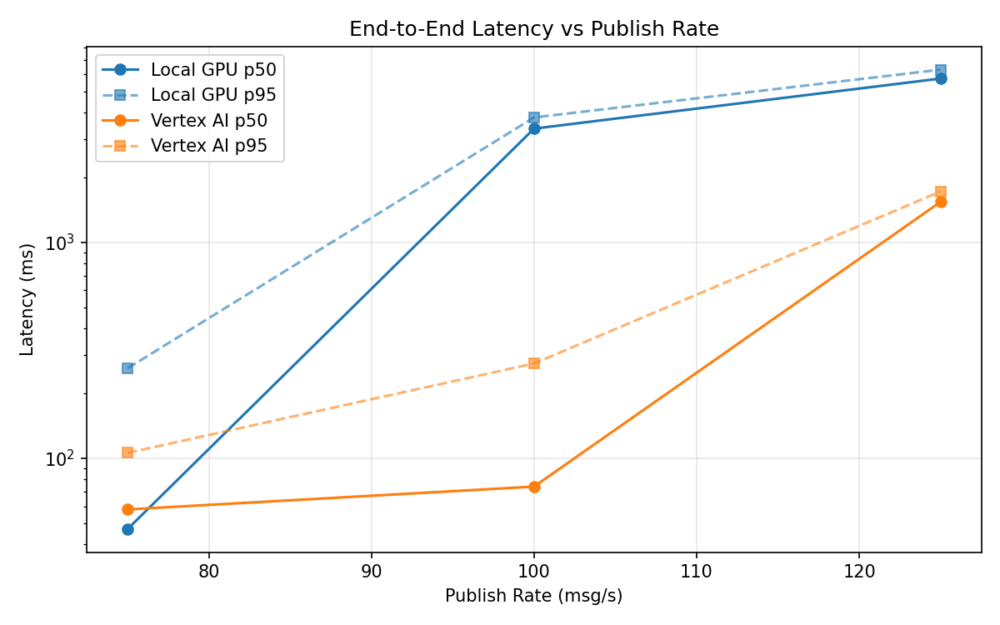
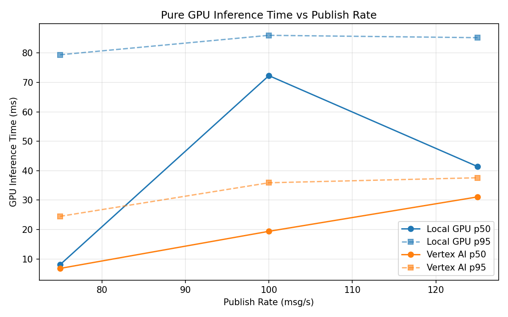
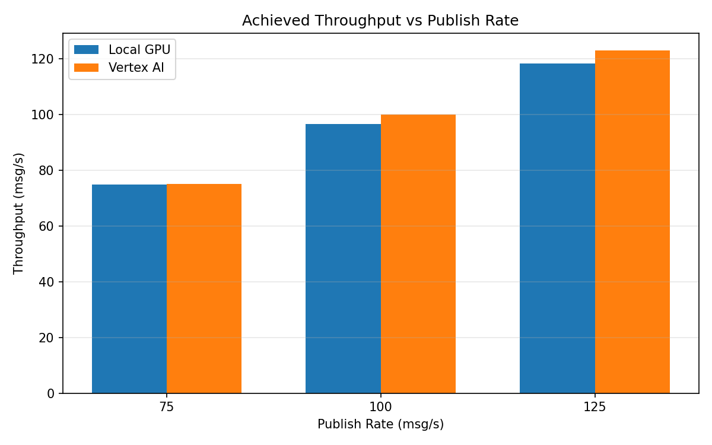

# Benchmark Report

Generated: 2026-03-08 04:55:16

## Configuration

| Parameter | Value |
|---|---|
| Messages per phase | 100s per phase |
| Rates (msg/s) | 75, 100, 125 |
| Experiments | Local GPU, Vertex AI |

## Throughput

| Rate (msg/s) | Local GPU | Vertex AI |
|---|---|---|
| 75 | 74.9 | 75.0 |
| 100 | 96.6 | 99.9 |
| 125 | 118.2 | 123.0 |

## End-to-End Latency (ms)

| Rate | Percentile | Local GPU | Vertex AI |
|---|---|---|---|
| 75 | p50 | 47.0 | 58.0 |
| 75 | p95 | 261.0 | 106.0 |
| 75 | p99 | 474.0 | 971.1 |
| 100 | p50 | 3365.0 | 74.0 |
| 100 | p95 | 3791.0 | 275.0 |
| 100 | p99 | 3863.0 | 652.0 |
| 125 | p50 | 5741.0 | 1541.0 |
| 125 | p95 | 6312.0 | 1722.0 |
| 125 | p99 | 6397.0 | 1770.0 |

## GPU Inference Time (ms)

| Rate | Percentile | Local GPU | Vertex AI |
|---|---|---|---|
| 75 | p50 | 8.1 | 6.8 |
| 75 | p95 | 79.4 | 24.5 |
| 75 | p99 | 87.0 | 33.2 |
| 100 | p50 | 72.3 | 19.4 |
| 100 | p95 | 86.0 | 35.9 |
| 100 | p99 | 91.6 | 44.9 |
| 125 | p50 | 41.4 | 31.1 |
| 125 | p95 | 85.2 | 37.6 |
| 125 | p99 | 90.0 | 47.5 |

## Charts

### Latency vs Publish Rate

### GPU Inference Time vs Publish Rate

### Throughput vs Publish Rate

