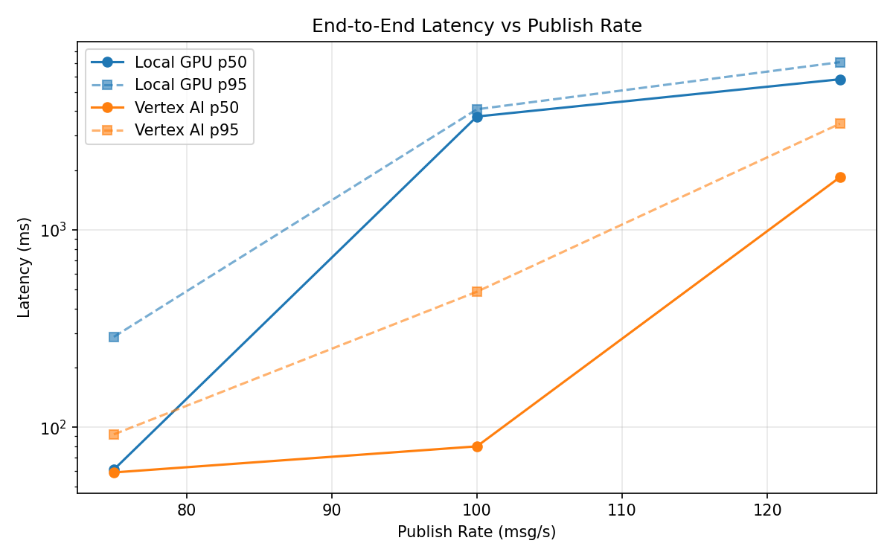
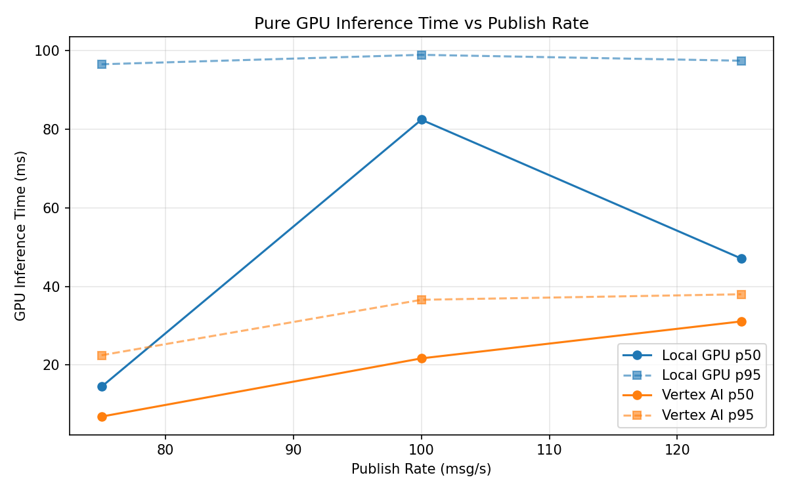
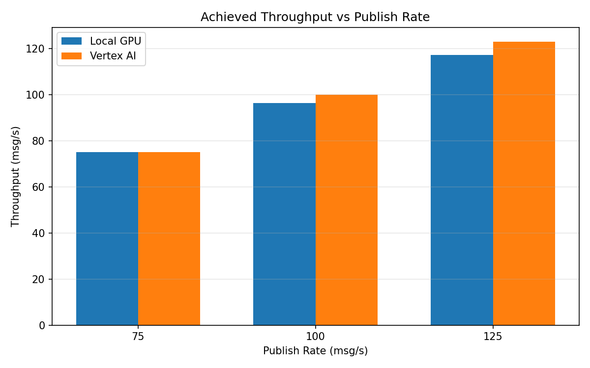

# Benchmark Report

Generated: 2026-03-08 05:07:29

## Configuration

| Parameter | Value |
|---|---|
| Messages per phase | 100s per phase |
| Rates (msg/s) | 75, 100, 125 |
| Experiments | Local GPU, Vertex AI |

## Throughput

| Rate (msg/s) | Local GPU | Vertex AI |
|---|---|---|
| 75 | 75.0 | 75.0 |
| 100 | 96.2 | 99.9 |
| 125 | 117.2 | 122.9 |

## End-to-End Latency (ms)

| Rate | Percentile | Local GPU | Vertex AI |
|---|---|---|---|
| 75 | p50 | 61.0 | 59.0 |
| 75 | p95 | 287.0 | 92.0 |
| 75 | p99 | 426.0 | 201.0 |
| 100 | p50 | 3754.0 | 80.0 |
| 100 | p95 | 4085.0 | 486.0 |
| 100 | p99 | 4195.0 | 967.0 |
| 125 | p50 | 5798.0 | 1849.0 |
| 125 | p95 | 7077.0 | 3452.0 |
| 125 | p99 | 7455.0 | 4192.0 |

## GPU Inference Time (ms)

| Rate | Percentile | Local GPU | Vertex AI |
|---|---|---|---|
| 75 | p50 | 14.5 | 6.9 |
| 75 | p95 | 96.5 | 22.5 |
| 75 | p99 | 103.8 | 33.9 |
| 100 | p50 | 82.4 | 21.7 |
| 100 | p95 | 98.9 | 36.6 |
| 100 | p99 | 104.7 | 46.2 |
| 125 | p50 | 47.1 | 31.1 |
| 125 | p95 | 97.4 | 38.0 |
| 125 | p99 | 103.0 | 47.1 |

## Charts

### Latency vs Publish Rate

### GPU Inference Time vs Publish Rate

### Throughput vs Publish Rate

