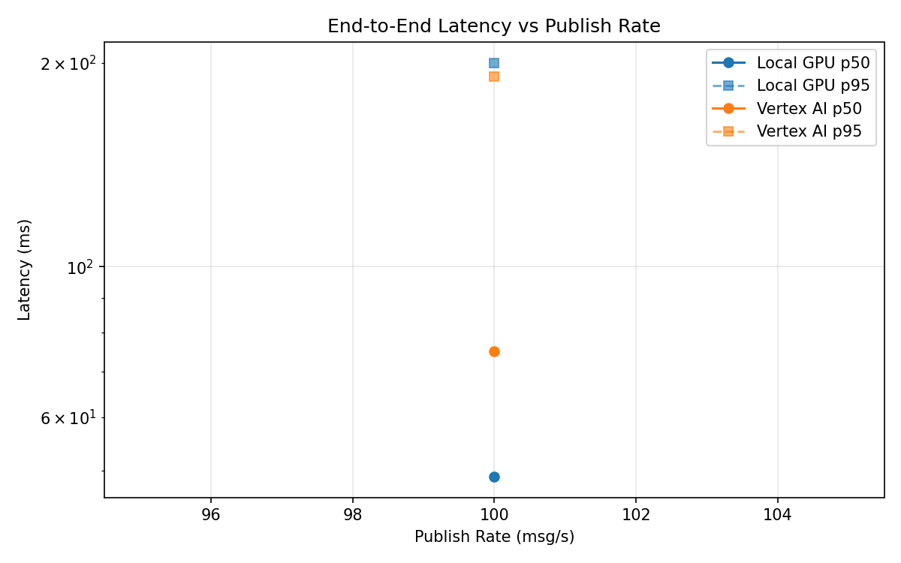
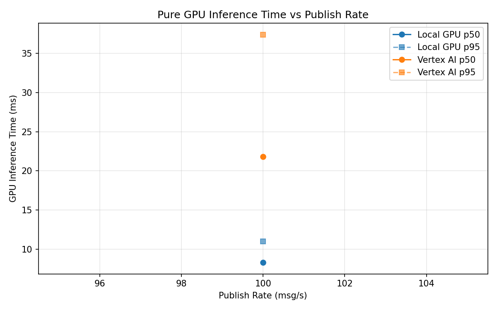
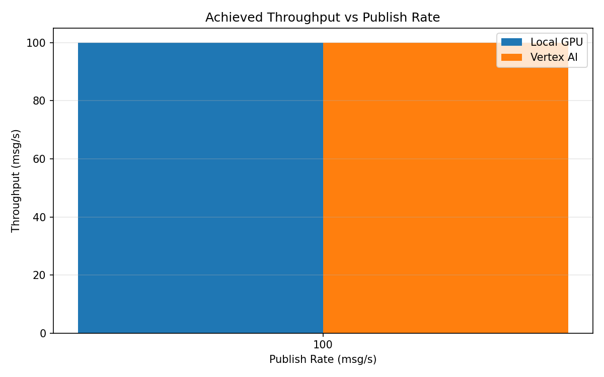

# Benchmark Report

Generated: 2026-03-08 18:21:13

## Configuration

| Parameter | Value |
|---|---|
| Messages per phase | 100s per phase |
| Rates (msg/s) | 100 |
| Experiments | Local GPU, Vertex AI |

## Throughput

| Rate (msg/s) | Local GPU | Vertex AI |
|---|---|---|
| 100 | 100.0 | 99.9 |

## End-to-End Latency (ms)

| Rate | Percentile | Local GPU | Vertex AI |
|---|---|---|---|
| 100 | p50 | 49.0 | 75.0 |
| 100 | p95 | 200.0 | 191.0 |
| 100 | p99 | 831.0 | 293.0 |

## GPU Inference Time (ms)

| Rate | Percentile | Local GPU | Vertex AI |
|---|---|---|---|
| 100 | p50 | 8.3 | 21.8 |
| 100 | p95 | 11.0 | 37.4 |
| 100 | p99 | 11.8 | 47.6 |

## Charts

### Latency vs Publish Rate

### GPU Inference Time vs Publish Rate

### Throughput vs Publish Rate

