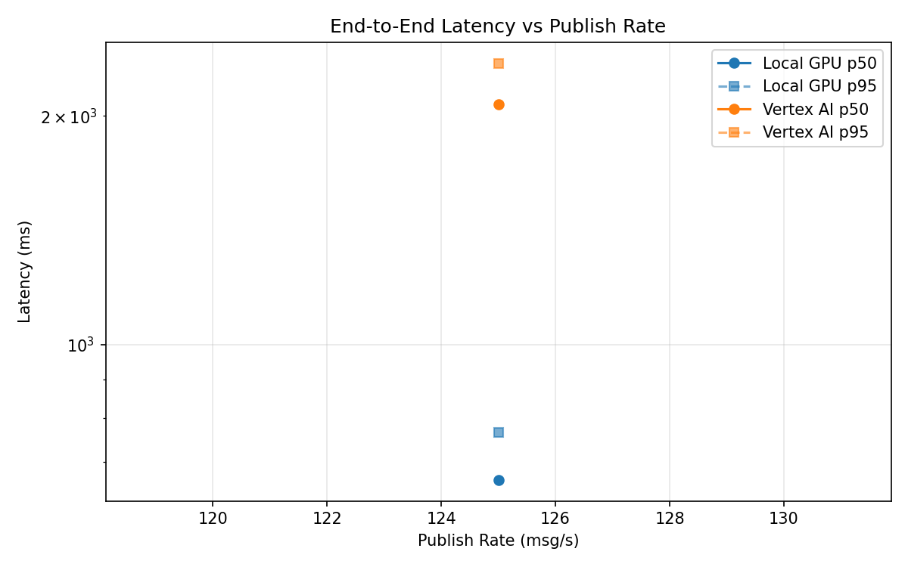
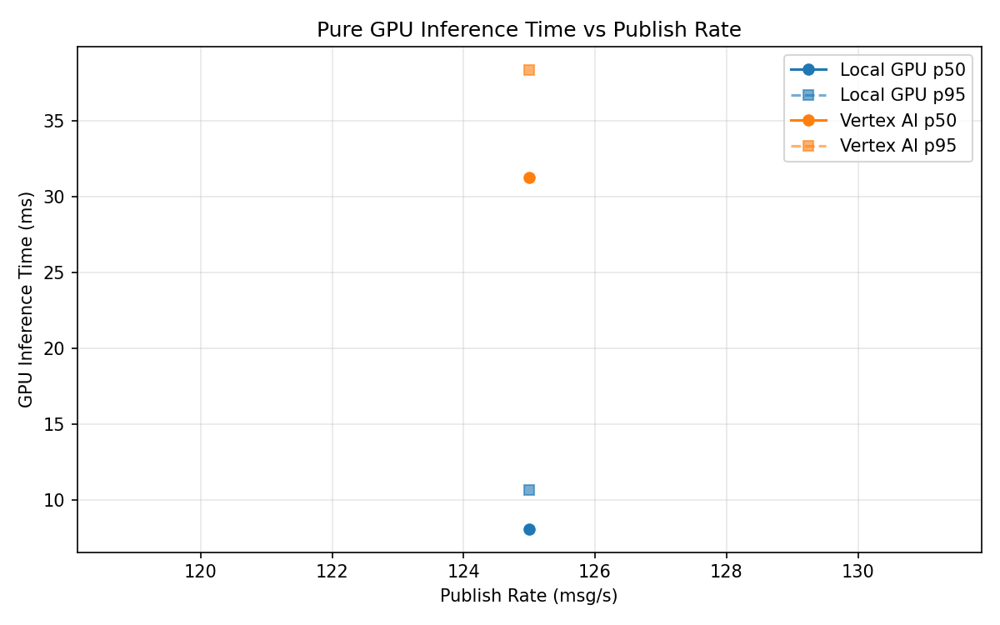
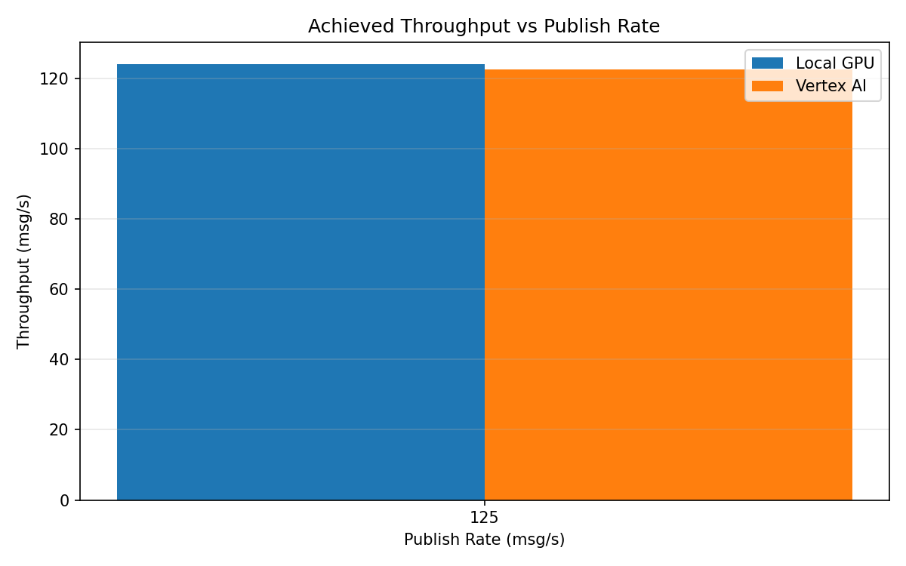

# Benchmark Report

Generated: 2026-03-08 18:30:26

## Configuration

| Parameter | Value |
|---|---|
| Messages per phase | 100s per phase |
| Rates (msg/s) | 125 |
| Experiments | Local GPU, Vertex AI |

## Throughput

| Rate (msg/s) | Local GPU | Vertex AI |
|---|---|---|
| 125 | 124.1 | 122.6 |

## End-to-End Latency (ms)

| Rate | Percentile | Local GPU | Vertex AI |
|---|---|---|---|
| 125 | p50 | 663.0 | 2072.0 |
| 125 | p95 | 766.0 | 2346.0 |
| 125 | p99 | 786.0 | 2408.0 |

## GPU Inference Time (ms)

| Rate | Percentile | Local GPU | Vertex AI |
|---|---|---|---|
| 125 | p50 | 8.1 | 31.3 |
| 125 | p95 | 10.7 | 38.4 |
| 125 | p99 | 11.3 | 47.5 |

## Charts

### Latency vs Publish Rate

### GPU Inference Time vs Publish Rate

### Throughput vs Publish Rate

