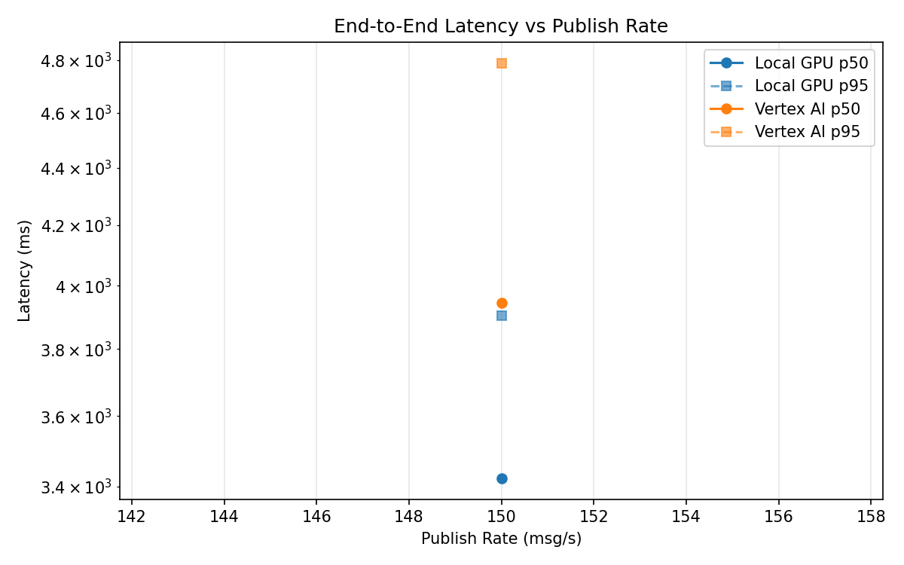
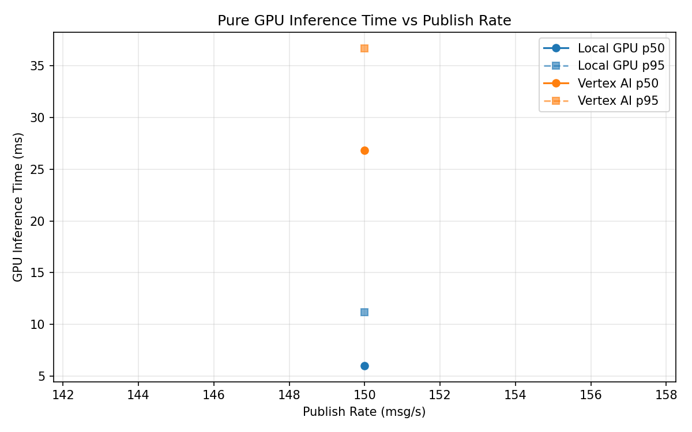
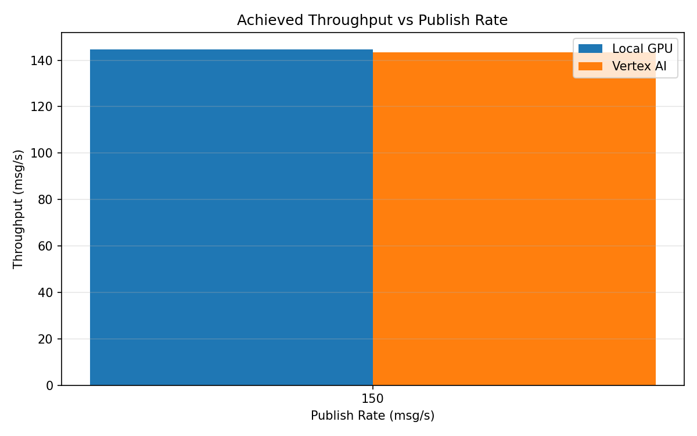

# Benchmark Report

Generated: 2026-03-08 18:38:35

## Configuration

| Parameter | Value |
|---|---|
| Messages per phase | 100s per phase |
| Rates (msg/s) | 150 |
| Experiments | Local GPU, Vertex AI |

## Throughput

| Rate (msg/s) | Local GPU | Vertex AI |
|---|---|---|
| 150 | 144.7 | 143.5 |

## End-to-End Latency (ms)

| Rate | Percentile | Local GPU | Vertex AI |
|---|---|---|---|
| 150 | p50 | 3423.0 | 3945.5 |
| 150 | p95 | 3904.0 | 4789.0 |
| 150 | p99 | 4182.0 | 4902.0 |

## GPU Inference Time (ms)

| Rate | Percentile | Local GPU | Vertex AI |
|---|---|---|---|
| 150 | p50 | 6.0 | 26.8 |
| 150 | p95 | 11.2 | 36.7 |
| 150 | p99 | 12.2 | 44.7 |

## Charts

### Latency vs Publish Rate

### GPU Inference Time vs Publish Rate

### Throughput vs Publish Rate

