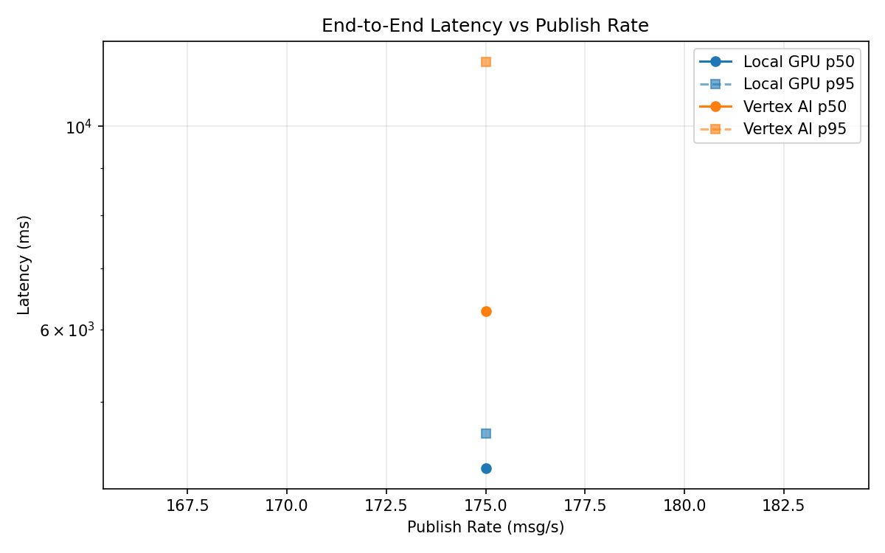
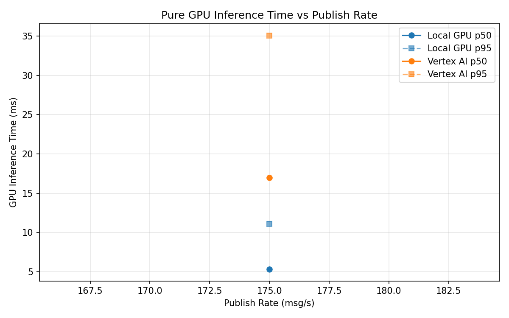
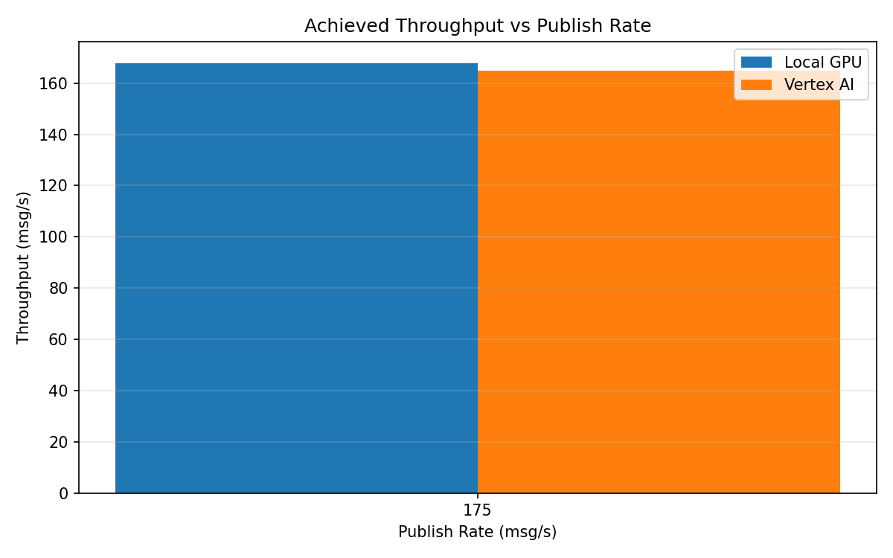

# Benchmark Report

Generated: 2026-03-08 18:46:40

## Configuration

| Parameter | Value |
|---|---|
| Messages per phase | 100s per phase |
| Rates (msg/s) | 175 |
| Experiments | Local GPU, Vertex AI |

## Throughput

| Rate (msg/s) | Local GPU | Vertex AI |
|---|---|---|
| 175 | 167.8 | 164.8 |

## End-to-End Latency (ms)

| Rate | Percentile | Local GPU | Vertex AI |
|---|---|---|---|
| 175 | p50 | 4230.5 | 6285.0 |
| 175 | p95 | 4613.0 | 11767.0 |
| 175 | p99 | 4695.0 | 12073.0 |

## GPU Inference Time (ms)

| Rate | Percentile | Local GPU | Vertex AI |
|---|---|---|---|
| 175 | p50 | 5.3 | 17.0 |
| 175 | p95 | 11.1 | 35.1 |
| 175 | p99 | 12.4 | 43.4 |

## Charts

### Latency vs Publish Rate

### GPU Inference Time vs Publish Rate

### Throughput vs Publish Rate

