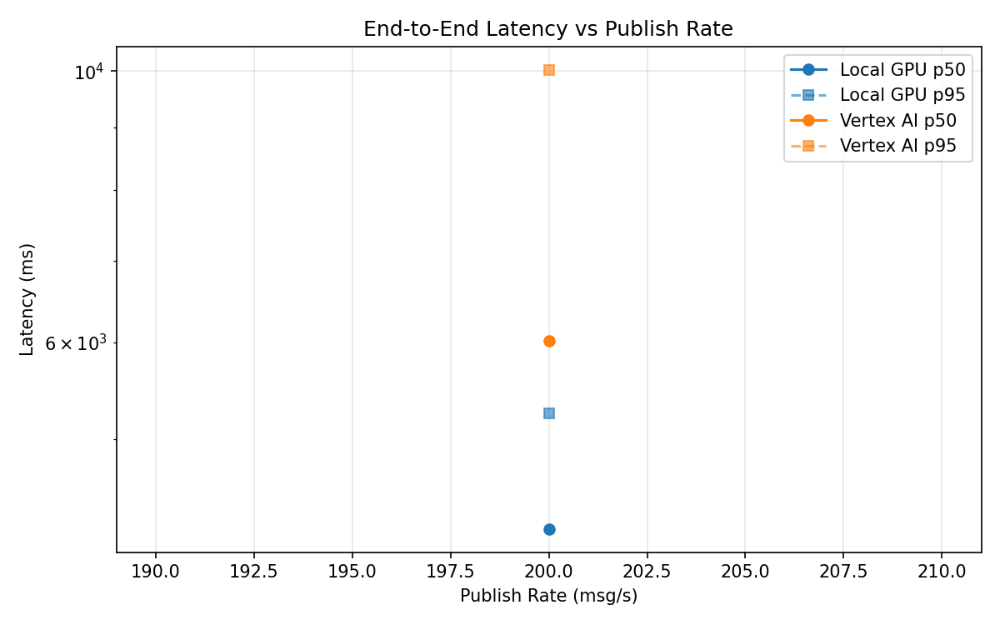
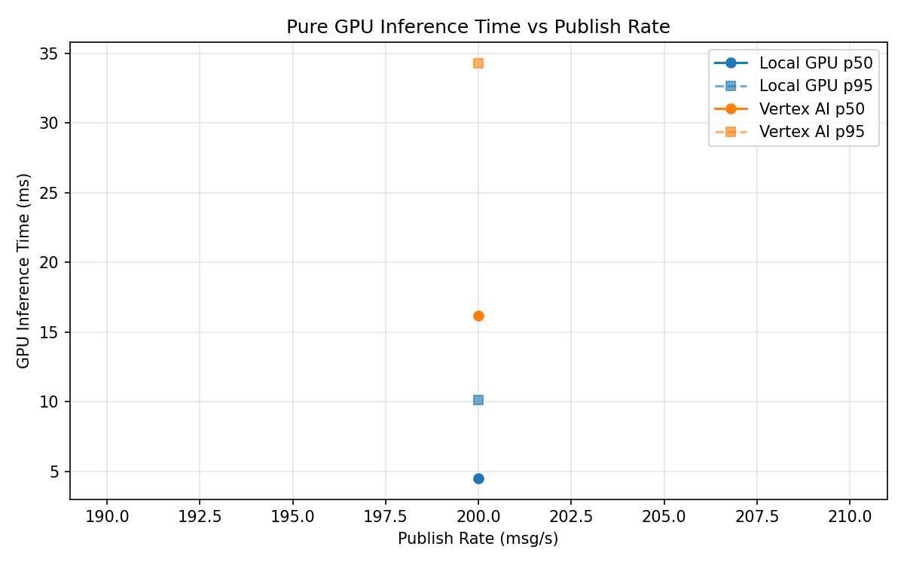
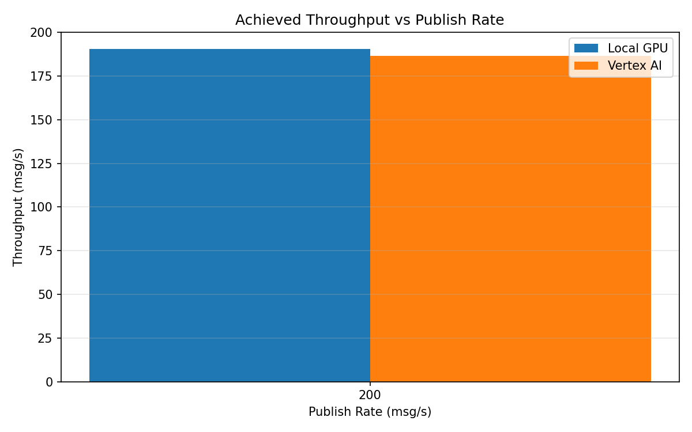

# Benchmark Report

Generated: 2026-03-08 18:55:37

## Configuration

| Parameter | Value |
|---|---|
| Messages per phase | 100s per phase |
| Rates (msg/s) | 200 |
| Experiments | Local GPU, Vertex AI |

## Throughput

| Rate (msg/s) | Local GPU | Vertex AI |
|---|---|---|
| 200 | 190.6 | 186.5 |

## End-to-End Latency (ms)

| Rate | Percentile | Local GPU | Vertex AI |
|---|---|---|---|
| 200 | p50 | 4218.0 | 6015.5 |
| 200 | p95 | 5245.2 | 10030.0 |
| 200 | p99 | 6006.0 | 10558.0 |

## GPU Inference Time (ms)

| Rate | Percentile | Local GPU | Vertex AI |
|---|---|---|---|
| 200 | p50 | 4.5 | 16.2 |
| 200 | p95 | 10.1 | 34.3 |
| 200 | p99 | 11.2 | 40.9 |

## Charts

### Latency vs Publish Rate

### GPU Inference Time vs Publish Rate

### Throughput vs Publish Rate

