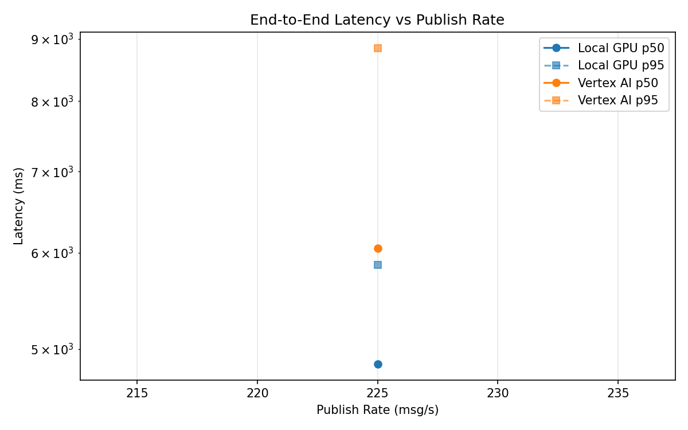
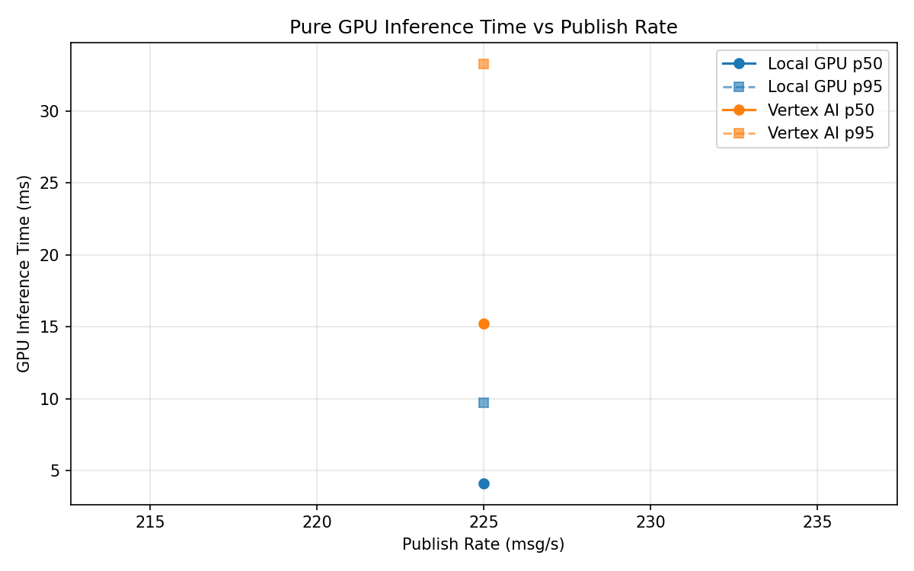
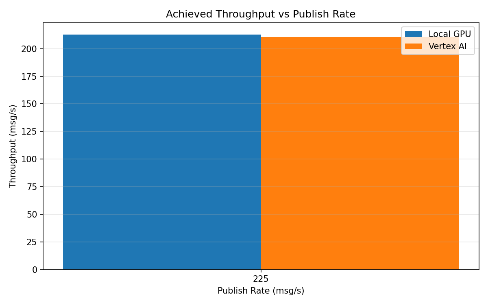

# Benchmark Report

Generated: 2026-03-08 19:03:47

## Configuration

| Parameter | Value |
|---|---|
| Messages per phase | 100s per phase |
| Rates (msg/s) | 225 |
| Experiments | Local GPU, Vertex AI |

## Throughput

| Rate (msg/s) | Local GPU | Vertex AI |
|---|---|---|
| 225 | 212.8 | 210.7 |

## End-to-End Latency (ms)

| Rate | Percentile | Local GPU | Vertex AI |
|---|---|---|---|
| 225 | p50 | 4859.0 | 6053.0 |
| 225 | p95 | 5865.0 | 8848.0 |
| 225 | p99 | 5969.0 | 9033.0 |

## GPU Inference Time (ms)

| Rate | Percentile | Local GPU | Vertex AI |
|---|---|---|---|
| 225 | p50 | 4.1 | 15.2 |
| 225 | p95 | 9.7 | 33.3 |
| 225 | p99 | 11.0 | 39.0 |

## Charts

### Latency vs Publish Rate

### GPU Inference Time vs Publish Rate

### Throughput vs Publish Rate

