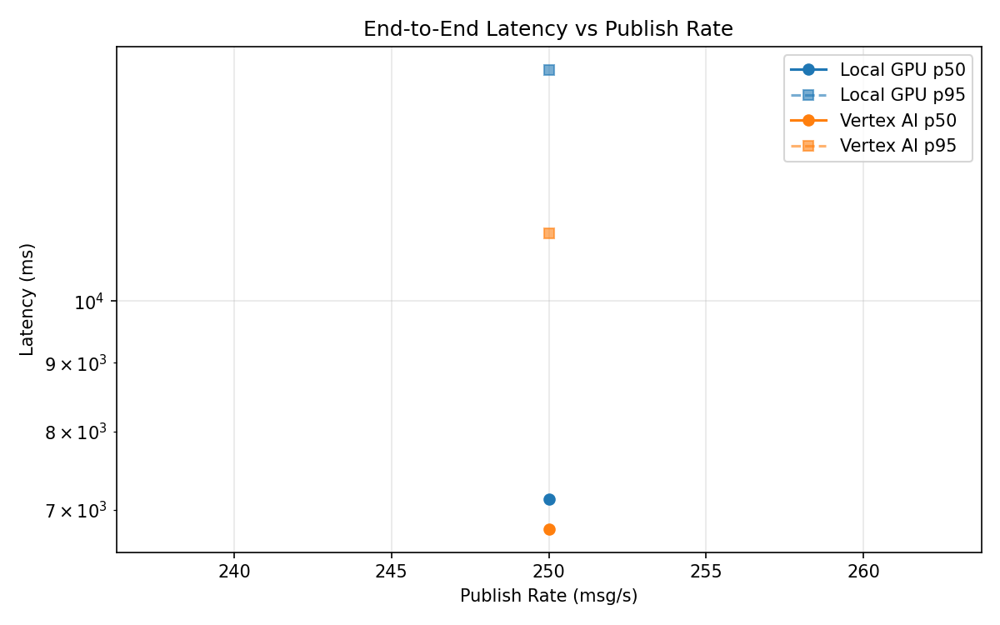
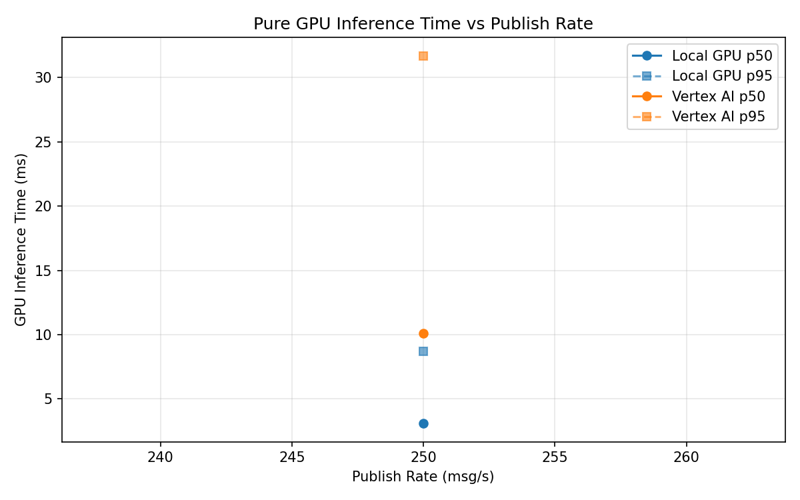
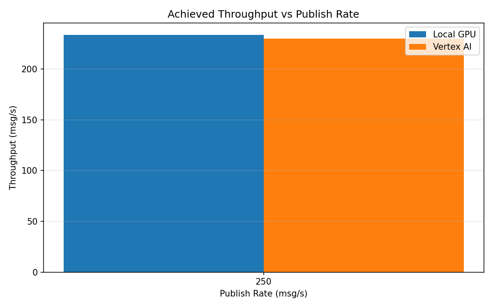

# Benchmark Report

Generated: 2026-03-08 19:12:16

## Configuration

| Parameter | Value |
|---|---|
| Messages per phase | 100s per phase |
| Rates (msg/s) | 250 |
| Experiments | Local GPU, Vertex AI |

## Throughput

| Rate (msg/s) | Local GPU | Vertex AI |
|---|---|---|
| 250 | 233.8 | 230.1 |

## End-to-End Latency (ms)

| Rate | Percentile | Local GPU | Vertex AI |
|---|---|---|---|
| 250 | p50 | 7132.5 | 6773.5 |
| 250 | p95 | 14843.1 | 11230.0 |
| 250 | p99 | 16678.0 | 11578.0 |

## GPU Inference Time (ms)

| Rate | Percentile | Local GPU | Vertex AI |
|---|---|---|---|
| 250 | p50 | 3.1 | 10.1 |
| 250 | p95 | 8.7 | 31.7 |
| 250 | p99 | 10.9 | 36.2 |

## Charts

### Latency vs Publish Rate

### GPU Inference Time vs Publish Rate

### Throughput vs Publish Rate

