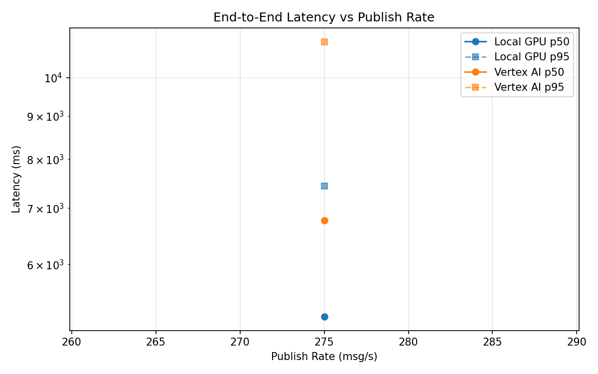
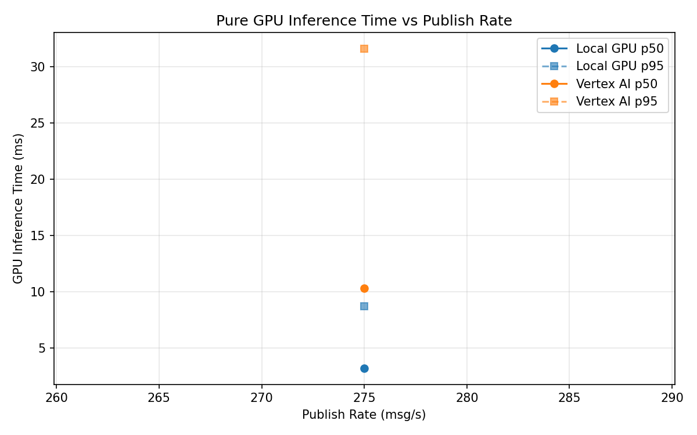
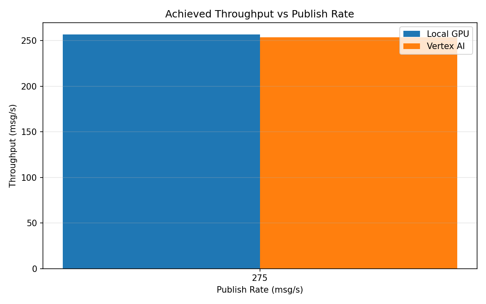

# Benchmark Report

Generated: 2026-03-08 19:20:21

## Configuration

| Parameter | Value |
|---|---|
| Messages per phase | 100s per phase |
| Rates (msg/s) | 275 |
| Experiments | Local GPU, Vertex AI |

## Throughput

| Rate (msg/s) | Local GPU | Vertex AI |
|---|---|---|
| 275 | 256.9 | 253.6 |

## End-to-End Latency (ms)

| Rate | Percentile | Local GPU | Vertex AI |
|---|---|---|---|
| 275 | p50 | 5200.0 | 6768.0 |
| 275 | p95 | 7435.0 | 11033.1 |
| 275 | p99 | 7590.0 | 11704.0 |

## GPU Inference Time (ms)

| Rate | Percentile | Local GPU | Vertex AI |
|---|---|---|---|
| 275 | p50 | 3.2 | 10.3 |
| 275 | p95 | 8.7 | 31.6 |
| 275 | p99 | 10.6 | 35.9 |

## Charts

### Latency vs Publish Rate

### GPU Inference Time vs Publish Rate

### Throughput vs Publish Rate

