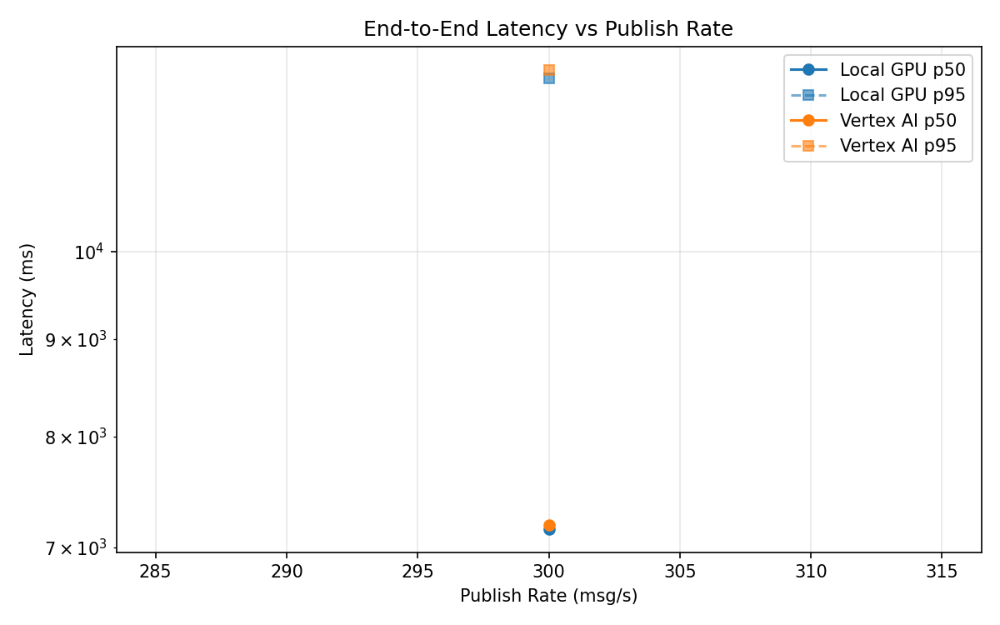
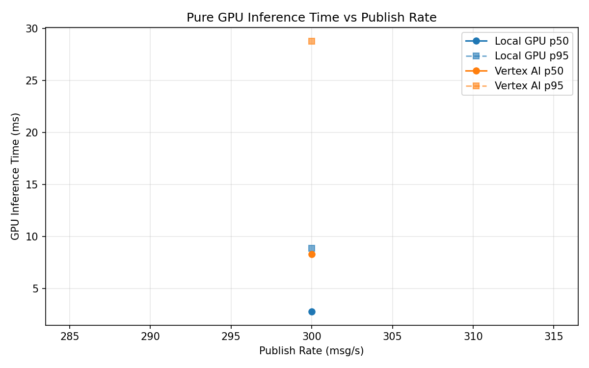
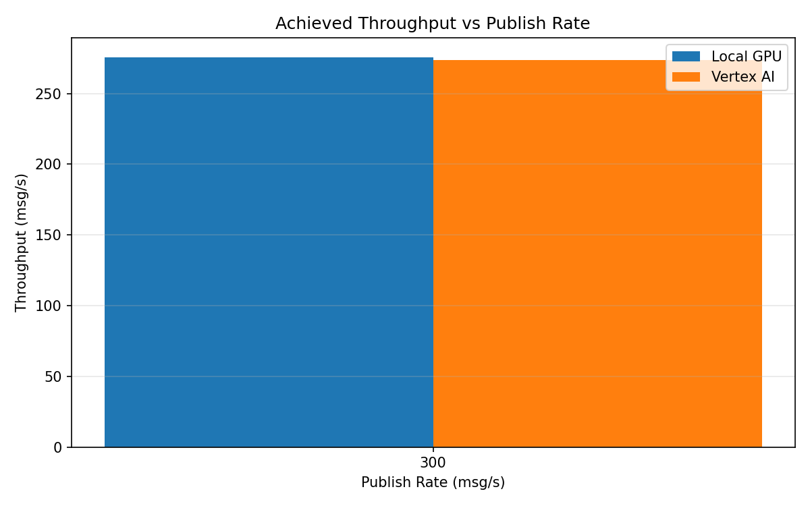

# Benchmark Report

Generated: 2026-03-08 19:29:12

## Configuration

| Parameter | Value |
|---|---|
| Messages per phase | 100s per phase |
| Rates (msg/s) | 300 |
| Experiments | Local GPU, Vertex AI |

## Throughput

| Rate (msg/s) | Local GPU | Vertex AI |
|---|---|---|
| 300 | 275.6 | 273.8 |

## End-to-End Latency (ms)

| Rate | Percentile | Local GPU | Vertex AI |
|---|---|---|---|
| 300 | p50 | 7156.5 | 7193.0 |
| 300 | p95 | 12322.0 | 12446.0 |
| 300 | p99 | 13957.0 | 12655.0 |

## GPU Inference Time (ms)

| Rate | Percentile | Local GPU | Vertex AI |
|---|---|---|---|
| 300 | p50 | 2.8 | 8.3 |
| 300 | p95 | 8.9 | 28.8 |
| 300 | p99 | 11.1 | 35.3 |

## Charts

### Latency vs Publish Rate

### GPU Inference Time vs Publish Rate

### Throughput vs Publish Rate

