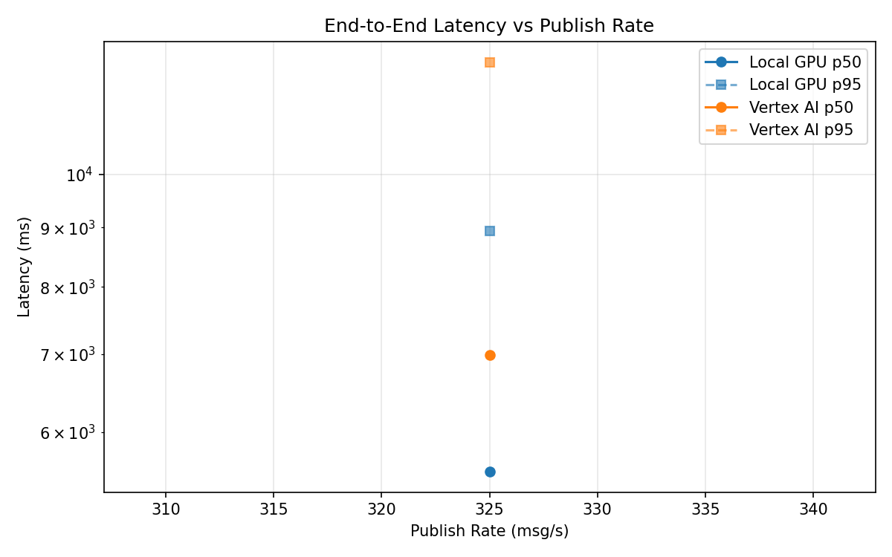
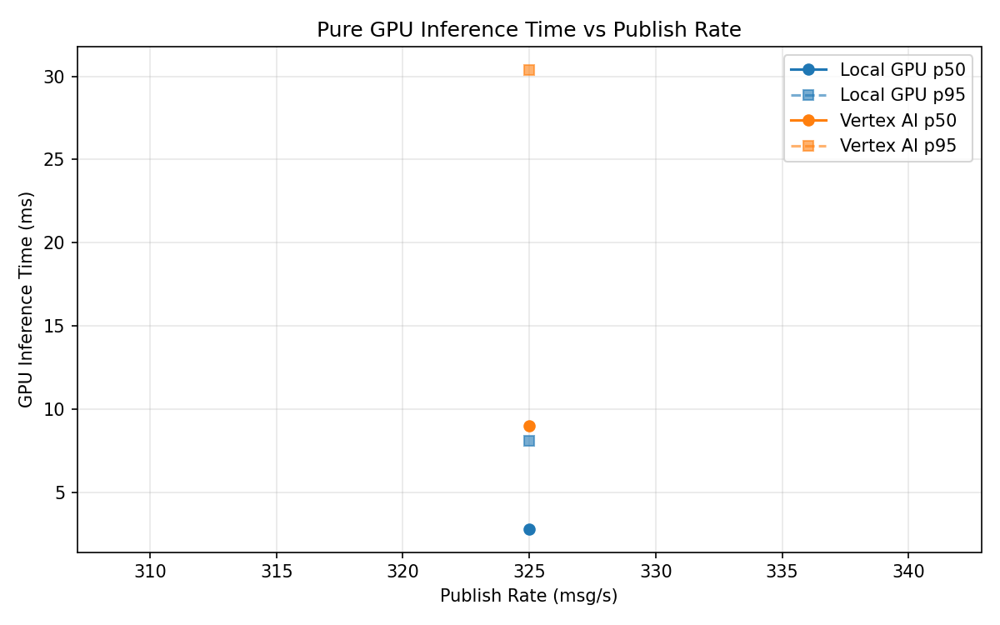
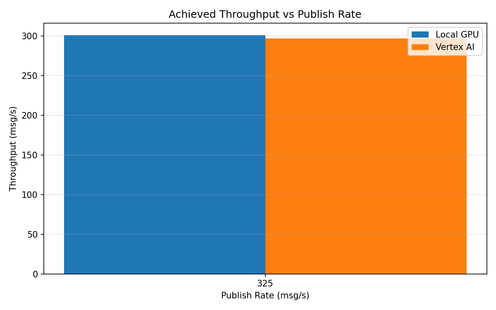

# Benchmark Report

Generated: 2026-03-08 19:37:21

## Configuration

| Parameter | Value |
|---|---|
| Messages per phase | 100s per phase |
| Rates (msg/s) | 325 |
| Experiments | Local GPU, Vertex AI |

## Throughput

| Rate (msg/s) | Local GPU | Vertex AI |
|---|---|---|
| 325 | 301.0 | 296.7 |

## End-to-End Latency (ms)

| Rate | Percentile | Local GPU | Vertex AI |
|---|---|---|---|
| 325 | p50 | 5545.0 | 6991.0 |
| 325 | p95 | 8934.0 | 12500.0 |
| 325 | p99 | 9215.0 | 13228.0 |

## GPU Inference Time (ms)

| Rate | Percentile | Local GPU | Vertex AI |
|---|---|---|---|
| 325 | p50 | 2.8 | 9.0 |
| 325 | p95 | 8.1 | 30.4 |
| 325 | p99 | 10.6 | 34.7 |

## Charts

### Latency vs Publish Rate

### GPU Inference Time vs Publish Rate

### Throughput vs Publish Rate

