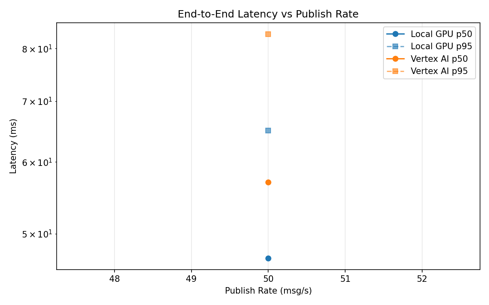
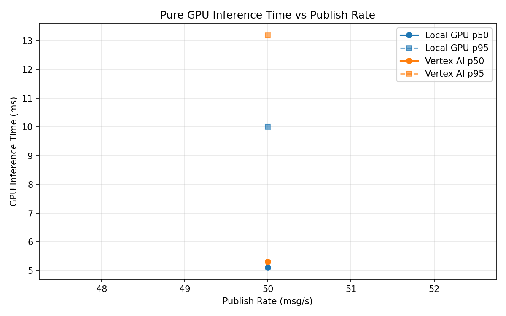
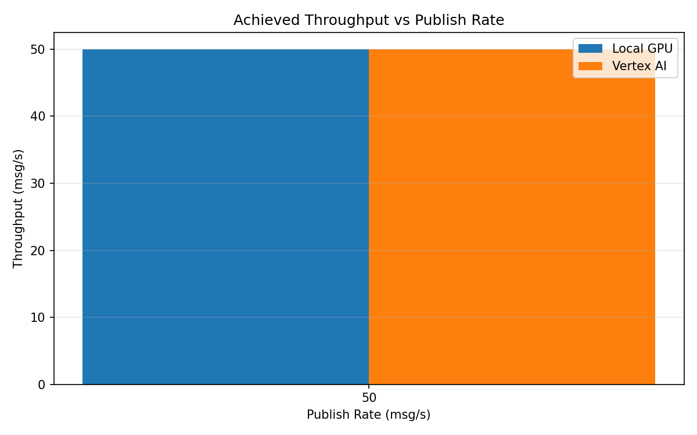

# Benchmark Report

Generated: 2026-03-08 18:03:56

## Configuration

| Parameter | Value |
|---|---|
| Messages per phase | 100s per phase |
| Rates (msg/s) | 50 |
| Experiments | Local GPU, Vertex AI |

## Throughput

| Rate (msg/s) | Local GPU | Vertex AI |
|---|---|---|
| 50 | 50.0 | 50.0 |

## End-to-End Latency (ms)

| Rate | Percentile | Local GPU | Vertex AI |
|---|---|---|---|
| 50 | p50 | 47.0 | 57.0 |
| 50 | p95 | 65.0 | 83.0 |
| 50 | p99 | 87.0 | 433.0 |

## GPU Inference Time (ms)

| Rate | Percentile | Local GPU | Vertex AI |
|---|---|---|---|
| 50 | p50 | 5.1 | 5.3 |
| 50 | p95 | 10.0 | 13.2 |
| 50 | p99 | 11.5 | 33.3 |

## Charts

### Latency vs Publish Rate

### GPU Inference Time vs Publish Rate

### Throughput vs Publish Rate

