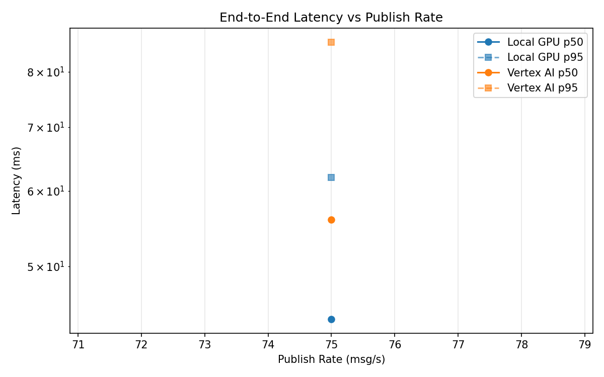
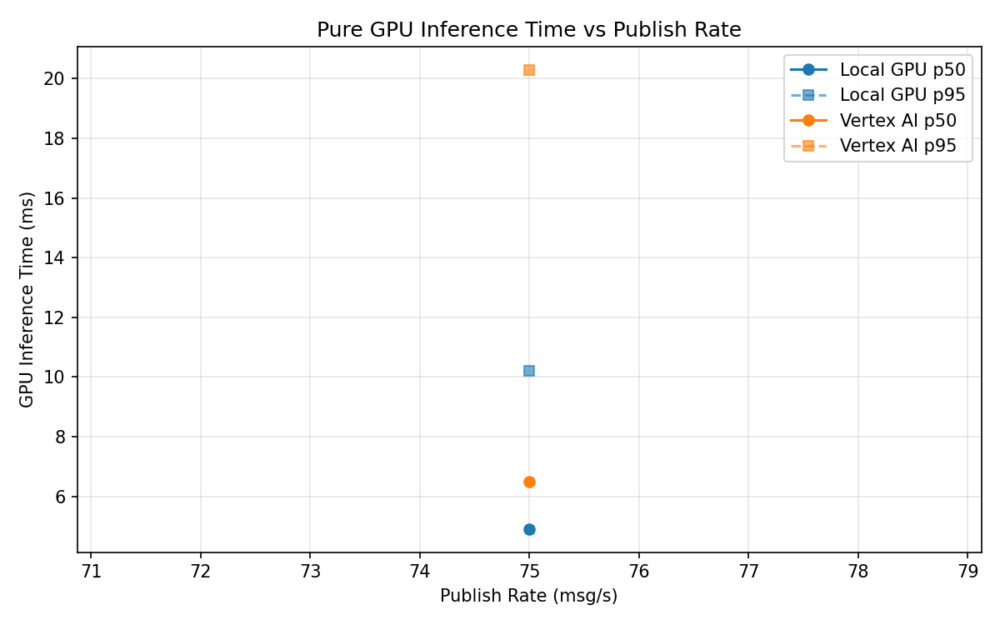
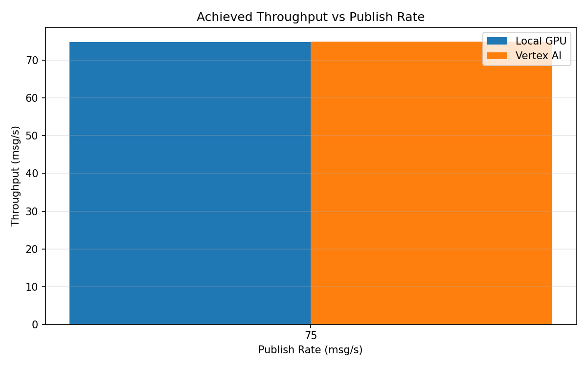

# Benchmark Report

Generated: 2026-03-08 18:13:08

## Configuration

| Parameter | Value |
|---|---|
| Messages per phase | 100s per phase |
| Rates (msg/s) | 75 |
| Experiments | Local GPU, Vertex AI |

## Throughput

| Rate (msg/s) | Local GPU | Vertex AI |
|---|---|---|
| 75 | 74.9 | 75.0 |

## End-to-End Latency (ms)

| Rate | Percentile | Local GPU | Vertex AI |
|---|---|---|---|
| 75 | p50 | 44.0 | 56.0 |
| 75 | p95 | 62.0 | 86.0 |
| 75 | p99 | 406.0 | 285.0 |

## GPU Inference Time (ms)

| Rate | Percentile | Local GPU | Vertex AI |
|---|---|---|---|
| 75 | p50 | 4.9 | 6.5 |
| 75 | p95 | 10.2 | 20.3 |
| 75 | p99 | 11.3 | 33.9 |

## Charts

### Latency vs Publish Rate

### GPU Inference Time vs Publish Rate

### Throughput vs Publish Rate

