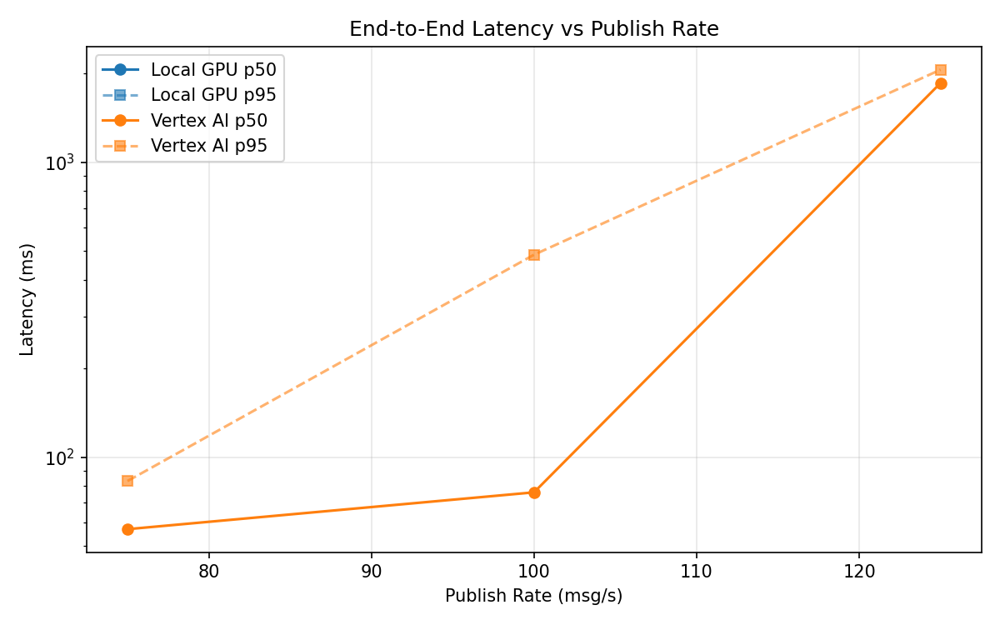
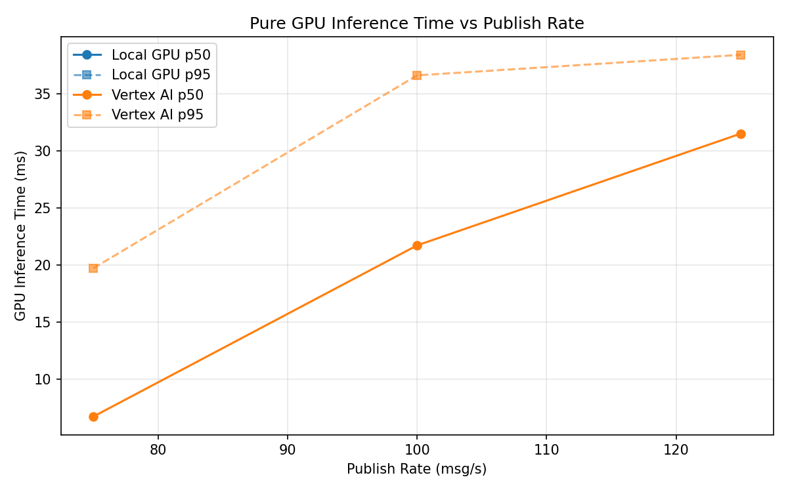

# Benchmark Report

Generated: 2026-03-08 14:59:49

## Configuration

| Parameter | Value |
|---|---|
| Messages per phase | 100s per phase |
| Rates (msg/s) | 75, 100, 125 |
| Experiments | Local GPU, Vertex AI |

## Throughput

| Rate (msg/s) | Local GPU | Vertex AI |
|---|---|---|
| 75 | — | 75.0 |
| 100 | — | 99.9 |
| 125 | — | 122.8 |

## End-to-End Latency (ms)

| Rate | Percentile | Local GPU | Vertex AI |
|---|---|---|---|
| 75 | p50 | — | 57.0 |
| 75 | p95 | — | 83.0 |
| 75 | p99 | — | 446.1 |
| 100 | p50 | — | 76.0 |
| 100 | p95 | — | 486.0 |
| 100 | p99 | — | 893.0 |
| 125 | p50 | — | 1858.0 |
| 125 | p95 | — | 2062.0 |
| 125 | p99 | — | 2118.0 |

## GPU Inference Time (ms)

| Rate | Percentile | Local GPU | Vertex AI |
|---|---|---|---|
| 75 | p50 | — | 6.7 |
| 75 | p95 | — | 19.7 |
| 75 | p99 | — | 33.0 |
| 100 | p50 | — | 21.7 |
| 100 | p95 | — | 36.6 |
| 100 | p99 | — | 47.0 |
| 125 | p50 | — | 31.5 |
| 125 | p95 | — | 38.4 |
| 125 | p99 | — | 47.8 |

## Charts

### Latency vs Publish Rate

### GPU Inference Time vs Publish Rate

### Throughput vs Publish Rate

