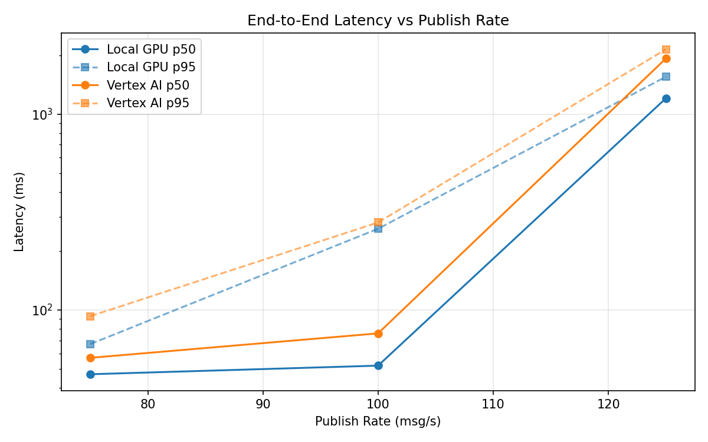
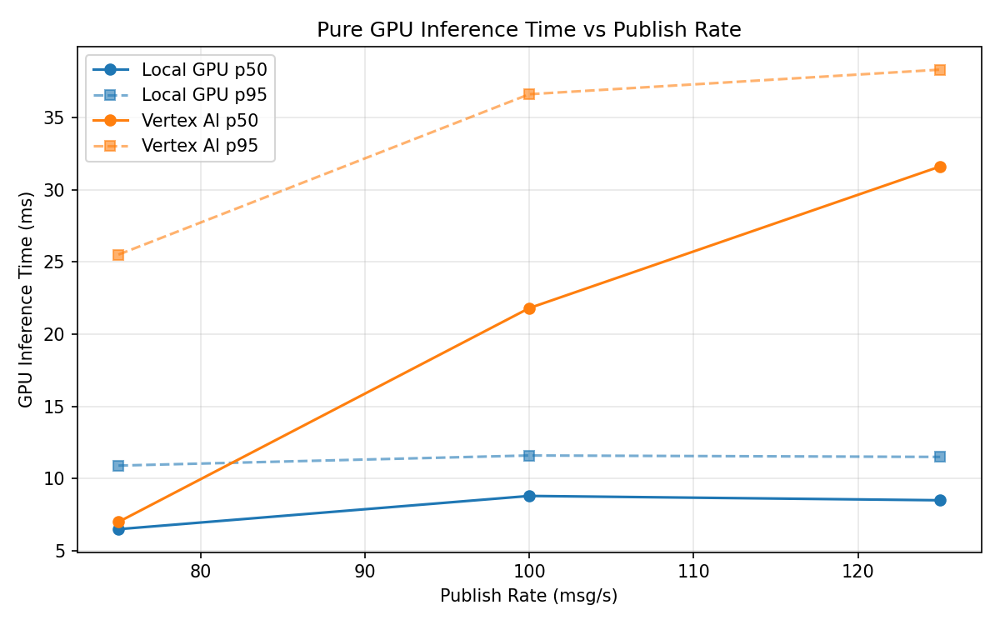

# Benchmark Report

Generated: 2026-03-08 15:11:56

## Configuration

| Parameter | Value |
|---|---|
| Messages per phase | 100s per phase |
| Rates (msg/s) | 75, 100, 125 |
| Experiments | Local GPU, Vertex AI |

## Throughput

| Rate (msg/s) | Local GPU | Vertex AI |
|---|---|---|
| 75 | 75.0 | 75.0 |
| 100 | 100.0 | 99.9 |
| 125 | 123.4 | 122.7 |

## End-to-End Latency (ms)

| Rate | Percentile | Local GPU | Vertex AI |
|---|---|---|---|
| 75 | p50 | 47.0 | 57.0 |
| 75 | p95 | 67.0 | 93.0 |
| 75 | p99 | 116.0 | 513.0 |
| 100 | p50 | 52.0 | 76.0 |
| 100 | p95 | 260.0 | 280.0 |
| 100 | p99 | 656.0 | 628.0 |
| 125 | p50 | 1206.0 | 1926.0 |
| 125 | p95 | 1554.0 | 2146.0 |
| 125 | p99 | 1606.0 | 2217.0 |

## GPU Inference Time (ms)

| Rate | Percentile | Local GPU | Vertex AI |
|---|---|---|---|
| 75 | p50 | 6.5 | 7.0 |
| 75 | p95 | 10.9 | 25.5 |
| 75 | p99 | 11.9 | 35.5 |
| 100 | p50 | 8.8 | 21.8 |
| 100 | p95 | 11.6 | 36.6 |
| 100 | p99 | 12.6 | 47.2 |
| 125 | p50 | 8.5 | 31.6 |
| 125 | p95 | 11.5 | 38.3 |
| 125 | p99 | 12.6 | 48.1 |

## Charts

### Latency vs Publish Rate

### GPU Inference Time vs Publish Rate

### Throughput vs Publish Rate

