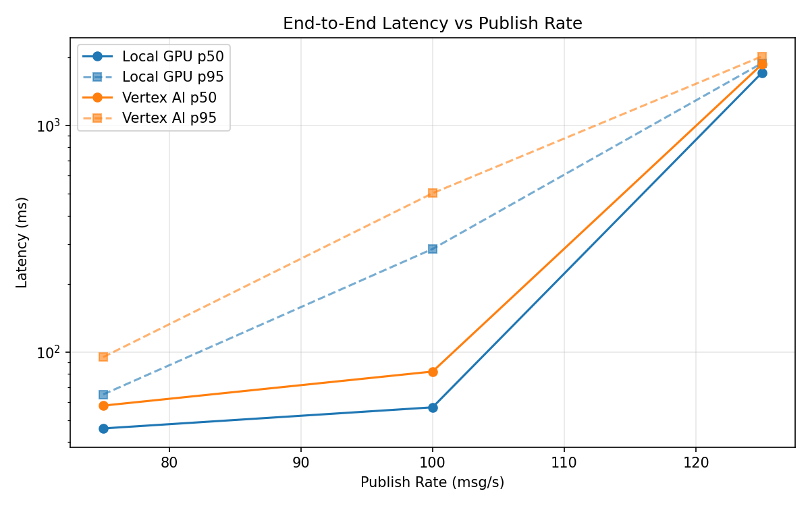
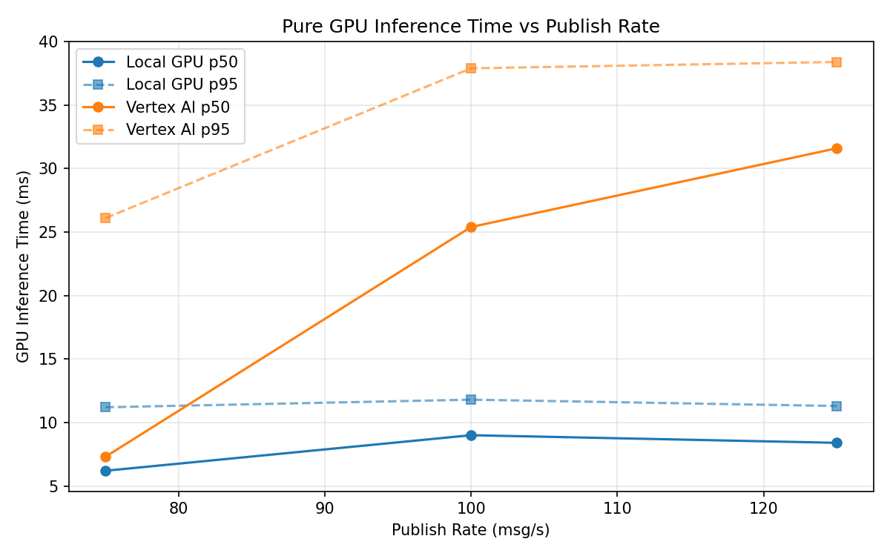
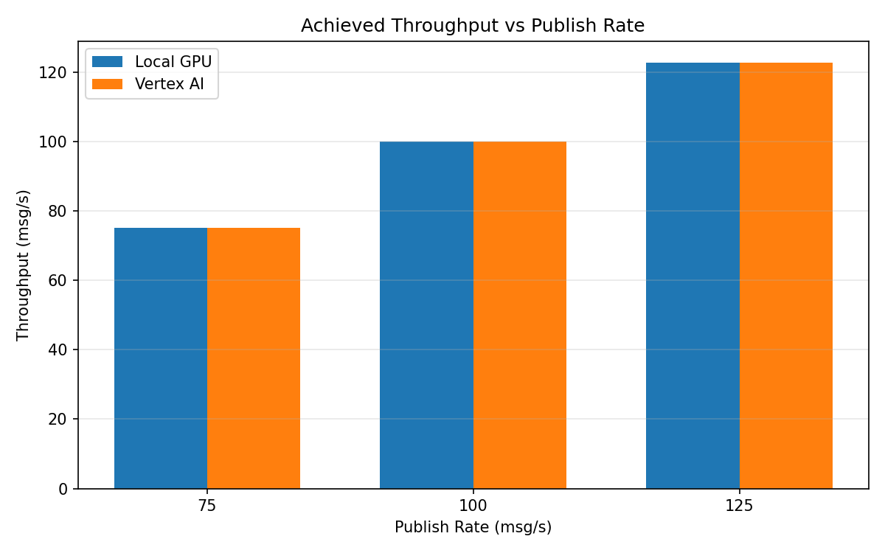

# Benchmark Report

Generated: 2026-03-08 15:24:42

## Configuration

| Parameter | Value |
|---|---|
| Messages per phase | 100s per phase |
| Rates (msg/s) | 75, 100, 125 |
| Experiments | Local GPU, Vertex AI |

## Throughput

| Rate (msg/s) | Local GPU | Vertex AI |
|---|---|---|
| 75 | 75.0 | 75.0 |
| 100 | 100.0 | 99.9 |
| 125 | 122.7 | 122.7 |

## End-to-End Latency (ms)

| Rate | Percentile | Local GPU | Vertex AI |
|---|---|---|---|
| 75 | p50 | 46.0 | 58.0 |
| 75 | p95 | 65.0 | 95.0 |
| 75 | p99 | 142.0 | 308.0 |
| 100 | p50 | 57.0 | 82.0 |
| 100 | p95 | 285.0 | 502.0 |
| 100 | p99 | 556.0 | 928.0 |
| 125 | p50 | 1707.0 | 1860.0 |
| 125 | p95 | 1882.0 | 2017.0 |
| 125 | p99 | 1978.0 | 2068.0 |

## GPU Inference Time (ms)

| Rate | Percentile | Local GPU | Vertex AI |
|---|---|---|---|
| 75 | p50 | 6.2 | 7.3 |
| 75 | p95 | 11.2 | 26.1 |
| 75 | p99 | 12.5 | 35.4 |
| 100 | p50 | 9.0 | 25.4 |
| 100 | p95 | 11.8 | 37.9 |
| 100 | p99 | 12.6 | 49.5 |
| 125 | p50 | 8.4 | 31.6 |
| 125 | p95 | 11.3 | 38.4 |
| 125 | p99 | 12.4 | 48.5 |

## Charts

### Latency vs Publish Rate

### GPU Inference Time vs Publish Rate

### Throughput vs Publish Rate

