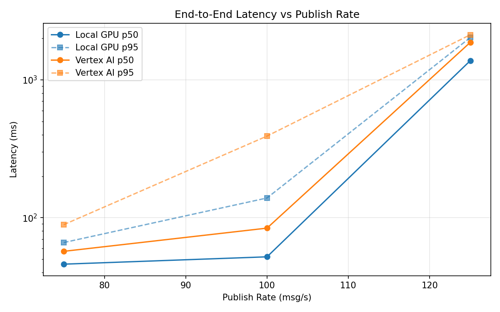
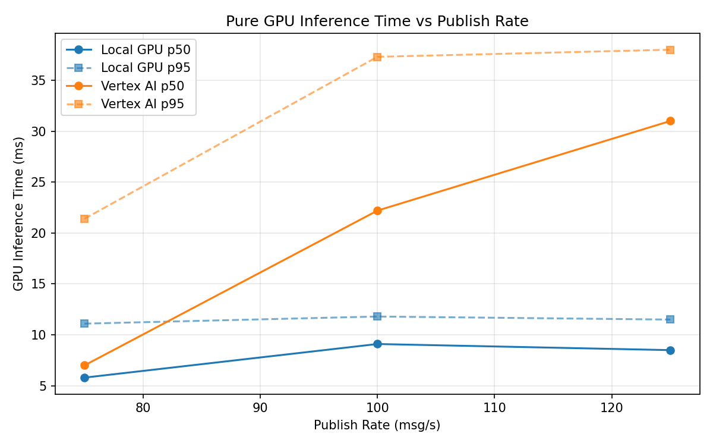
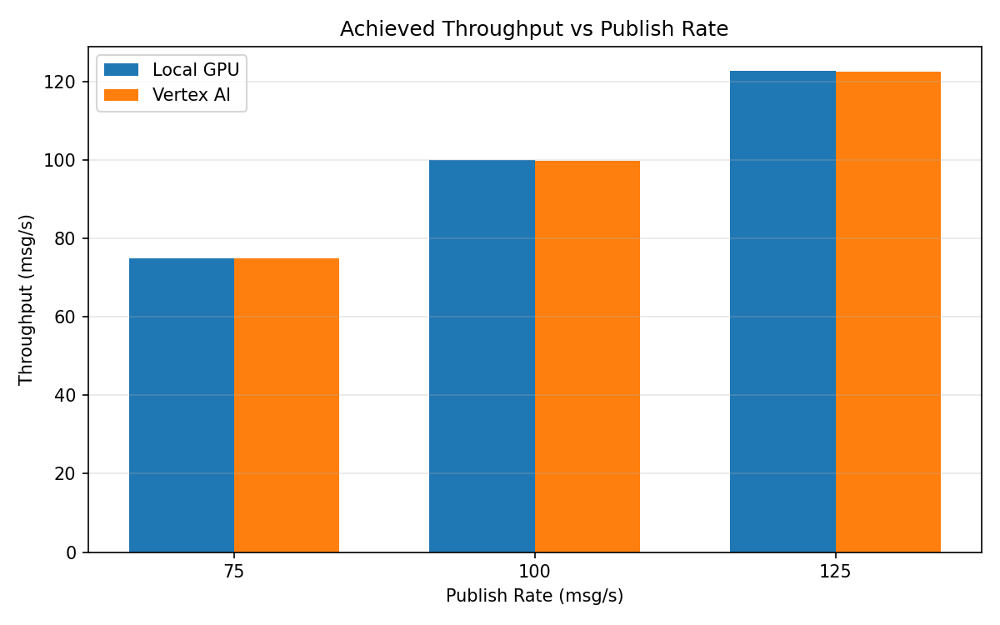

# Benchmark Report

Generated: 2026-03-08 15:36:28

## Configuration

| Parameter | Value |
|---|---|
| Messages per phase | 100s per phase |
| Rates (msg/s) | 75, 100, 125 |
| Experiments | Local GPU, Vertex AI |

## Throughput

| Rate (msg/s) | Local GPU | Vertex AI |
|---|---|---|
| 75 | 75.0 | 75.0 |
| 100 | 100.0 | 99.9 |
| 125 | 122.8 | 122.5 |

## End-to-End Latency (ms)

| Rate | Percentile | Local GPU | Vertex AI |
|---|---|---|---|
| 75 | p50 | 46.0 | 57.0 |
| 75 | p95 | 66.0 | 89.0 |
| 75 | p99 | 355.1 | 604.1 |
| 100 | p50 | 52.0 | 84.0 |
| 100 | p95 | 139.0 | 391.0 |
| 100 | p99 | 254.0 | 808.0 |
| 125 | p50 | 1379.0 | 1872.0 |
| 125 | p95 | 2029.0 | 2125.0 |
| 125 | p99 | 2069.0 | 2206.0 |

## GPU Inference Time (ms)

| Rate | Percentile | Local GPU | Vertex AI |
|---|---|---|---|
| 75 | p50 | 5.8 | 7.0 |
| 75 | p95 | 11.1 | 21.4 |
| 75 | p99 | 12.1 | 33.7 |
| 100 | p50 | 9.1 | 22.2 |
| 100 | p95 | 11.8 | 37.3 |
| 100 | p99 | 12.8 | 47.9 |
| 125 | p50 | 8.5 | 31.0 |
| 125 | p95 | 11.5 | 38.0 |
| 125 | p99 | 12.6 | 48.1 |

## Charts

### Latency vs Publish Rate

### GPU Inference Time vs Publish Rate

### Throughput vs Publish Rate

