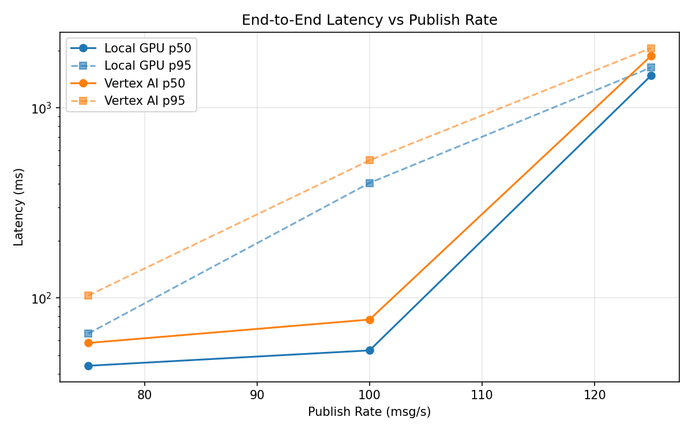
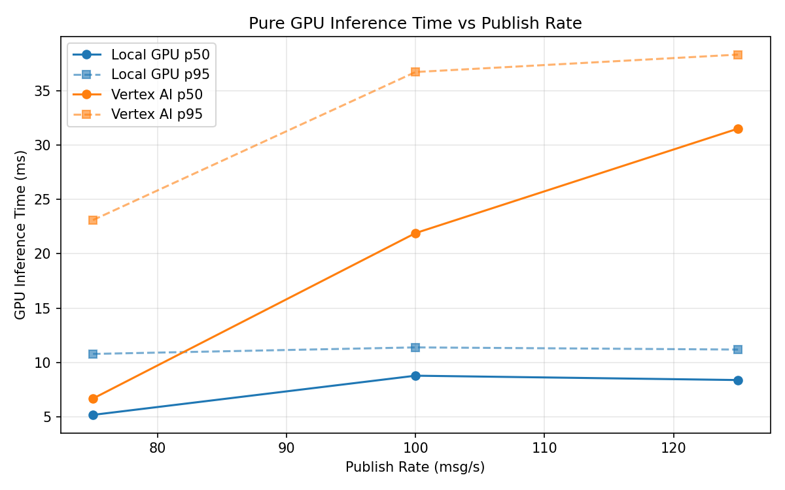
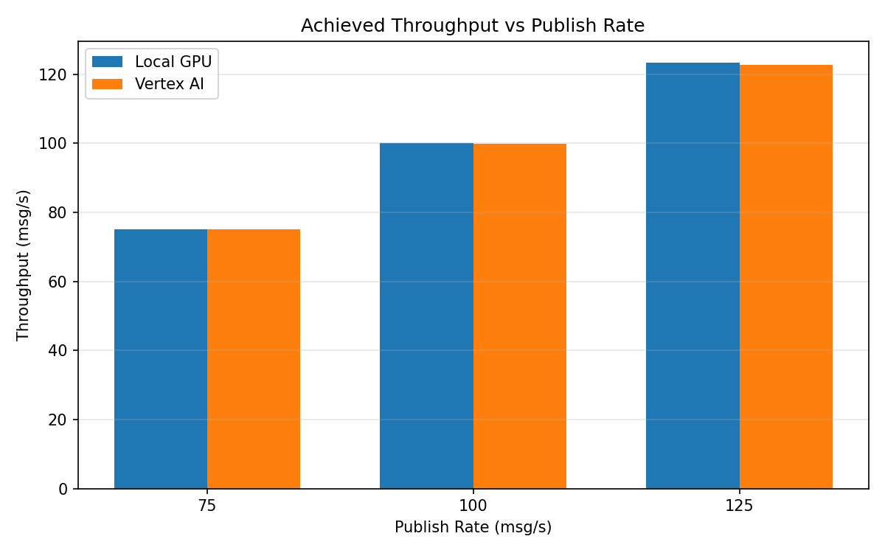

# Benchmark Report

Generated: 2026-03-08 15:49:54

## Configuration

| Parameter | Value |
|---|---|
| Messages per phase | 100s per phase |
| Rates (msg/s) | 75, 100, 125 |
| Experiments | Local GPU, Vertex AI |

## Throughput

| Rate (msg/s) | Local GPU | Vertex AI |
|---|---|---|
| 75 | 75.0 | 75.0 |
| 100 | 100.0 | 99.9 |
| 125 | 123.4 | 122.7 |

## End-to-End Latency (ms)

| Rate | Percentile | Local GPU | Vertex AI |
|---|---|---|---|
| 75 | p50 | 44.0 | 58.0 |
| 75 | p95 | 65.0 | 103.0 |
| 75 | p99 | 417.0 | 248.0 |
| 100 | p50 | 53.0 | 77.0 |
| 100 | p95 | 403.0 | 530.0 |
| 100 | p99 | 894.0 | 913.0 |
| 125 | p50 | 1477.0 | 1876.0 |
| 125 | p95 | 1630.0 | 2063.0 |
| 125 | p99 | 1683.0 | 2130.0 |

## GPU Inference Time (ms)

| Rate | Percentile | Local GPU | Vertex AI |
|---|---|---|---|
| 75 | p50 | 5.2 | 6.7 |
| 75 | p95 | 10.8 | 23.1 |
| 75 | p99 | 11.9 | 34.1 |
| 100 | p50 | 8.8 | 21.9 |
| 100 | p95 | 11.4 | 36.7 |
| 100 | p99 | 12.3 | 47.7 |
| 125 | p50 | 8.4 | 31.5 |
| 125 | p95 | 11.2 | 38.3 |
| 125 | p99 | 12.1 | 48.0 |

## Charts

### Latency vs Publish Rate

### GPU Inference Time vs Publish Rate

### Throughput vs Publish Rate

