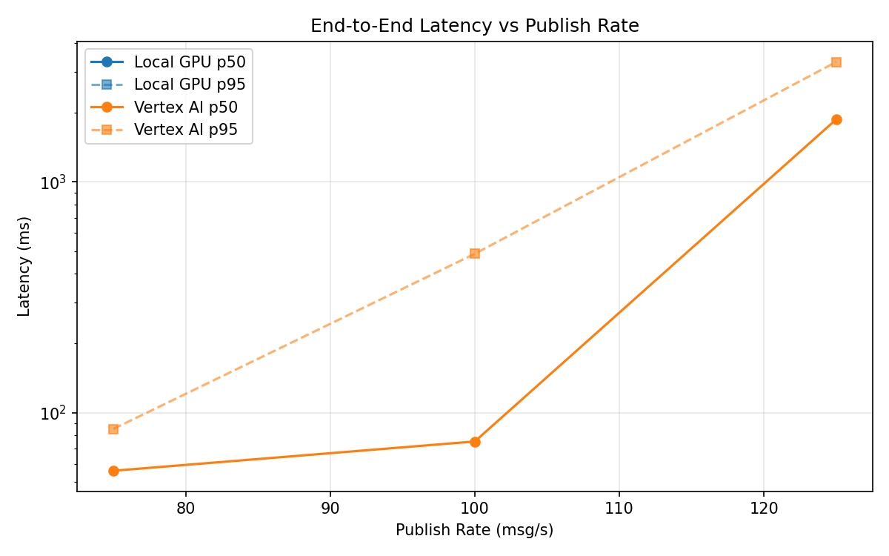
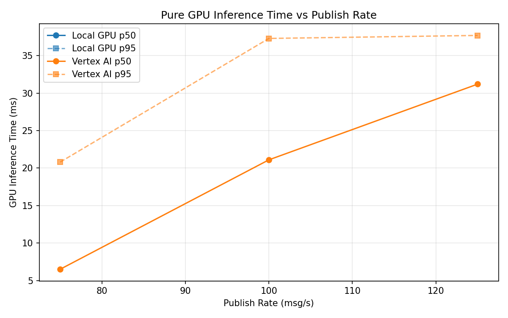
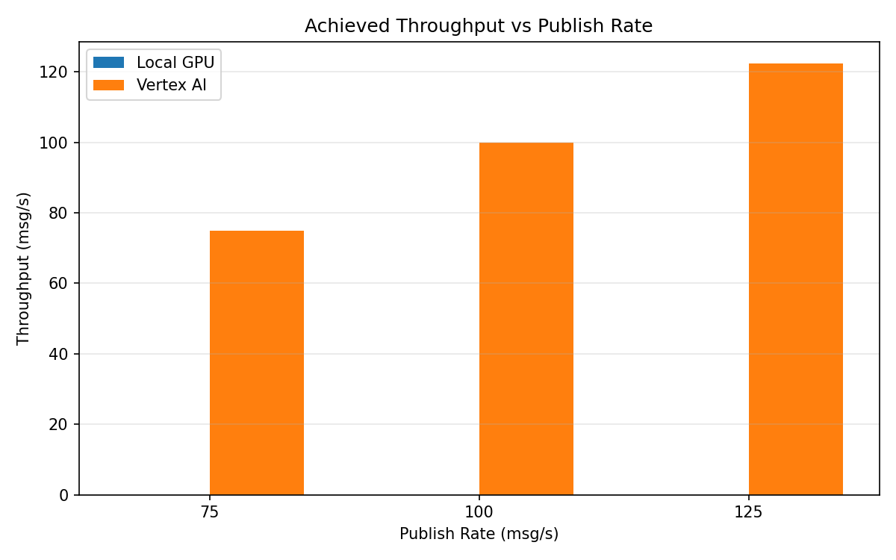

# Benchmark Report

Generated: 2026-03-08 14:27:41

## Configuration

| Parameter | Value |
|---|---|
| Messages per phase | 100s per phase |
| Rates (msg/s) | 75, 100, 125 |
| Experiments | Local GPU, Vertex AI |

## Throughput

| Rate (msg/s) | Local GPU | Vertex AI |
|---|---|---|
| 75 | — | 75.0 |
| 100 | — | 100.0 |
| 125 | — | 122.4 |

## End-to-End Latency (ms)

| Rate | Percentile | Local GPU | Vertex AI |
|---|---|---|---|
| 75 | p50 | — | 56.0 |
| 75 | p95 | — | 85.0 |
| 75 | p99 | — | 469.0 |
| 100 | p50 | — | 75.0 |
| 100 | p95 | — | 488.1 |
| 100 | p99 | — | 867.0 |
| 125 | p50 | — | 1867.0 |
| 125 | p95 | — | 3313.0 |
| 125 | p99 | — | 4010.0 |

## GPU Inference Time (ms)

| Rate | Percentile | Local GPU | Vertex AI |
|---|---|---|---|
| 75 | p50 | — | 6.5 |
| 75 | p95 | — | 20.8 |
| 75 | p99 | — | 33.7 |
| 100 | p50 | — | 21.1 |
| 100 | p95 | — | 37.3 |
| 100 | p99 | — | 48.1 |
| 125 | p50 | — | 31.2 |
| 125 | p95 | — | 37.7 |
| 125 | p99 | — | 47.0 |

## Charts

### Latency vs Publish Rate

### GPU Inference Time vs Publish Rate

### Throughput vs Publish Rate

