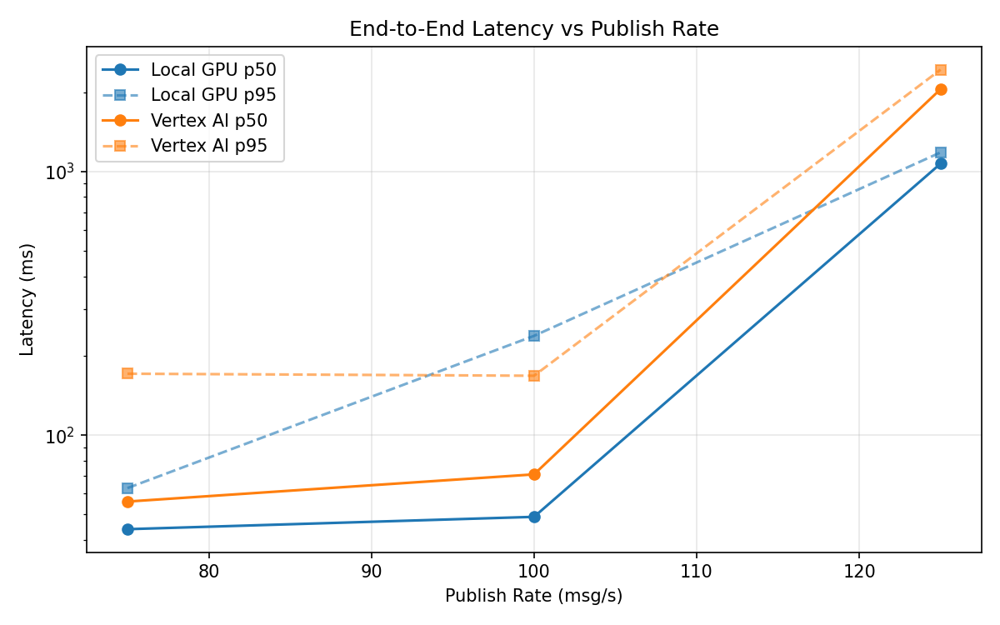
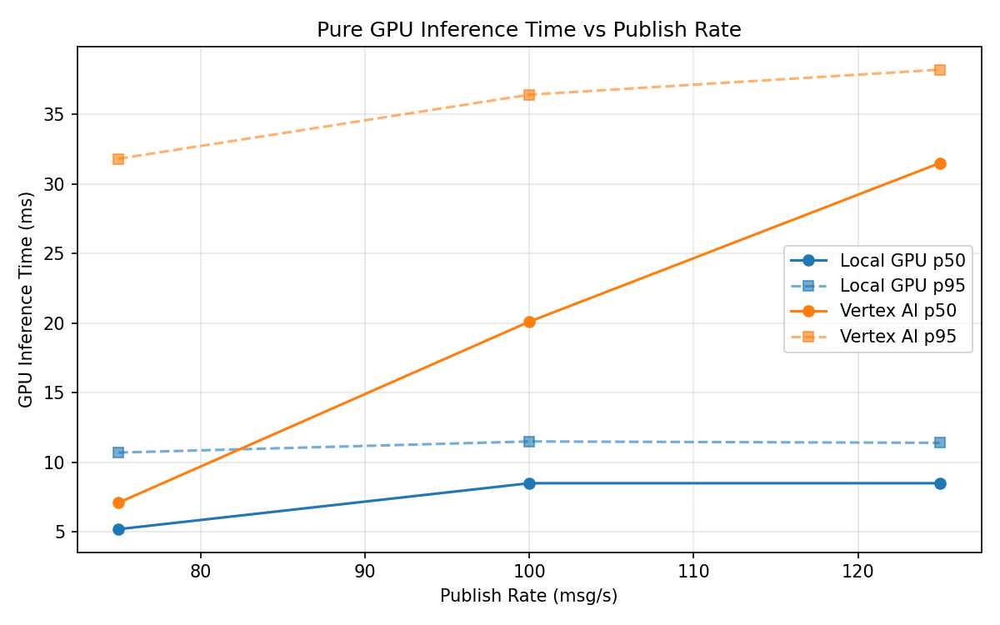
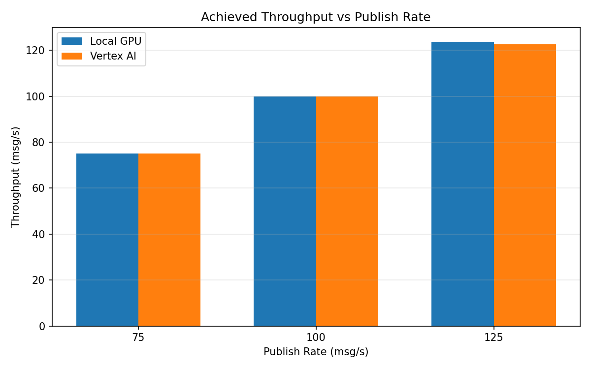

# Benchmark Report

Generated: 2026-03-08 16:02:16

## Configuration

| Parameter | Value |
|---|---|
| Messages per phase | 100s per phase |
| Rates (msg/s) | 75, 100, 125 |
| Experiments | Local GPU, Vertex AI |

## Throughput

| Rate (msg/s) | Local GPU | Vertex AI |
|---|---|---|
| 75 | 75.0 | 75.0 |
| 100 | 100.0 | 99.9 |
| 125 | 123.7 | 122.5 |

## End-to-End Latency (ms)

| Rate | Percentile | Local GPU | Vertex AI |
|---|---|---|---|
| 75 | p50 | 44.0 | 56.0 |
| 75 | p95 | 63.0 | 171.0 |
| 75 | p99 | 320.1 | 766.0 |
| 100 | p50 | 49.0 | 71.0 |
| 100 | p95 | 238.0 | 168.0 |
| 100 | p99 | 868.0 | 219.0 |
| 125 | p50 | 1071.0 | 2052.0 |
| 125 | p95 | 1181.0 | 2433.0 |
| 125 | p99 | 1220.0 | 2505.0 |

## GPU Inference Time (ms)

| Rate | Percentile | Local GPU | Vertex AI |
|---|---|---|---|
| 75 | p50 | 5.2 | 7.1 |
| 75 | p95 | 10.7 | 31.8 |
| 75 | p99 | 11.8 | 37.0 |
| 100 | p50 | 8.5 | 20.1 |
| 100 | p95 | 11.5 | 36.4 |
| 100 | p99 | 12.3 | 46.5 |
| 125 | p50 | 8.5 | 31.5 |
| 125 | p95 | 11.4 | 38.2 |
| 125 | p99 | 12.5 | 48.2 |

## Charts

### Latency vs Publish Rate

### GPU Inference Time vs Publish Rate

### Throughput vs Publish Rate

