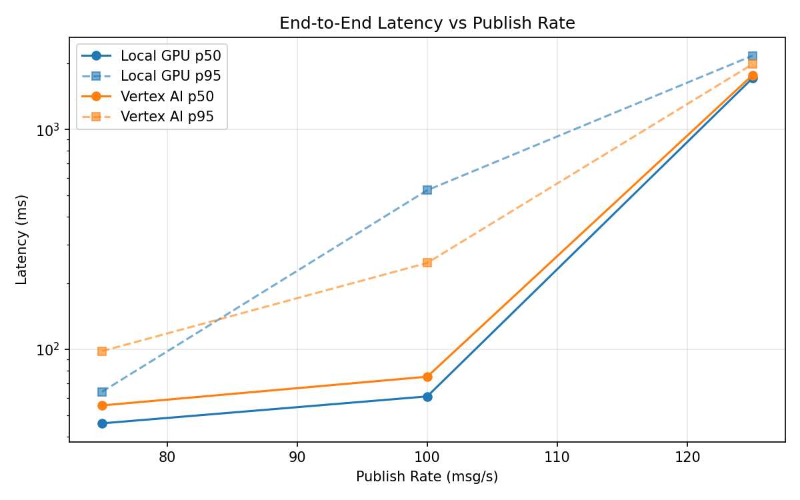
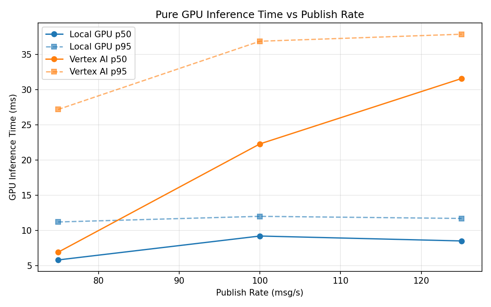
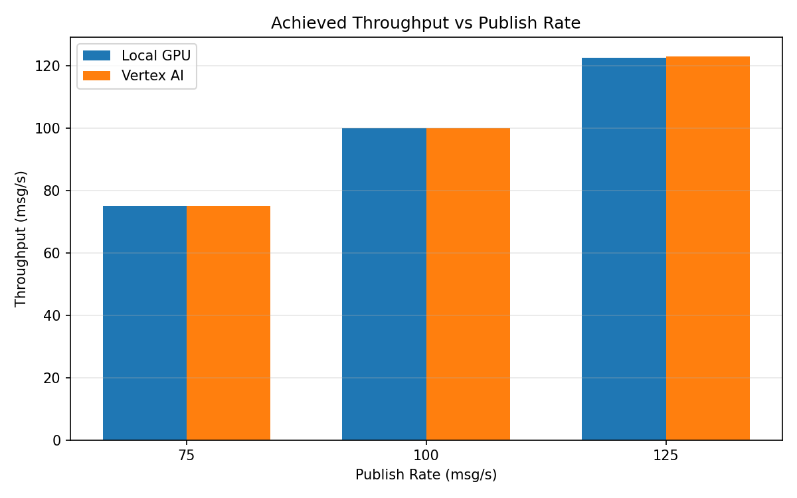

# Benchmark Report

Generated: 2026-03-08 17:27:55

## Configuration

| Parameter | Value |
|---|---|
| Messages per phase | 100s per phase |
| Rates (msg/s) | 75, 100, 125 |
| Experiments | Local GPU, Vertex AI |

## Throughput

| Rate (msg/s) | Local GPU | Vertex AI |
|---|---|---|
| 75 | 75.0 | 75.0 |
| 100 | 100.0 | 99.9 |
| 125 | 122.5 | 122.9 |

## End-to-End Latency (ms)

| Rate | Percentile | Local GPU | Vertex AI |
|---|---|---|---|
| 75 | p50 | 46.0 | 55.5 |
| 75 | p95 | 64.0 | 98.0 |
| 75 | p99 | 199.0 | 590.1 |
| 100 | p50 | 61.0 | 75.0 |
| 100 | p95 | 529.0 | 247.0 |
| 100 | p99 | 896.0 | 474.0 |
| 125 | p50 | 1710.0 | 1766.0 |
| 125 | p95 | 2165.0 | 1981.0 |
| 125 | p99 | 2196.0 | 2039.0 |

## GPU Inference Time (ms)

| Rate | Percentile | Local GPU | Vertex AI |
|---|---|---|---|
| 75 | p50 | 5.8 | 6.9 |
| 75 | p95 | 11.2 | 27.2 |
| 75 | p99 | 12.3 | 34.5 |
| 100 | p50 | 9.2 | 22.3 |
| 100 | p95 | 12.0 | 36.9 |
| 100 | p99 | 13.2 | 47.0 |
| 125 | p50 | 8.5 | 31.6 |
| 125 | p95 | 11.7 | 37.9 |
| 125 | p99 | 12.9 | 47.9 |

## Charts

### Latency vs Publish Rate

### GPU Inference Time vs Publish Rate

### Throughput vs Publish Rate

