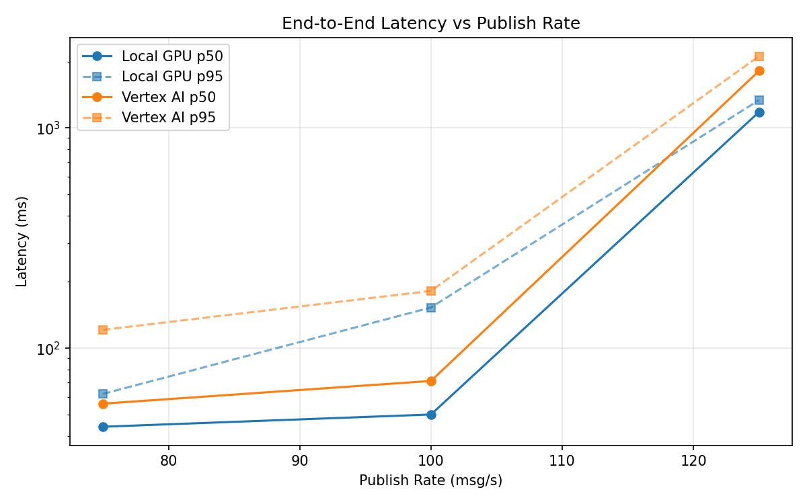
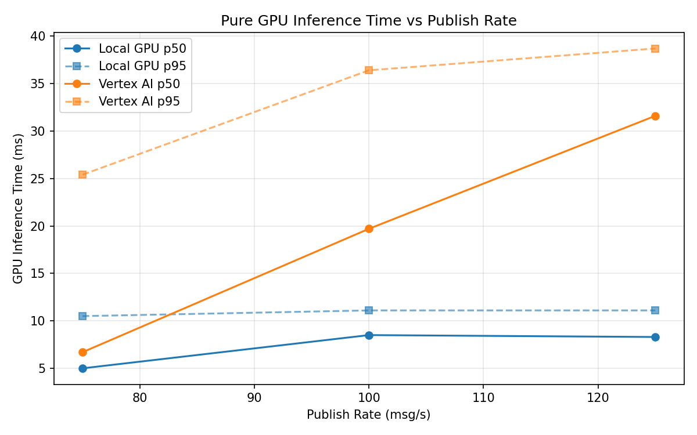
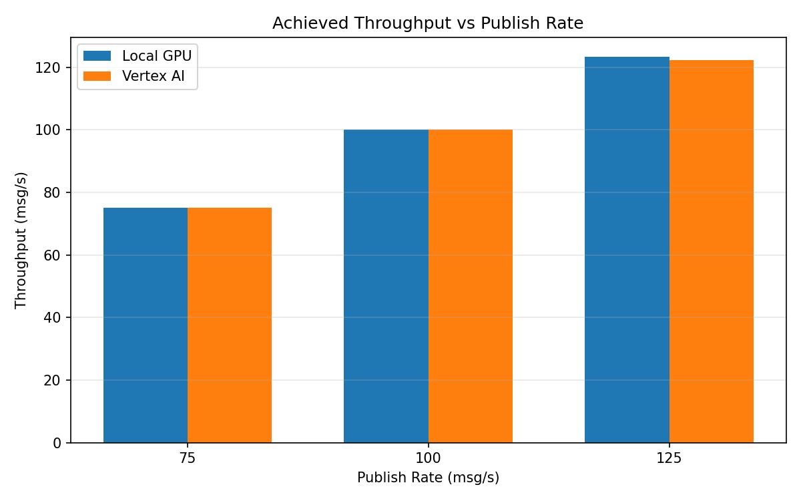

# Benchmark Report

Generated: 2026-03-08 16:38:16

## Configuration

| Parameter | Value |
|---|---|
| Messages per phase | 100s per phase |
| Rates (msg/s) | 75, 100, 125 |
| Experiments | Local GPU, Vertex AI |

## Throughput

| Rate (msg/s) | Local GPU | Vertex AI |
|---|---|---|
| 75 | 75.0 | 75.0 |
| 100 | 100.0 | 100.0 |
| 125 | 123.4 | 122.4 |

## End-to-End Latency (ms)

| Rate | Percentile | Local GPU | Vertex AI |
|---|---|---|---|
| 75 | p50 | 44.0 | 56.0 |
| 75 | p95 | 62.0 | 121.1 |
| 75 | p99 | 220.0 | 597.0 |
| 100 | p50 | 50.0 | 71.0 |
| 100 | p95 | 153.0 | 182.0 |
| 100 | p99 | 343.0 | 264.0 |
| 125 | p50 | 1181.0 | 1815.0 |
| 125 | p95 | 1338.0 | 2116.0 |
| 125 | p99 | 1398.0 | 2192.0 |

## GPU Inference Time (ms)

| Rate | Percentile | Local GPU | Vertex AI |
|---|---|---|---|
| 75 | p50 | 5.0 | 6.7 |
| 75 | p95 | 10.5 | 25.4 |
| 75 | p99 | 11.6 | 34.5 |
| 100 | p50 | 8.5 | 19.7 |
| 100 | p95 | 11.1 | 36.4 |
| 100 | p99 | 12.1 | 46.7 |
| 125 | p50 | 8.3 | 31.6 |
| 125 | p95 | 11.1 | 38.7 |
| 125 | p99 | 12.0 | 49.1 |

## Charts

### Latency vs Publish Rate

### GPU Inference Time vs Publish Rate

### Throughput vs Publish Rate

