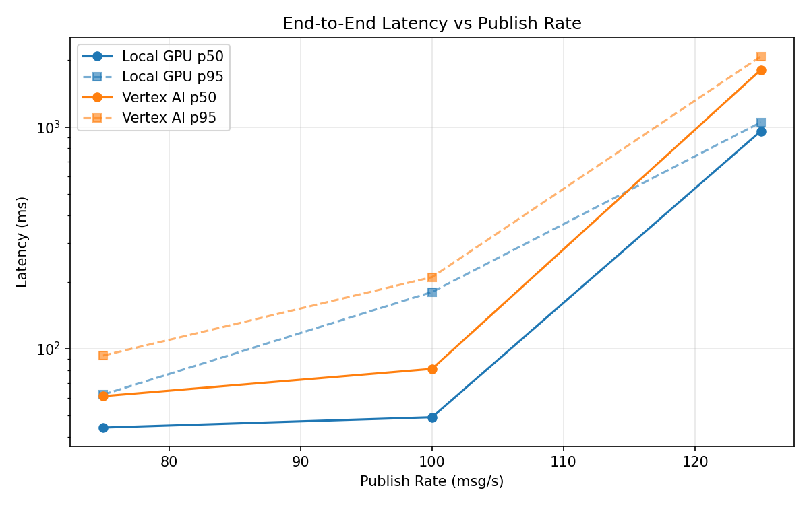
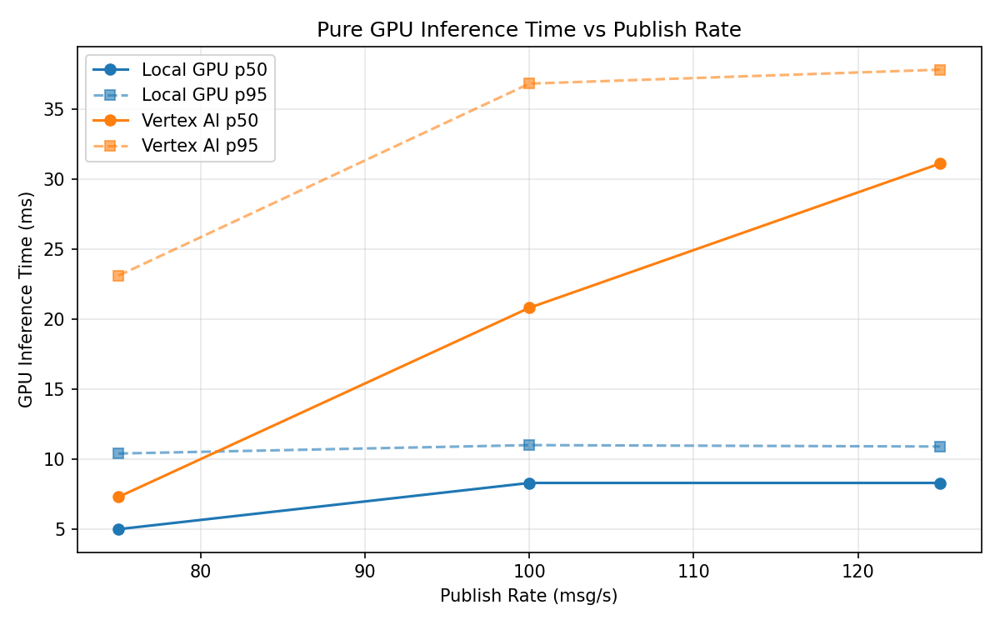
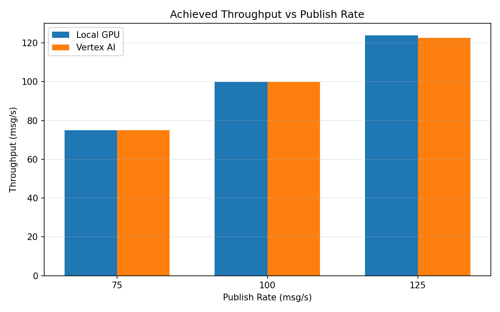

# Benchmark Report

Generated: 2026-03-08 17:40:06

## Configuration

| Parameter | Value |
|---|---|
| Messages per phase | 100s per phase |
| Rates (msg/s) | 75, 100, 125 |
| Experiments | Local GPU, Vertex AI |

## Throughput

| Rate (msg/s) | Local GPU | Vertex AI |
|---|---|---|
| 75 | 75.0 | 75.0 |
| 100 | 99.9 | 99.9 |
| 125 | 123.9 | 122.6 |

## End-to-End Latency (ms)

| Rate | Percentile | Local GPU | Vertex AI |
|---|---|---|---|
| 75 | p50 | 44.0 | 61.0 |
| 75 | p95 | 62.0 | 93.0 |
| 75 | p99 | 369.2 | 254.0 |
| 100 | p50 | 49.0 | 81.0 |
| 100 | p95 | 180.0 | 210.0 |
| 100 | p99 | 523.1 | 281.0 |
| 125 | p50 | 959.0 | 1812.0 |
| 125 | p95 | 1050.0 | 2084.0 |
| 125 | p99 | 1080.0 | 2154.0 |

## GPU Inference Time (ms)

| Rate | Percentile | Local GPU | Vertex AI |
|---|---|---|---|
| 75 | p50 | 5.0 | 7.3 |
| 75 | p95 | 10.4 | 23.1 |
| 75 | p99 | 11.4 | 34.3 |
| 100 | p50 | 8.3 | 20.8 |
| 100 | p95 | 11.0 | 36.8 |
| 100 | p99 | 11.7 | 47.8 |
| 125 | p50 | 8.3 | 31.1 |
| 125 | p95 | 10.9 | 37.8 |
| 125 | p99 | 11.7 | 48.0 |

## Charts

### Latency vs Publish Rate

### GPU Inference Time vs Publish Rate

### Throughput vs Publish Rate

