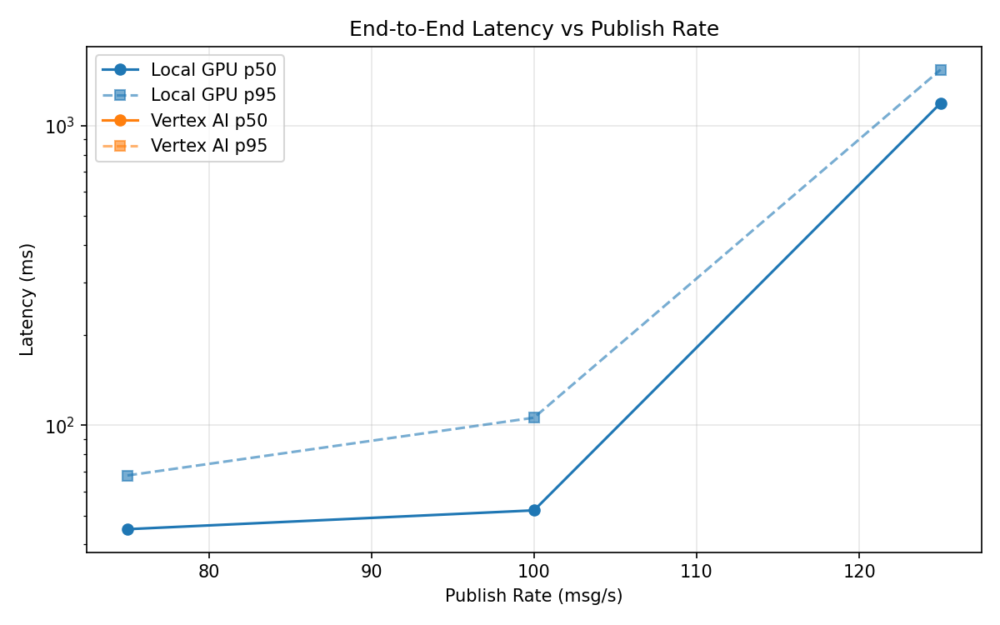
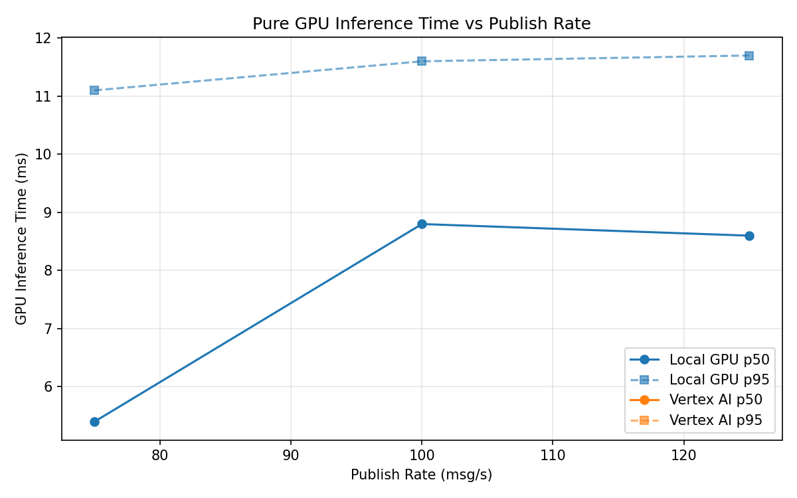
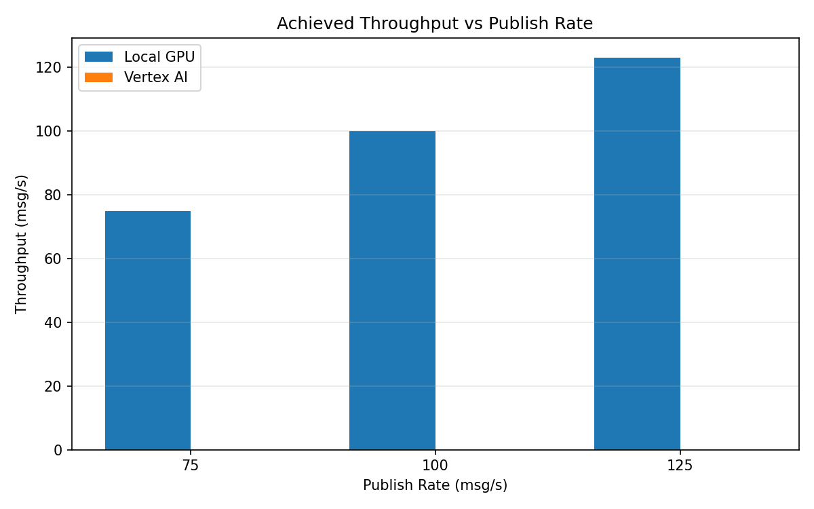

# Benchmark Report

Generated: 2026-03-08 17:55:55

## Configuration

| Parameter | Value |
|---|---|
| Messages per phase | 100s per phase |
| Rates (msg/s) | 75, 100, 125 |
| Experiments | Local GPU, Vertex AI |

## Throughput

| Rate (msg/s) | Local GPU | Vertex AI |
|---|---|---|
| 75 | 75.0 | — |
| 100 | 100.0 | — |
| 125 | 123.1 | — |

## End-to-End Latency (ms)

| Rate | Percentile | Local GPU | Vertex AI |
|---|---|---|---|
| 75 | p50 | 45.0 | — |
| 75 | p95 | 68.0 | — |
| 75 | p99 | 794.0 | — |
| 100 | p50 | 52.0 | — |
| 100 | p95 | 106.0 | — |
| 100 | p99 | 178.0 | — |
| 125 | p50 | 1188.0 | — |
| 125 | p95 | 1537.0 | — |
| 125 | p99 | 1611.0 | — |

## GPU Inference Time (ms)

| Rate | Percentile | Local GPU | Vertex AI |
|---|---|---|---|
| 75 | p50 | 5.4 | — |
| 75 | p95 | 11.1 | — |
| 75 | p99 | 12.2 | — |
| 100 | p50 | 8.8 | — |
| 100 | p95 | 11.6 | — |
| 100 | p99 | 12.6 | — |
| 125 | p50 | 8.6 | — |
| 125 | p95 | 11.7 | — |
| 125 | p99 | 12.7 | — |

## Charts

### Latency vs Publish Rate

### GPU Inference Time vs Publish Rate

### Throughput vs Publish Rate

