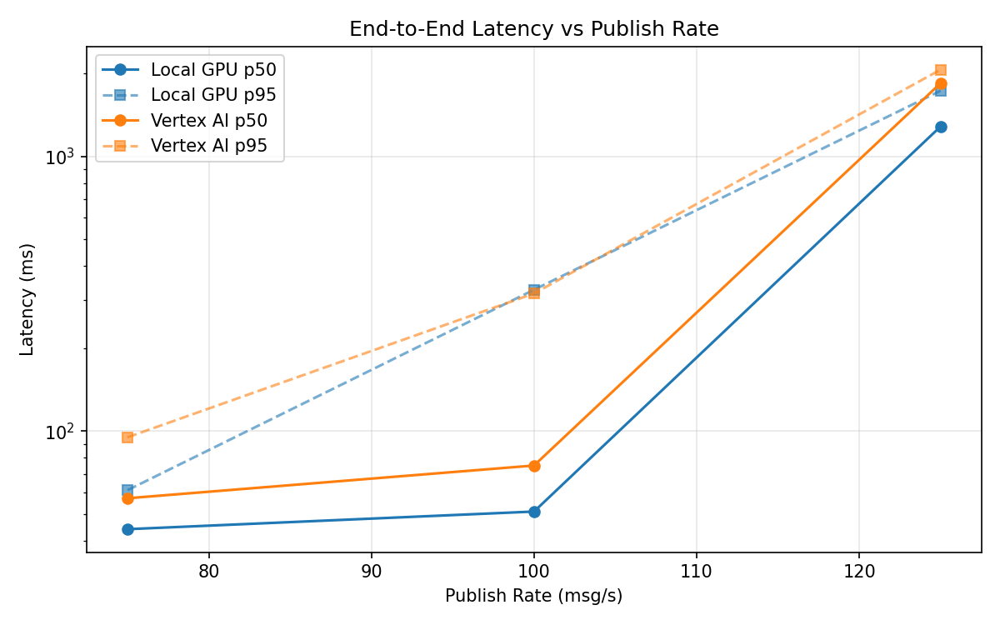
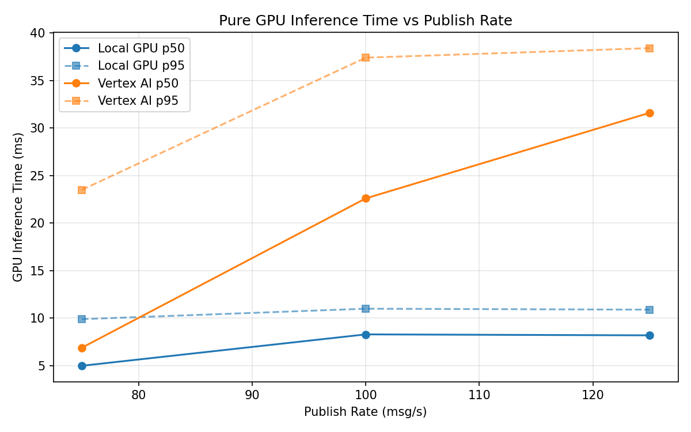
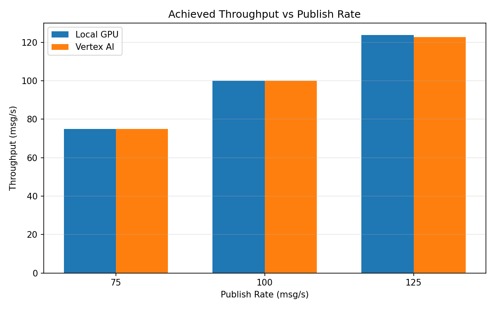

# Benchmark Report

Generated: 2026-03-08 16:50:24

## Configuration

| Parameter | Value |
|---|---|
| Messages per phase | 100s per phase |
| Rates (msg/s) | 75, 100, 125 |
| Experiments | Local GPU, Vertex AI |

## Throughput

| Rate (msg/s) | Local GPU | Vertex AI |
|---|---|---|
| 75 | 75.0 | 75.0 |
| 100 | 99.9 | 99.9 |
| 125 | 123.8 | 122.7 |

## End-to-End Latency (ms)

| Rate | Percentile | Local GPU | Vertex AI |
|---|---|---|---|
| 75 | p50 | 44.0 | 57.0 |
| 75 | p95 | 61.0 | 95.0 |
| 75 | p99 | 126.0 | 532.2 |
| 100 | p50 | 51.0 | 75.0 |
| 100 | p95 | 327.1 | 317.0 |
| 100 | p99 | 785.0 | 604.0 |
| 125 | p50 | 1284.0 | 1845.0 |
| 125 | p95 | 1732.0 | 2067.0 |
| 125 | p99 | 1821.0 | 2133.0 |

## GPU Inference Time (ms)

| Rate | Percentile | Local GPU | Vertex AI |
|---|---|---|---|
| 75 | p50 | 5.0 | 6.9 |
| 75 | p95 | 9.9 | 23.5 |
| 75 | p99 | 11.2 | 35.2 |
| 100 | p50 | 8.3 | 22.6 |
| 100 | p95 | 11.0 | 37.4 |
| 100 | p99 | 11.8 | 46.7 |
| 125 | p50 | 8.2 | 31.6 |
| 125 | p95 | 10.9 | 38.4 |
| 125 | p99 | 11.8 | 47.6 |

## Charts

### Latency vs Publish Rate

### GPU Inference Time vs Publish Rate

### Throughput vs Publish Rate

