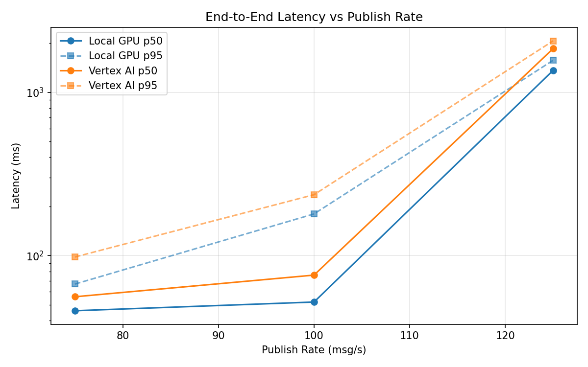
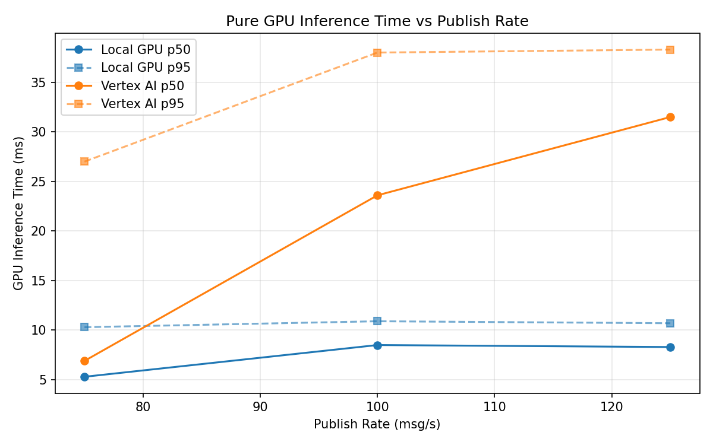
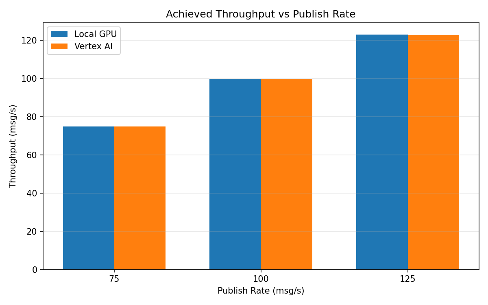

# Benchmark Report

Generated: 2026-03-08 16:13:54

## Configuration

| Parameter | Value |
|---|---|
| Messages per phase | 100s per phase |
| Rates (msg/s) | 75, 100, 125 |
| Experiments | Local GPU, Vertex AI |

## Throughput

| Rate (msg/s) | Local GPU | Vertex AI |
|---|---|---|
| 75 | 75.0 | 75.0 |
| 100 | 99.9 | 99.9 |
| 125 | 123.1 | 122.9 |

## End-to-End Latency (ms)

| Rate | Percentile | Local GPU | Vertex AI |
|---|---|---|---|
| 75 | p50 | 46.0 | 56.0 |
| 75 | p95 | 67.0 | 98.1 |
| 75 | p99 | 583.2 | 578.0 |
| 100 | p50 | 52.0 | 76.0 |
| 100 | p95 | 180.0 | 236.0 |
| 100 | p99 | 340.0 | 401.0 |
| 125 | p50 | 1360.0 | 1848.0 |
| 125 | p95 | 1568.0 | 2062.0 |
| 125 | p99 | 1600.0 | 2140.0 |

## GPU Inference Time (ms)

| Rate | Percentile | Local GPU | Vertex AI |
|---|---|---|---|
| 75 | p50 | 5.3 | 6.9 |
| 75 | p95 | 10.3 | 27.0 |
| 75 | p99 | 11.3 | 35.3 |
| 100 | p50 | 8.5 | 23.6 |
| 100 | p95 | 10.9 | 38.0 |
| 100 | p99 | 11.7 | 49.6 |
| 125 | p50 | 8.3 | 31.5 |
| 125 | p95 | 10.7 | 38.3 |
| 125 | p99 | 11.5 | 48.7 |

## Charts

### Latency vs Publish Rate

### GPU Inference Time vs Publish Rate

### Throughput vs Publish Rate

