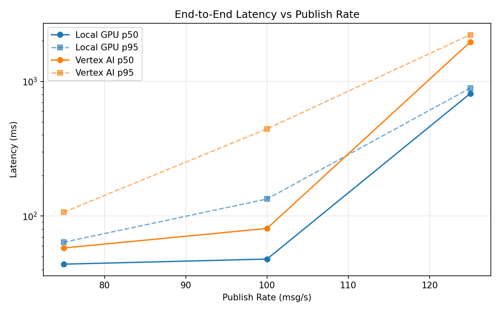
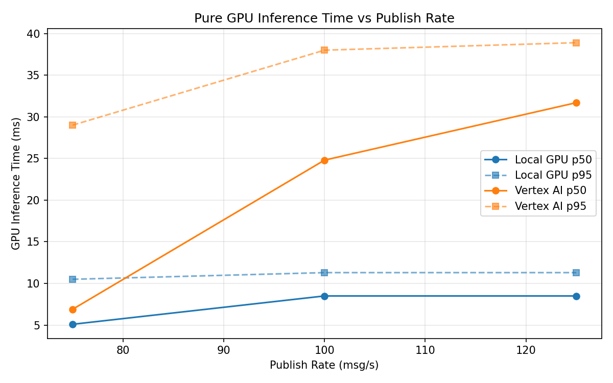
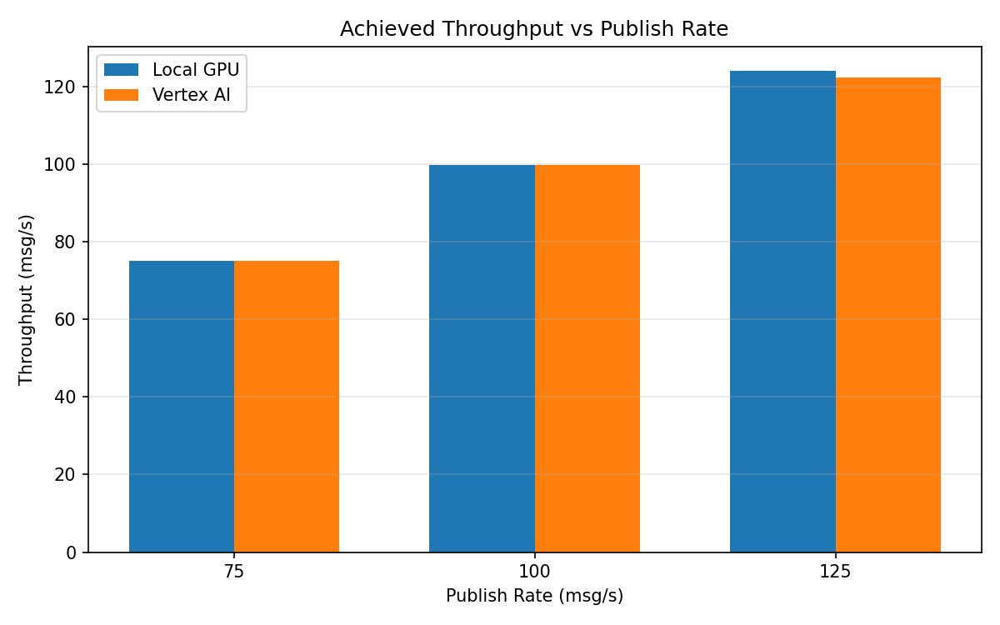

# Benchmark Report

Generated: 2026-03-08 17:02:34

## Configuration

| Parameter | Value |
|---|---|
| Messages per phase | 100s per phase |
| Rates (msg/s) | 75, 100, 125 |
| Experiments | Local GPU, Vertex AI |

## Throughput

| Rate (msg/s) | Local GPU | Vertex AI |
|---|---|---|
| 75 | 75.0 | 75.0 |
| 100 | 99.9 | 99.9 |
| 125 | 124.1 | 122.4 |

## End-to-End Latency (ms)

| Rate | Percentile | Local GPU | Vertex AI |
|---|---|---|---|
| 75 | p50 | 44.0 | 58.0 |
| 75 | p95 | 64.0 | 107.0 |
| 75 | p99 | 299.0 | 821.1 |
| 100 | p50 | 48.0 | 81.0 |
| 100 | p95 | 134.0 | 444.1 |
| 100 | p99 | 282.0 | 765.1 |
| 125 | p50 | 813.0 | 1962.0 |
| 125 | p95 | 892.0 | 2216.0 |
| 125 | p99 | 923.0 | 2326.0 |

## GPU Inference Time (ms)

| Rate | Percentile | Local GPU | Vertex AI |
|---|---|---|---|
| 75 | p50 | 5.1 | 6.9 |
| 75 | p95 | 10.5 | 29.0 |
| 75 | p99 | 11.5 | 35.3 |
| 100 | p50 | 8.5 | 24.8 |
| 100 | p95 | 11.3 | 38.0 |
| 100 | p99 | 12.1 | 49.3 |
| 125 | p50 | 8.5 | 31.7 |
| 125 | p95 | 11.3 | 38.9 |
| 125 | p99 | 12.3 | 48.4 |

## Charts

### Latency vs Publish Rate

### GPU Inference Time vs Publish Rate

### Throughput vs Publish Rate

