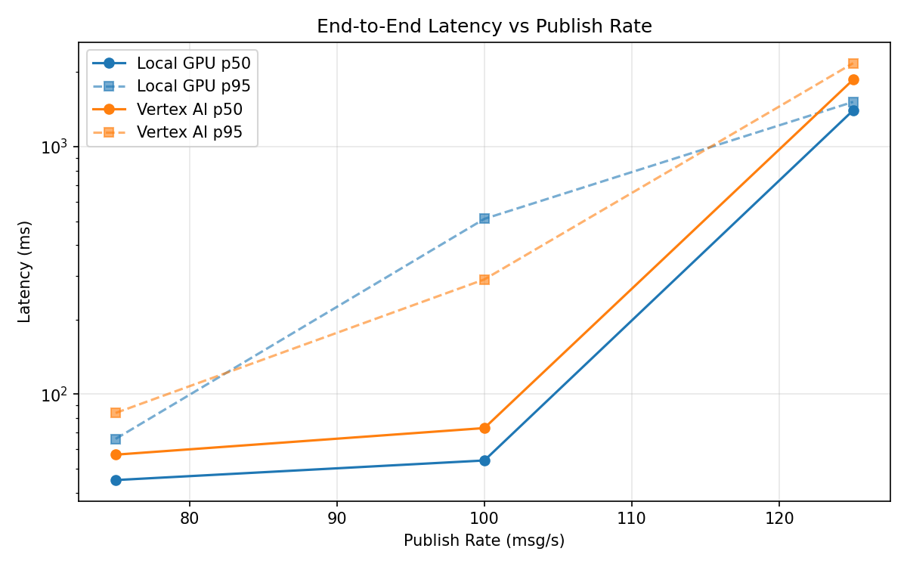
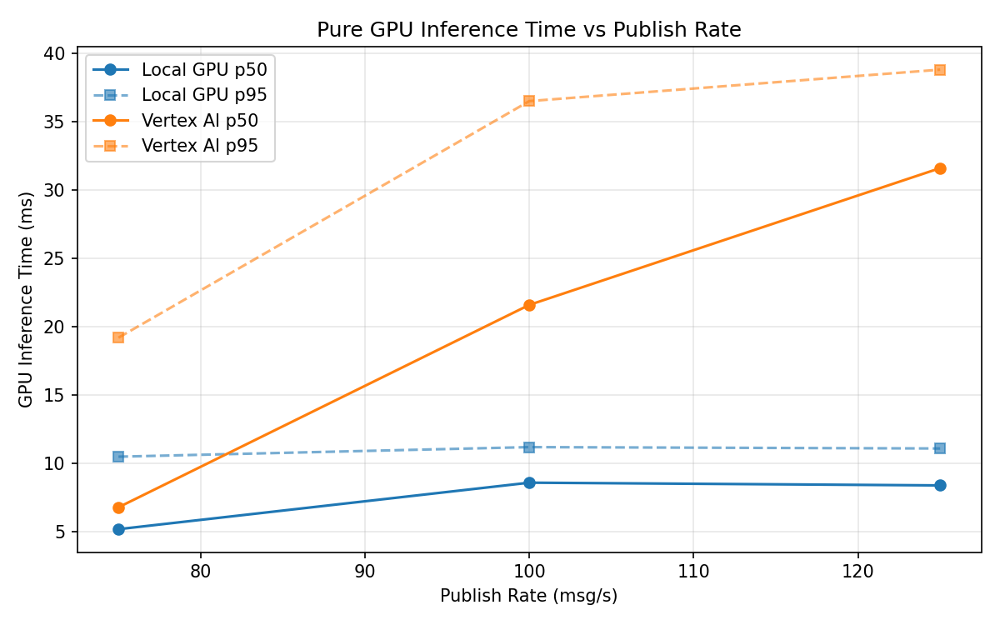
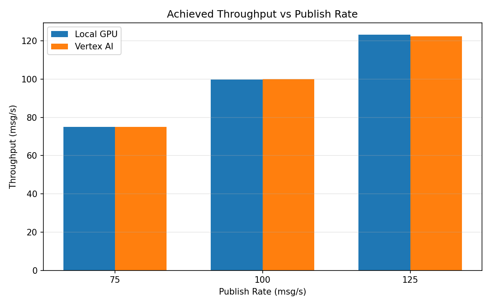

# Benchmark Report

Generated: 2026-03-08 16:26:27

## Configuration

| Parameter | Value |
|---|---|
| Messages per phase | 100s per phase |
| Rates (msg/s) | 75, 100, 125 |
| Experiments | Local GPU, Vertex AI |

## Throughput

| Rate (msg/s) | Local GPU | Vertex AI |
|---|---|---|
| 75 | 75.0 | 75.0 |
| 100 | 99.9 | 100.0 |
| 125 | 123.3 | 122.5 |

## End-to-End Latency (ms)

| Rate | Percentile | Local GPU | Vertex AI |
|---|---|---|---|
| 75 | p50 | 45.0 | 57.0 |
| 75 | p95 | 66.0 | 84.0 |
| 75 | p99 | 517.0 | 191.0 |
| 100 | p50 | 54.0 | 73.0 |
| 100 | p95 | 511.1 | 291.0 |
| 100 | p99 | 1173.1 | 632.0 |
| 125 | p50 | 1402.0 | 1865.0 |
| 125 | p95 | 1517.0 | 2175.0 |
| 125 | p99 | 1543.0 | 2268.0 |

## GPU Inference Time (ms)

| Rate | Percentile | Local GPU | Vertex AI |
|---|---|---|---|
| 75 | p50 | 5.2 | 6.8 |
| 75 | p95 | 10.5 | 19.2 |
| 75 | p99 | 11.7 | 33.7 |
| 100 | p50 | 8.6 | 21.6 |
| 100 | p95 | 11.2 | 36.5 |
| 100 | p99 | 12.0 | 47.8 |
| 125 | p50 | 8.4 | 31.6 |
| 125 | p95 | 11.1 | 38.8 |
| 125 | p99 | 12.0 | 47.6 |

## Charts

### Latency vs Publish Rate

### GPU Inference Time vs Publish Rate

### Throughput vs Publish Rate

