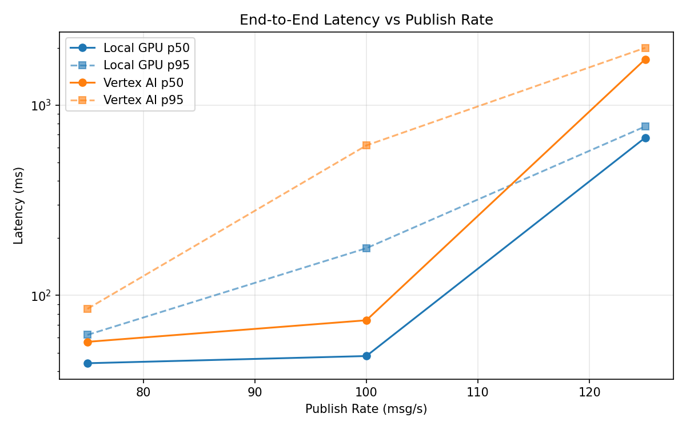
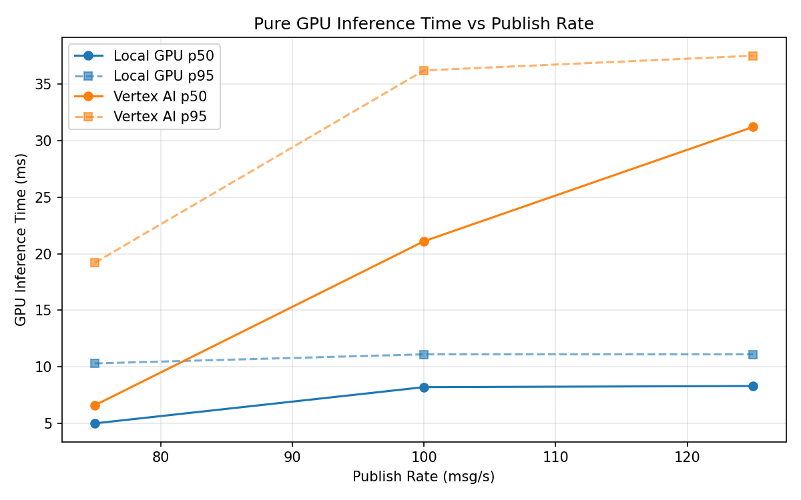
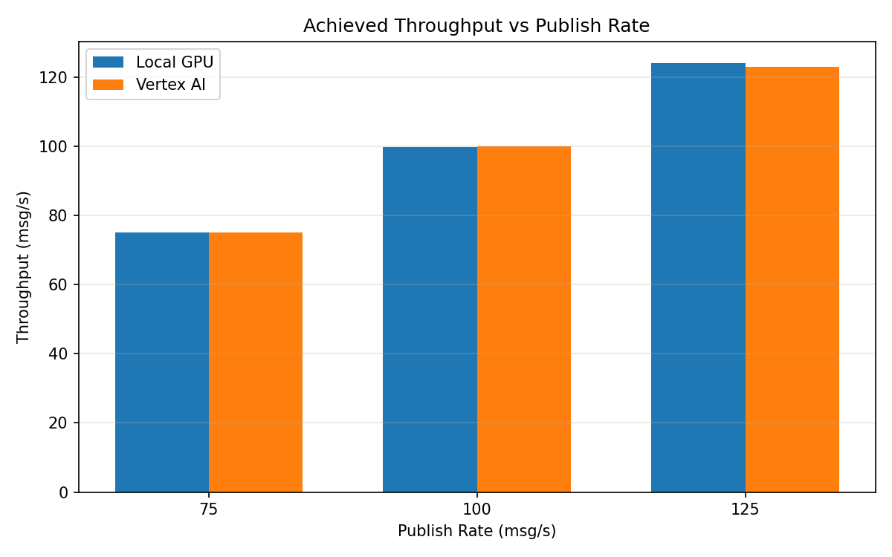

# Benchmark Report

Generated: 2026-03-08 17:15:10

## Configuration

| Parameter | Value |
|---|---|
| Messages per phase | 100s per phase |
| Rates (msg/s) | 75, 100, 125 |
| Experiments | Local GPU, Vertex AI |

## Throughput

| Rate (msg/s) | Local GPU | Vertex AI |
|---|---|---|
| 75 | 75.0 | 75.0 |
| 100 | 99.9 | 100.0 |
| 125 | 124.1 | 122.9 |

## End-to-End Latency (ms)

| Rate | Percentile | Local GPU | Vertex AI |
|---|---|---|---|
| 75 | p50 | 44.0 | 57.0 |
| 75 | p95 | 62.0 | 85.0 |
| 75 | p99 | 142.0 | 347.0 |
| 100 | p50 | 48.0 | 74.0 |
| 100 | p95 | 177.0 | 614.0 |
| 100 | p99 | 684.0 | 1042.0 |
| 125 | p50 | 675.0 | 1743.5 |
| 125 | p95 | 773.0 | 2002.0 |
| 125 | p99 | 806.0 | 2143.0 |

## GPU Inference Time (ms)

| Rate | Percentile | Local GPU | Vertex AI |
|---|---|---|---|
| 75 | p50 | 5.0 | 6.6 |
| 75 | p95 | 10.3 | 19.2 |
| 75 | p99 | 11.5 | 33.2 |
| 100 | p50 | 8.2 | 21.1 |
| 100 | p95 | 11.1 | 36.2 |
| 100 | p99 | 11.9 | 46.9 |
| 125 | p50 | 8.3 | 31.2 |
| 125 | p95 | 11.1 | 37.5 |
| 125 | p99 | 11.9 | 47.6 |

## Charts

### Latency vs Publish Rate

### GPU Inference Time vs Publish Rate

### Throughput vs Publish Rate

