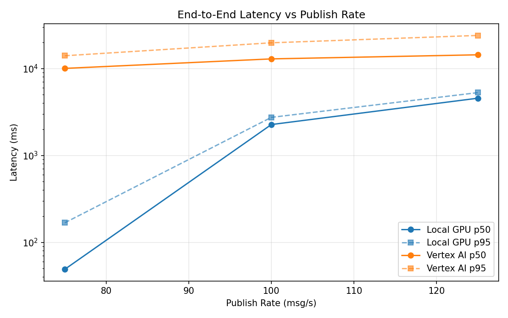
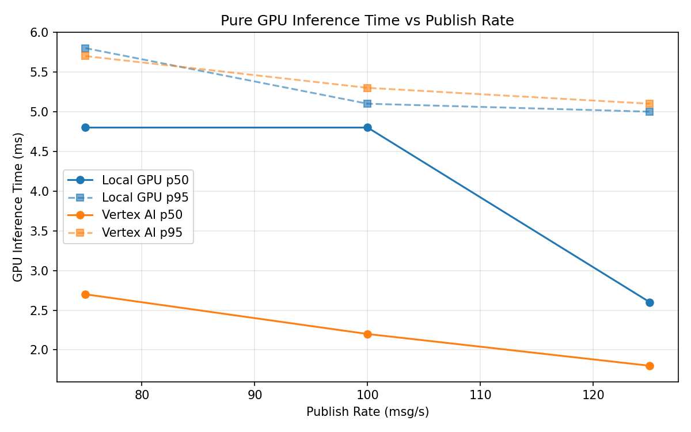
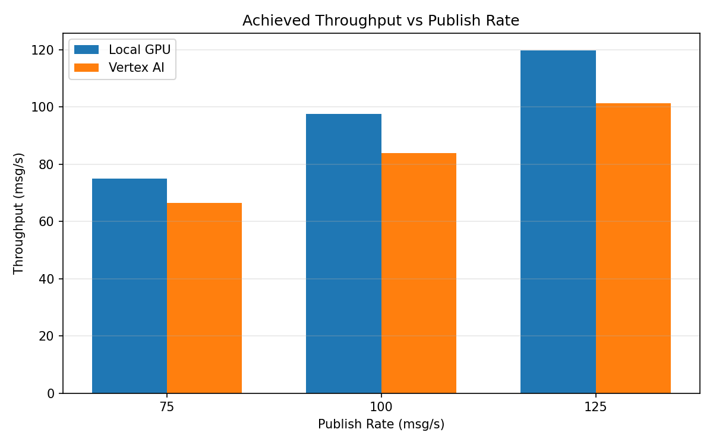

# Benchmark Report

Generated: 2026-03-08 11:54:32

## Configuration

| Parameter | Value |
|---|---|
| Messages per phase | 100s per phase |
| Rates (msg/s) | 75, 100, 125 |
| Experiments | Local GPU, Vertex AI |

## Throughput

| Rate (msg/s) | Local GPU | Vertex AI |
|---|---|---|
| 75 | 75.0 | 66.4 |
| 100 | 97.5 | 83.9 |
| 125 | 119.8 | 101.4 |

## End-to-End Latency (ms)

| Rate | Percentile | Local GPU | Vertex AI |
|---|---|---|---|
| 75 | p50 | 49.0 | 10035.0 |
| 75 | p95 | 168.0 | 14025.0 |
| 75 | p99 | 401.1 | 14384.0 |
| 100 | p50 | 2266.0 | 12906.0 |
| 100 | p95 | 2741.0 | 19769.0 |
| 100 | p99 | 2815.0 | 20036.0 |
| 125 | p50 | 4554.0 | 14380.0 |
| 125 | p95 | 5280.0 | 24027.3 |
| 125 | p99 | 5349.0 | 24657.0 |

## GPU Inference Time (ms)

| Rate | Percentile | Local GPU | Vertex AI |
|---|---|---|---|
| 75 | p50 | 4.8 | 2.7 |
| 75 | p95 | 5.8 | 5.7 |
| 75 | p99 | 6.1 | 8.1 |
| 100 | p50 | 4.8 | 2.2 |
| 100 | p95 | 5.1 | 5.3 |
| 100 | p99 | 6.1 | 7.0 |
| 125 | p50 | 2.6 | 1.8 |
| 125 | p95 | 5.0 | 5.1 |
| 125 | p99 | 6.0 | 6.3 |

## Charts

### Latency vs Publish Rate

### GPU Inference Time vs Publish Rate

### Throughput vs Publish Rate

