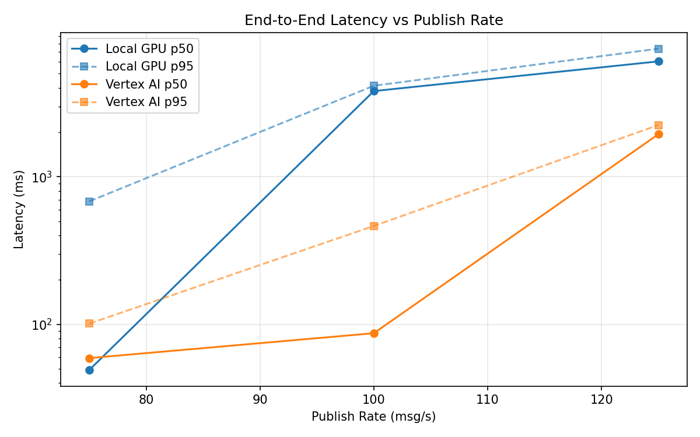
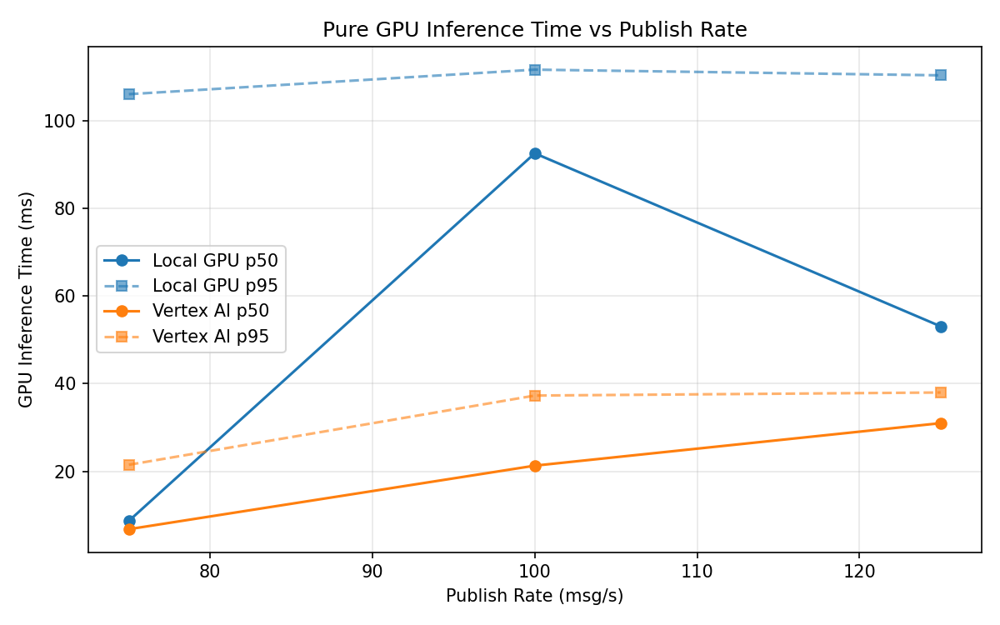
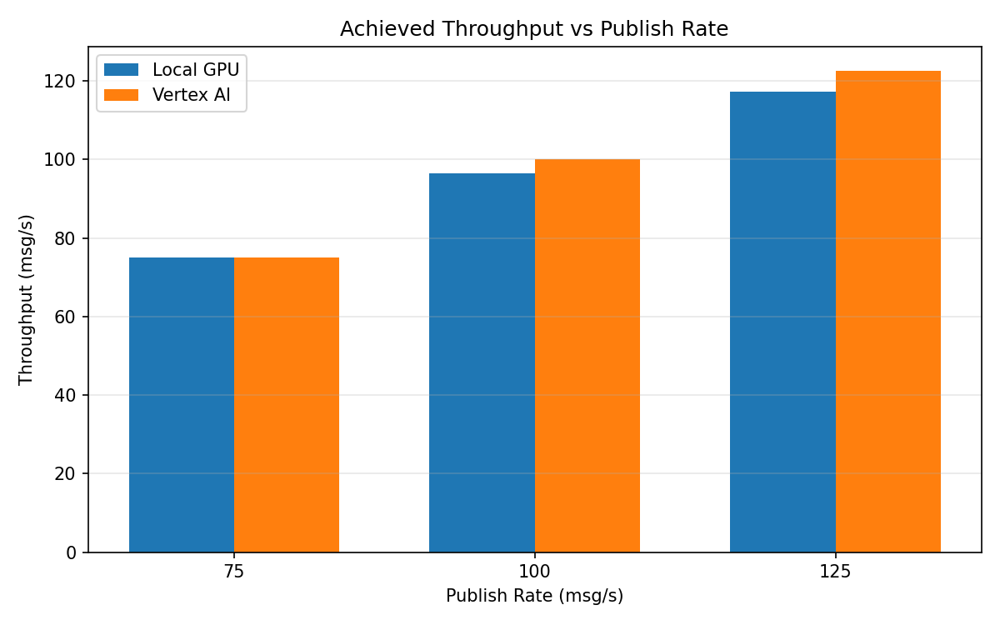

# Benchmark Report

Generated: 2026-03-08 13:46:59

## Configuration

| Parameter | Value |
|---|---|
| Messages per phase | 100s per phase |
| Rates (msg/s) | 75, 100, 125 |
| Experiments | Local GPU, Vertex AI |

## Throughput

| Rate (msg/s) | Local GPU | Vertex AI |
|---|---|---|
| 75 | 75.0 | 75.0 |
| 100 | 96.5 | 100.0 |
| 125 | 117.3 | 122.6 |

## End-to-End Latency (ms)

| Rate | Percentile | Local GPU | Vertex AI |
|---|---|---|---|
| 75 | p50 | 49.0 | 59.0 |
| 75 | p95 | 681.0 | 101.0 |
| 75 | p99 | 816.0 | 272.0 |
| 100 | p50 | 3808.0 | 87.0 |
| 100 | p95 | 4138.0 | 464.1 |
| 100 | p99 | 4232.0 | 789.0 |
| 125 | p50 | 6051.0 | 1942.0 |
| 125 | p95 | 7377.0 | 2242.0 |
| 125 | p99 | 7565.0 | 2320.0 |

## GPU Inference Time (ms)

| Rate | Percentile | Local GPU | Vertex AI |
|---|---|---|---|
| 75 | p50 | 8.7 | 6.8 |
| 75 | p95 | 106.1 | 21.5 |
| 75 | p99 | 113.1 | 33.4 |
| 100 | p50 | 92.6 | 21.3 |
| 100 | p95 | 111.7 | 37.3 |
| 100 | p99 | 117.3 | 47.7 |
| 125 | p50 | 53.1 | 31.0 |
| 125 | p95 | 110.4 | 38.0 |
| 125 | p99 | 117.2 | 48.2 |

## Charts

### Latency vs Publish Rate

### GPU Inference Time vs Publish Rate

### Throughput vs Publish Rate

