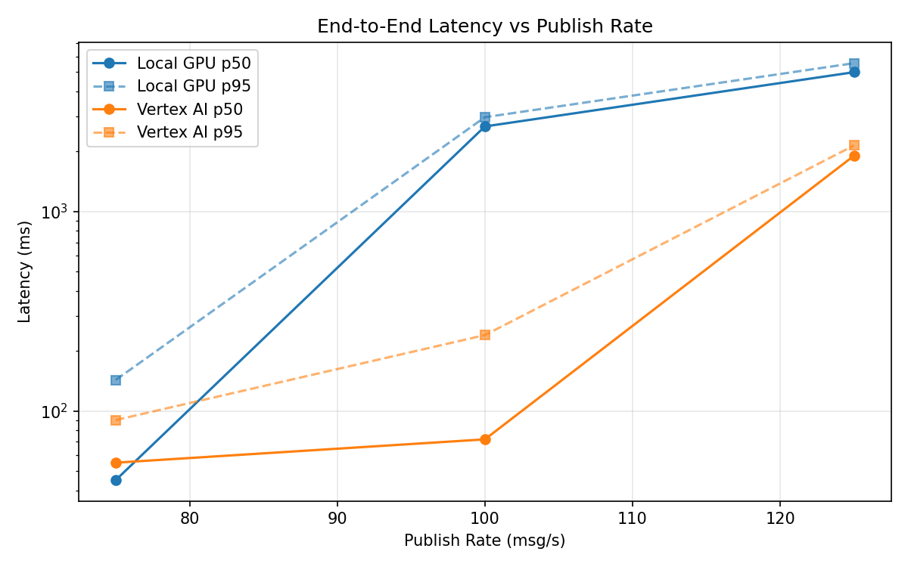
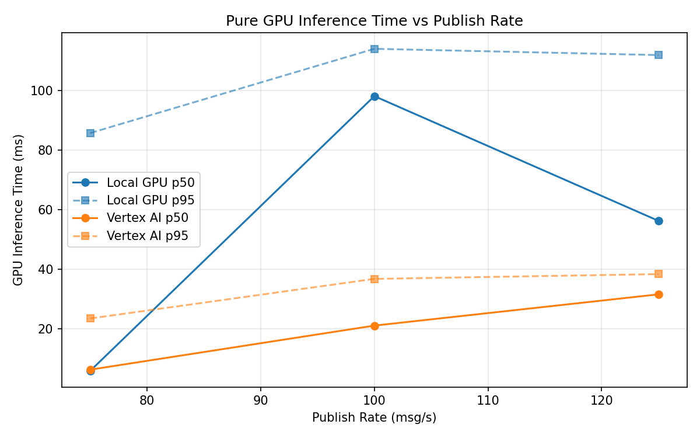
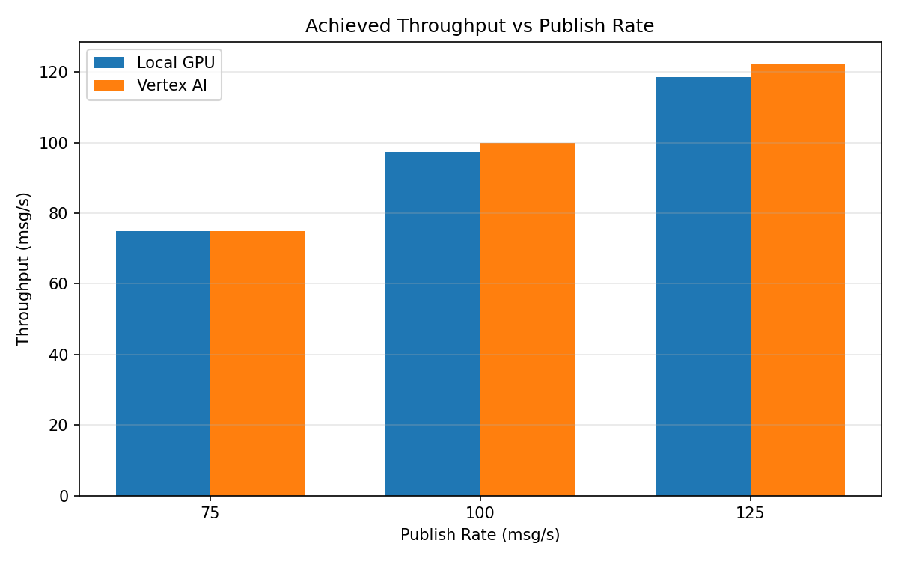

# Benchmark Report

Generated: 2026-03-08 13:59:23

## Configuration

| Parameter | Value |
|---|---|
| Messages per phase | 100s per phase |
| Rates (msg/s) | 75, 100, 125 |
| Experiments | Local GPU, Vertex AI |

## Throughput

| Rate (msg/s) | Local GPU | Vertex AI |
|---|---|---|
| 75 | 75.0 | 75.0 |
| 100 | 97.3 | 100.0 |
| 125 | 118.6 | 122.4 |

## End-to-End Latency (ms)

| Rate | Percentile | Local GPU | Vertex AI |
|---|---|---|---|
| 75 | p50 | 45.0 | 55.0 |
| 75 | p95 | 143.0 | 90.0 |
| 75 | p99 | 277.0 | 529.0 |
| 100 | p50 | 2671.0 | 72.0 |
| 100 | p95 | 2972.0 | 240.0 |
| 100 | p99 | 3057.0 | 419.0 |
| 125 | p50 | 4998.0 | 1906.0 |
| 125 | p95 | 5545.0 | 2145.0 |
| 125 | p99 | 5656.0 | 2230.0 |

## GPU Inference Time (ms)

| Rate | Percentile | Local GPU | Vertex AI |
|---|---|---|---|
| 75 | p50 | 5.9 | 6.3 |
| 75 | p95 | 85.8 | 23.5 |
| 75 | p99 | 108.8 | 34.4 |
| 100 | p50 | 98.2 | 21.1 |
| 100 | p95 | 114.1 | 36.8 |
| 100 | p99 | 119.4 | 46.6 |
| 125 | p50 | 56.3 | 31.6 |
| 125 | p95 | 112.0 | 38.4 |
| 125 | p99 | 118.1 | 48.0 |

## Charts

### Latency vs Publish Rate

### GPU Inference Time vs Publish Rate

### Throughput vs Publish Rate

