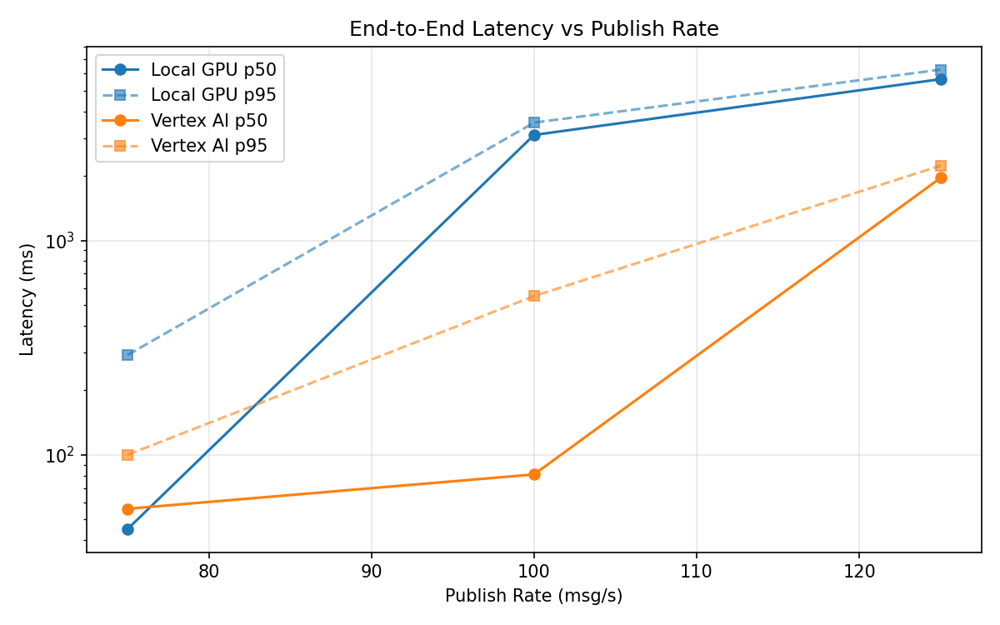
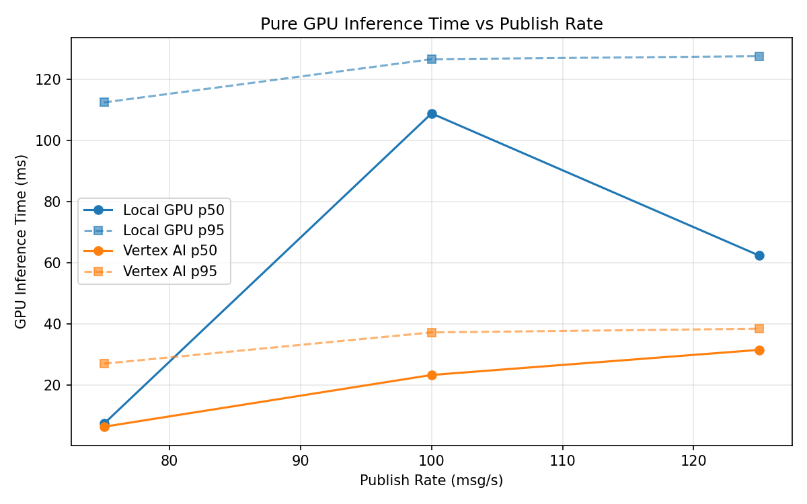
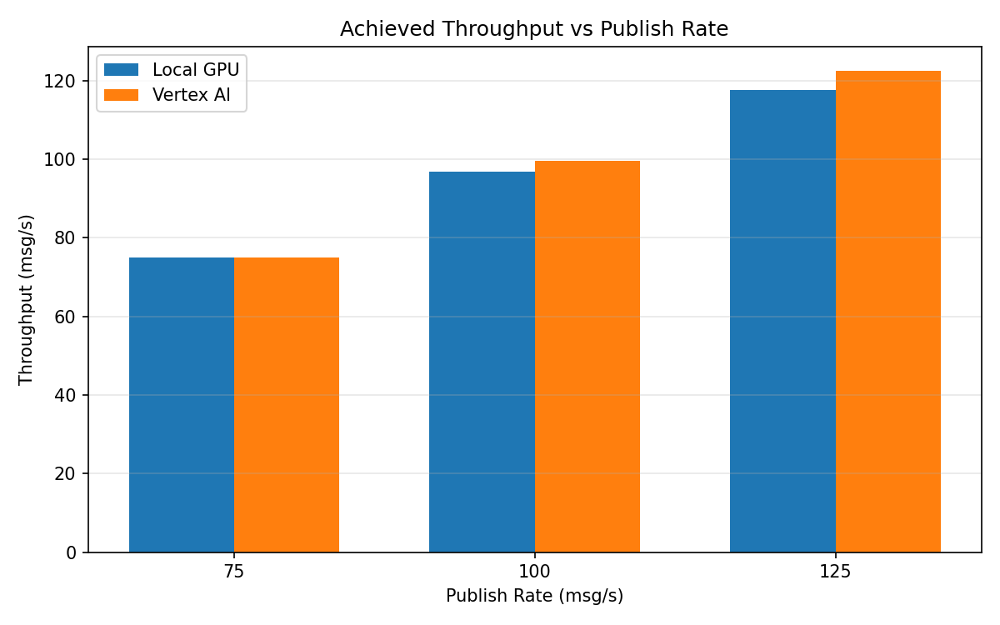

# Benchmark Report

Generated: 2026-03-08 14:11:42

## Configuration

| Parameter | Value |
|---|---|
| Messages per phase | 100s per phase |
| Rates (msg/s) | 75, 100, 125 |
| Experiments | Local GPU, Vertex AI |

## Throughput

| Rate (msg/s) | Local GPU | Vertex AI |
|---|---|---|
| 75 | 75.0 | 75.0 |
| 100 | 96.8 | 99.6 |
| 125 | 117.5 | 122.5 |

## End-to-End Latency (ms)

| Rate | Percentile | Local GPU | Vertex AI |
|---|---|---|---|
| 75 | p50 | 45.0 | 56.0 |
| 75 | p95 | 292.0 | 100.0 |
| 75 | p99 | 608.0 | 717.0 |
| 100 | p50 | 3104.0 | 81.0 |
| 100 | p95 | 3543.0 | 550.0 |
| 100 | p99 | 3639.0 | 962.0 |
| 125 | p50 | 5650.0 | 1958.0 |
| 125 | p95 | 6259.0 | 2233.0 |
| 125 | p99 | 6457.0 | 2334.0 |

## GPU Inference Time (ms)

| Rate | Percentile | Local GPU | Vertex AI |
|---|---|---|---|
| 75 | p50 | 7.5 | 6.5 |
| 75 | p95 | 112.4 | 27.1 |
| 75 | p99 | 124.0 | 34.9 |
| 100 | p50 | 108.8 | 23.4 |
| 100 | p95 | 126.5 | 37.3 |
| 100 | p99 | 132.6 | 48.7 |
| 125 | p50 | 62.4 | 31.6 |
| 125 | p95 | 127.5 | 38.5 |
| 125 | p99 | 134.5 | 49.7 |

## Charts

### Latency vs Publish Rate

### GPU Inference Time vs Publish Rate

### Throughput vs Publish Rate

